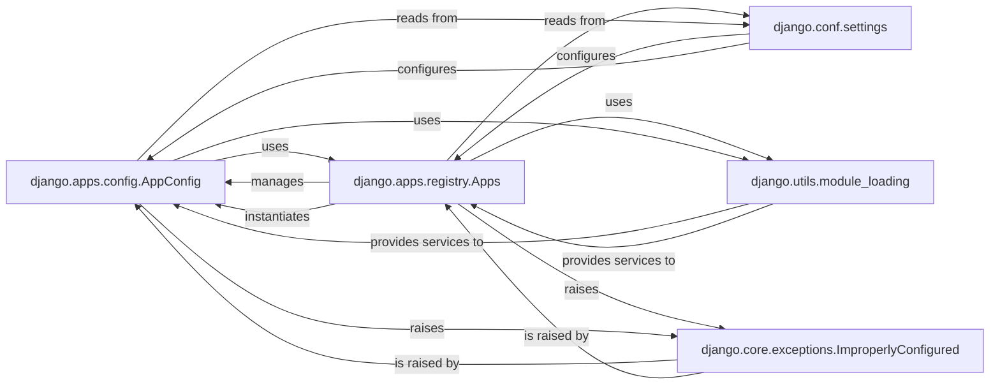

## Component Details

This analysis focuses on the `AppConfig` subsystem within Django, which is crucial for how Django discovers, configures, and loads applications and their models. The core idea is to provide a structured way for each Django application to declare its metadata and define startup behavior.

### django.apps.config.AppConfig
This is the primary configuration object for a single Django application. Each installed application is represented by an `AppConfig` instance, encapsulating essential metadata like the application's name, label, and file system path. It provides hooks for application-specific initialization and is responsible for loading the application's models. It acts as the central point of configuration for an individual app.

**Related Classes/Methods**:

- <a href="https://github.com/django/django/blob/master/django/apps/config.py#L12-L273" target="_blank" rel="noopener noreferrer">`django.apps.config.AppConfig` (12:273)</a>

### django.apps.registry.Apps
This component serves as the central registry for all installed Django applications. Its core responsibility is to discover, load, and manage the lifecycle of `AppConfig` instances. The `populate` method orchestrates the entire application startup, ensuring all applications are properly initialized, their configurations loaded, and their models ready for use across the Django project. It acts as the "brain" that knows about all registered applications.

**Related Classes/Methods**:

- <a href="https://github.com/django/django/blob/master/django/apps/registry.py#L12-L433" target="_blank" rel="noopener noreferrer">`django.apps.registry.Apps` (12:433)</a>

### django.utils.module_loading
This utility component provides essential functions for dynamic module and attribute loading within Django. Functions like `import_string` and `module_has_submodule` are critical for Django's ability to dynamically discover and load application code, including `AppConfig` classes and models, based on project configuration. It enables the flexible and extensible nature of Django's app system.

**Related Classes/Methods**:

- <a href="https://github.com/django/django/blob/master/django/utils/module_loading.py#L1-L1" target="_blank" rel="noopener noreferrer">`django.utils.module_loading` (1:1)</a>

### django.conf.settings
This component provides access to Django's project-wide settings, which are defined in the `settings.py` file. It's the central hub for all configuration variables, including `INSTALLED_APPS`, which dictates which `AppConfig` instances the `Apps` registry should load. It ensures that all parts of Django and its applications can access a consistent set of configurations.

**Related Classes/Methods**:

- <a href="https://github.com/django/django/blob/master/django/template/backends/django.py#L1-L1" target="_blank" rel="noopener noreferrer">`django.conf.settings` (1:1)</a>

### django.core.exceptions.ImproperlyConfigured
This specific exception class is a core part of Django's error handling mechanism, particularly during application startup and configuration. It is raised when the framework or an application encounters a critical configuration issue that prevents it from operating correctly. Its use provides clear and specific feedback to developers, aiding in the diagnosis and resolution of setup problems.

**Related Classes/Methods**:

- <a href="https://github.com/django/django/blob/master/django/core/exceptions.py#L1-L1" target="_blank" rel="noopener noreferrer">`django.core.exceptions.ImproperlyConfigured` (1:1)</a>

### [FAQ](https://github.com/CodeBoarding/GeneratedOnBoardings/tree/main?tab=readme-ov-file#faq)