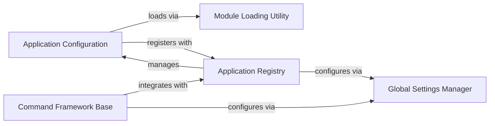

## Component Details

This subsystem manages the core structure and configuration of Django applications. It encompasses the definition and loading of individual application settings (Application Configuration), the central registry that tracks all installed applications and their models (Application Registry), the default and project-specific global settings that govern the framework's behavior (Global Settings Manager), and the framework for creating and executing command-line utilities that interact with the application environment (Command Framework Base). The Module Loading Utility provides the dynamic import capabilities essential for loading these components. The Application Registry orchestrates the loading of Application Configuration instances, which in turn use the Module Loading Utility and interact with the Global Settings Manager for their setup. The Command Framework Base leverages both the Application Registry for system checks and the Global Settings Manager for command-line configuration.

### Application Configuration
Defines and manages the configuration of individual Django applications, including their initialization, metadata (name, label, path), and model loading.

**Related Classes/Methods**:

- <a href="https://github.com/django/django/blob/master/django/apps/config.py#L12-L273" target="_blank" rel="noopener noreferrer">`django.apps.config.AppConfig` (12:273)</a>

### Application Registry
Centralizes the management of all installed Django applications and their models, handling their loading, state, and providing a unified interface for accessing application configurations and models.

**Related Classes/Methods**:

- <a href="https://github.com/django/django/blob/master/django/apps/registry.py#L12-L433" target="_blank" rel="noopener noreferrer">`django.apps.registry.Apps` (12:433)</a>

### Global Settings Manager
Provides default configuration values for the entire Django project and allows for project-specific overrides, influencing various aspects of the framework's behavior.

**Related Classes/Methods**:

- <a href="https://github.com/django/django/blob/master/django/conf/global_settings.py#L1-L200" target="_blank" rel="noopener noreferrer">`django.conf.global_settings` (1:200)</a>

### Command Framework Base
Establishes the foundational structure for creating and executing custom management commands, handling argument parsing, system checks, and defining the command lifecycle.

**Related Classes/Methods**:

- <a href="https://github.com/django/django/blob/master/django/core/management/base.py#L187-L619" target="_blank" rel="noopener noreferrer">`django.core.management.base.BaseCommand` (187:619)</a>

### Module Loading Utility
Offers a utility for dynamically importing Python modules and objects from string paths, crucial for flexible and configurable loading of applications and classes.

**Related Classes/Methods**:

- <a href="https://github.com/django/django/blob/master/django/utils/module_loading.py#L18-L34" target="_blank" rel="noopener noreferrer">`django.utils.module_loading.import_string` (18:34)</a>

### [FAQ](https://github.com/CodeBoarding/GeneratedOnBoardings/tree/main?tab=readme-ov-file#faq)