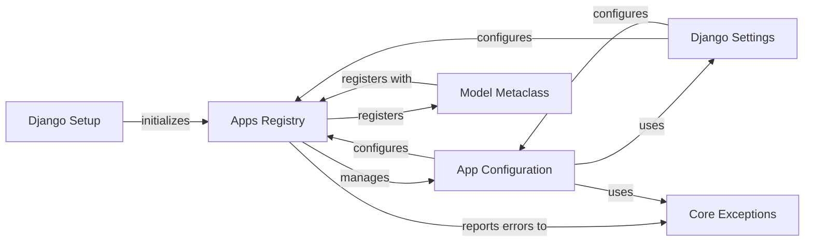

## Component Details

The `Application Registry` in Django is a core component responsible for managing the lifecycle and configuration of all installed Django applications. It acts as a central hub for registering models, signals, and other app-specific metadata, ensuring that applications and their components are properly loaded and discoverable throughout the project.

### Apps Registry
This is the central repository for all installed Django applications and their models. It orchestrates the loading process of applications and provides methods to access registered `AppConfig` instances and model classes. It maintains the state of application and model readiness (`apps_ready`, `models_ready`, `ready`).

**Related Classes/Methods**:

- <a href="https://github.com/django/django/blob/master/django/apps/registry.py#L12-L433" target="_blank" rel="noopener noreferrer">`django.apps.registry.Apps` (12:433)</a>

### App Configuration
Represents a single Django application. Each installed application has an `AppConfig` instance that holds its metadata (e.g., name, label, path) and defines its behavior during the registry's population. It's responsible for importing models within its application.

**Related Classes/Methods**:

- <a href="https://github.com/django/django/blob/master/django/apps/config.py#L12-L273" target="_blank" rel="noopener noreferrer">`django.apps.config.AppConfig` (12:273)</a>

### Model Metaclass
This is the metaclass for all Django models. When a Django model class is defined, `ModelBase.__new__` is called, which automatically registers the model with the `Apps Registry` (`apps.register_model`). This ensures that all models are discoverable and usable by Django's ORM.

**Related Classes/Methods**:

- <a href="https://github.com/django/django/blob/master/django/db/models/base.py#L93-L457" target="_blank" rel="noopener noreferrer">`django.db.models.base.ModelBase` (93:457)</a>

### Django Setup
The main function (`django.setup()`) that initializes the Django environment. A key part of its role is populating the `Apps Registry` by calling `apps.populate()`, which loads all installed applications and their models based on `INSTALLED_APPS` from settings.

**Related Classes/Methods**:

- <a href="https://github.com/django/django/blob/master/django/__init__.py#L7-L23" target="_blank" rel="noopener noreferrer">`django.__init__.setup` (7:23)</a>

### Django Settings
Provides access to project-wide configurations, including the `INSTALLED_APPS` list. The `Apps Registry` relies heavily on `INSTALLED_APPS` to identify which applications need to be loaded and configured during the population process.

**Related Classes/Methods**:

- <a href="https://github.com/django/django/blob/master/django/template/backends/django.py#L1-L1" target="_blank" rel="noopener noreferrer">`django.conf.settings` (1:1)</a>

### Core Exceptions
Defines standard Django exceptions used for error handling across the framework. This includes exceptions like `ImproperlyConfigured` and `AppRegistryNotReady`, which are raised by the `Apps Registry` and `App Configuration` during issues with application or model registration.

**Related Classes/Methods**:

- <a href="https://github.com/django/django/blob/master/django/core/exceptions.py#L1-L1" target="_blank" rel="noopener noreferrer">`django.core.exceptions` (1:1)</a>

### [FAQ](https://github.com/CodeBoarding/GeneratedOnBoardings/tree/main?tab=readme-ov-file#faq)