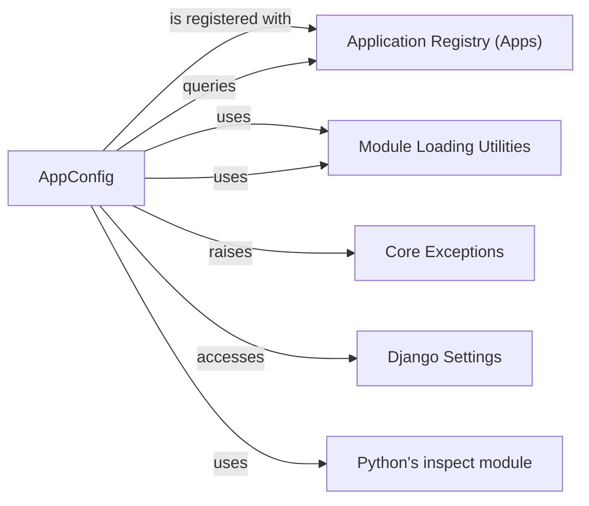

## Component Details

The Application Configuration component, primarily embodied by django.apps.config.AppConfig, is fundamental to Django's modular architecture. It acts as the central hub for managing individual application lifecycles and metadata. Its interactions with other core components ensure that applications are correctly discovered, configured, and integrated into the Django project.

### AppConfig
The core class that encapsulates the configuration and metadata for a single Django application. It manages application name, label, path, model loading, and provides a ready() hook for initialization.

**Related Classes/Methods**:

- <a href="https://github.com/django/django/blob/master/django/apps/config.py#L12-L273" target="_blank" rel="noopener noreferrer">`django.apps.config.AppConfig` (12:273)</a>
- <a href="https://github.com/django/django/blob/master/django/apps/config.py#L270-L273" target="_blank" rel="noopener noreferrer">`django.apps.config.AppConfig:ready` (270:273)</a>
- <a href="https://github.com/django/django/blob/master/django/apps/config.py#L99-L221" target="_blank" rel="noopener noreferrer">`django.apps.config.AppConfig:create` (99:221)</a>
- <a href="https://github.com/django/django/blob/master/django/apps/config.py#L261-L268" target="_blank" rel="noopener noreferrer">`django.apps.config.AppConfig:import_models` (261:268)</a>
- <a href="https://github.com/django/django/blob/master/django/apps/config.py#L15-L55" target="_blank" rel="noopener noreferrer">`django.apps.config.AppConfig:__init__` (15:55)</a>
- <a href="https://github.com/django/django/blob/master/django/apps/config.py#L70-L96" target="_blank" rel="noopener noreferrer">`django.apps.config.AppConfig:_path_from_module` (70:96)</a>
- <a href="https://github.com/django/django/blob/master/django/apps/config.py#L223-L238" target="_blank" rel="noopener noreferrer">`django.apps.config.AppConfig:get_model` (223:238)</a>
- <a href="https://github.com/django/django/blob/master/django/apps/config.py#L61-L64" target="_blank" rel="noopener noreferrer">`django.apps.config.AppConfig:default_auto_field` (61:64)</a>

### Application Registry (Apps)
The central registry (django.apps.apps.Apps) that holds and manages all AppConfig instances across a Django project. It orchestrates the loading, readiness checks, and provides access to models from all installed applications.

**Related Classes/Methods**:

- `django.apps.apps.Apps` (0:0)
- `django.apps.apps.Apps:check_models_ready` (0:0)
- `django.apps.apps.Apps:all_models` (0:0)

### Module Loading Utilities
A set of internal utilities (e.g., django.utils.module_loading.import_module, import_string, module_has_submodule) responsible for dynamically importing Python modules and classes based on their string paths.

**Related Classes/Methods**:

- <a href="https://github.com/django/django/blob/master/django/utils/module_loading.py#L0-L0" target="_blank" rel="noopener noreferrer">`django.utils.module_loading.import_module` (0:0)</a>
- <a href="https://github.com/django/django/blob/master/django/utils/module_loading.py#L18-L34" target="_blank" rel="noopener noreferrer">`django.utils.module_loading.import_string` (18:34)</a>
- <a href="https://github.com/django/django/blob/master/django/utils/module_loading.py#L73-L88" target="_blank" rel="noopener noreferrer">`django.utils.module_loading.module_has_submodule` (73:88)</a>

### Core Exceptions
Standard Django exceptions such as ImproperlyConfigured, ImportError, LookupError, and RuntimeError, used to signal critical errors related to configuration, module loading, or data retrieval.

**Related Classes/Methods**:

- <a href="https://github.com/django/django/blob/master/django/core/exceptions.py#L0-L0" target="_blank" rel="noopener noreferrer">`django.core.exceptions.ImproperlyConfigured` (0:0)</a>
- <a href="https://github.com/django/django/blob/master/django/core/exceptions.py#L0-L0" target="_blank" rel="noopener noreferrer">`django.core.exceptions.ImportError` (0:0)</a>
- <a href="https://github.com/django/django/blob/master/django/core/exceptions.py#L0-L0" target="_blank" rel="noopener noreferrer">`django.core.exceptions.LookupError` (0:0)</a>
- <a href="https://github.com/django/django/blob/master/django/core/exceptions.py#L0-L0" target="_blank" rel="noopener noreferrer">`django.core.exceptions.RuntimeError` (0:0)</a>

### Django Settings
The global configuration object (django.conf.settings) that provides access to project-wide settings defined in the settings.py file, such as DEFAULT_AUTO_FIELD.

**Related Classes/Methods**:

- <a href="https://github.com/django/django/blob/master/django/template/backends/django.py#L0-L0" target="_blank" rel="noopener noreferrer">`django.conf.settings` (0:0)</a>
- <a href="https://github.com/django/django/blob/master/django/template/backends/django.py#L0-L0" target="_blank" rel="noopener noreferrer">`django.conf.settings:DEFAULT_AUTO_FIELD` (0:0)</a>

### Python's inspect module
A built-in Python module that provides functions for examining live objects, including modules, classes, functions, and methods.

**Related Classes/Methods**:

- <a href="https://github.com/django/django/blob/master/django/utils/inspect.py#L0-L0" target="_blank" rel="noopener noreferrer">`inspect.getmembers` (0:0)</a>
- <a href="https://github.com/django/django/blob/master/django/utils/inspect.py#L0-L0" target="_blank" rel="noopener noreferrer">`inspect.isclass` (0:0)</a>

### [FAQ](https://github.com/CodeBoarding/GeneratedOnBoardings/tree/main?tab=readme-ov-file#faq)