## Details

The `Application Infrastructure` component forms the bedrock of a Django application, providing essential services and configurations that enable the entire system to function. It encompasses the core mechanisms for managing application lifecycle, handling global settings, processing HTTP requests and responses, implementing middleware, routing URLs, managing user authentication and sessions, rendering dynamic content, and optimizing performance through caching.

### Application Registry
This component serves as the central repository for all installed Django applications. It is responsible for loading, configuring, and managing the lifecycle of applications, including the registration of their models. It ensures that all applications and their associated models are properly initialized and ready for use before the application starts processing requests.

**Related Classes/Methods**:

- <a href="https://github.com/django/django/blob/master/django/apps/registry.py#L12-L433" target="_blank" rel="noopener noreferrer">`django.apps.registry.Apps` (12:433)</a>
- <a href="https://github.com/django/django/blob/master/django/apps/config.py#L12-L273" target="_blank" rel="noopener noreferrer">`django.apps.config.AppConfig` (12:273)</a>

### Settings Management
This component provides a robust and flexible mechanism for Django to load and access project-wide settings. It supports lazy loading of configurations, meaning settings are only fully loaded when they are first accessed, optimizing startup time. It centralizes the configuration of the Django environment, including database connections, installed applications, middleware, and template settings.

**Related Classes/Methods**:

- <a href="https://github.com/django/django/blob/master/django/template/backends/django.py#L1-L1" target="_blank" rel="noopener noreferrer">`django.conf.LazySettings` (1:1)</a>
- <a href="https://github.com/django/django/blob/master/django/template/backends/django.py#L1-L1" target="_blank" rel="noopener noreferrer">`django.conf.Settings` (1:1)</a>

### HTTP Request/Response Handling
This fundamental component is responsible for receiving incoming HTTP requests, encapsulating them into a structured `HttpRequest` object, and generating appropriate `HttpResponse` objects to send back to the client. It acts as the primary interface between the web server and the Django application, orchestrating the flow of data for every web interaction.

**Related Classes/Methods**:

- <a href="https://github.com/django/django/blob/master/django/core/handlers/wsgi.py#L112-L143" target="_blank" rel="noopener noreferrer">`django.core.handlers.wsgi.WSGIHandler` (112:143)</a>
- <a href="https://github.com/django/django/blob/master/django/core/handlers/asgi.py#L138-L378" target="_blank" rel="noopener noreferrer">`django.core.handlers.asgi.ASGIHandler` (138:378)</a>
- <a href="https://github.com/django/django/blob/master/django/http/request.py#L52-L480" target="_blank" rel="noopener noreferrer">`django.http.request.HttpRequest` (52:480)</a>
- <a href="https://github.com/django/django/blob/master/django/http/response.py#L364-L434" target="_blank" rel="noopener noreferrer">`django.http.response.HttpResponse` (364:434)</a>

### Middleware System
The Middleware System provides a pluggable framework for processing requests and responses globally across the application. It allows for the insertion of "hooks" at various stages of the request/response cycle, enabling functionalities such as session management, authentication, CSRF protection, and caching to be applied consistently without modifying individual view logic.

**Related Classes/Methods**:

- <a href="https://github.com/django/django/blob/master/django/utils/deprecation.py#L85-L141" target="_blank" rel="noopener noreferrer">`django.utils.deprecation.MiddlewareMixin` (85:141)</a>
- <a href="https://github.com/django/django/blob/master/django/contrib/sessions/middleware.py#L11-L76" target="_blank" rel="noopener noreferrer">`django.contrib.sessions.middleware.SessionMiddleware` (11:76)</a>
- <a href="https://github.com/django/django/blob/master/django/contrib/auth/middleware.py#L29-L40" target="_blank" rel="noopener noreferrer">`django.contrib.auth.middleware.AuthenticationMiddleware` (29:40)</a>
- <a href="https://github.com/django/django/blob/master/django/middleware/cache.py#L1-L1" target="_blank" rel="noopener noreferrer">`django.middleware.cache.CacheMiddleware` (1:1)</a>

### URL Routing
This component is responsible for mapping incoming URLs to the correct view functions or classes within the Django application. It parses the URL, extracts any parameters, and dispatches the request to the appropriate handler, ensuring that web requests are correctly directed to the code designed to handle them.

**Related Classes/Methods**:

- <a href="https://github.com/django/django/blob/master/django/urls/resolvers.py#L1-L1" target="_blank" rel="noopener noreferrer">`django.urls.resolvers.RegexPattern` (1:1)</a>
- <a href="https://github.com/django/django/blob/master/django/urls/resolvers.py#L1-L1" target="_blank" rel="noopener noreferrer">`django.urls.resolvers.RoutePattern` (1:1)</a>
- <a href="https://github.com/django/django/blob/master/django/urls/converters.py#L38-L39" target="_blank" rel="noopener noreferrer">`django.urls.converters.PathConverter` (38:39)</a>

### Authentication and Authorization
This component provides the necessary tools for user identity verification (authentication) and controlling access to resources based on user permissions (authorization). It includes abstract user models, various authentication backends (e.g., database, remote user), password hashing utilities, and middleware to integrate authentication into the request/response flow.

**Related Classes/Methods**:

- <a href="https://github.com/django/django/blob/master/django/contrib/auth/models.py#L1-L1" target="_blank" rel="noopener noreferrer">`django.contrib.auth.models.AbstractBaseUser` (1:1)</a>
- <a href="https://github.com/django/django/blob/master/django/contrib/auth/models.py#L445-L513" target="_blank" rel="noopener noreferrer">`django.contrib.auth.models.AbstractUser` (445:513)</a>
- <a href="https://github.com/django/django/blob/master/django/contrib/auth/backends.py#L9-L50" target="_blank" rel="noopener noreferrer">`django.contrib.auth.backends.BaseBackend` (9:50)</a>
- <a href="https://github.com/django/django/blob/master/django/contrib/auth/hashers.py#L203-L307" target="_blank" rel="noopener noreferrer">`django.contrib.auth.hashers.BasePasswordHasher` (203:307)</a>
- <a href="https://github.com/django/django/blob/master/django/contrib/auth/middleware.py#L29-L40" target="_blank" rel="noopener noreferrer">`django.contrib.auth.middleware.AuthenticationMiddleware` (29:40)</a>

### Session Management
This component handles the persistence of user-specific data across multiple requests. It provides a standardized interface for storing, retrieving, updating, and deleting session data, abstracting away the underlying storage mechanism (e.g., database, file system, cache, signed cookies).

**Related Classes/Methods**:

- <a href="https://github.com/django/django/blob/master/django/contrib/sessions/backends/base.py#L34-L522" target="_blank" rel="noopener noreferrer">`django.contrib.sessions.backends.base.SessionBase` (34:522)</a>
- <a href="https://github.com/django/django/blob/master/django/contrib/sessions/backends/db.py#L11-L197" target="_blank" rel="noopener noreferrer">`django.contrib.sessions.backends.db.SessionStore` (11:197)</a>
- <a href="https://github.com/django/django/blob/master/django/contrib/sessions/backends/cache.py#L7-L144" target="_blank" rel="noopener noreferrer">`django.contrib.sessions.backends.cache.SessionStore` (7:144)</a>
- <a href="https://github.com/django/django/blob/master/django/contrib/sessions/middleware.py#L11-L76" target="_blank" rel="noopener noreferrer">`django.contrib.sessions.middleware.SessionMiddleware` (11:76)</a>

### Template Rendering System
This component is responsible for dynamically generating HTML or other text-based content using templates. It provides an engine to load, parse, and render templates, incorporating data from the application context. It supports various template loaders and built-in tags/filters for flexible content generation.

**Related Classes/Methods**:

- <a href="https://github.com/django/django/blob/master/django/template/engine.py#L12-L213" target="_blank" rel="noopener noreferrer">`django.template.engine.Engine` (12:213)</a>
- <a href="https://github.com/django/django/blob/master/django/template/backends/django.py#L15-L89" target="_blank" rel="noopener noreferrer">`django.template.backends.django.DjangoTemplates` (15:89)</a>
- <a href="https://github.com/django/django/blob/master/django/template/base.py#L1-L1" target="_blank" rel="noopener noreferrer">`django.template.base.Node` (1:1)</a>
- <a href="https://github.com/django/django/blob/master/django/template/context.py#L137-L172" target="_blank" rel="noopener noreferrer">`django.template.context.Context` (137:172)</a>
- <a href="https://github.com/django/django/blob/master/django/template/loader.py#L1-L1" target="_blank" rel="noopener noreferrer">`django.template.loader.Loader` (1:1)</a>

### Caching
The Caching component offers a framework for storing frequently accessed data or computed results to reduce redundant processing and improve application performance. It provides a unified API for interacting with different cache backends (e.g., in-memory, database, file-based, Memcached, Redis).

**Related Classes/Methods**:

- <a href="https://github.com/django/django/blob/master/django/core/cache/backends/base.py#L57-L389" target="_blank" rel="noopener noreferrer">`django.core.cache.backends.base.BaseCache` (57:389)</a>
- <a href="https://github.com/django/django/blob/master/django/core/cache/backends/locmem.py#L16-L117" target="_blank" rel="noopener noreferrer">`django.core.cache.backends.locmem.LocMemCache` (16:117)</a>
- <a href="https://github.com/django/django/blob/master/django/middleware/cache.py#L1-L1" target="_blank" rel="noopener noreferrer">`django.middleware.cache.CacheMiddleware` (1:1)</a>

### Database Interaction (ORM)
This component provides Django's powerful Object-Relational Mapper (ORM), allowing Python code to interact with relational databases using Python objects instead of raw SQL. It handles database connectivity, query construction, data retrieval, and schema migrations, abstracting database specifics from the application logic.

**Related Classes/Methods**:

- <a href="https://github.com/django/django/blob/master/django/db/models/base.py#L480-L2407" target="_blank" rel="noopener noreferrer">`django.db.models.base.Model` (480:2407)</a>
- <a href="https://github.com/django/django/blob/master/django/db/models/manager.py#L175-L176" target="_blank" rel="noopener noreferrer">`django.db.models.manager.Manager` (175:176)</a>
- <a href="https://github.com/django/django/blob/master/django/db/models/query.py#L1-L1" target="_blank" rel="noopener noreferrer">`django.db.models.query.QuerySet` (1:1)</a>
- <a href="https://github.com/django/django/blob/master/django/db/backends/base/base.py#L29-L791" target="_blank" rel="noopener noreferrer">`django.db.backends.base.base.BaseDatabaseWrapper` (29:791)</a>
- <a href="https://github.com/django/django/blob/master/django/db/migrations/migration.py#L8-L221" target="_blank" rel="noopener noreferrer">`django.db.migrations.migration.Migration` (8:221)</a>

### [FAQ](https://github.com/CodeBoarding/GeneratedOnBoardings/tree/main?tab=readme-ov-file#faq)