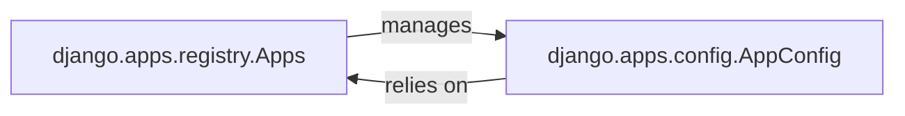

## Details

The `django.apps` subsystem is fundamental to Django's modular application structure. At its core, `django.apps.registry.Apps` serves as the central application registry, responsible for discovering, loading, and managing all installed Django applications. Each individual application is represented and configured by an instance of `django.apps.config.AppConfig`, which provides essential metadata and hooks for application-specific setup. The `Apps` component actively manages these `AppConfig` instances, ensuring they are properly initialized and accessible throughout the framework's lifecycle. Conversely, each `AppConfig` instance relies on the `Apps` registry to be recognized and integrated into the overall Django project, allowing its defined application logic and models to become part of the running application. This symbiotic relationship enables Django's extensible and pluggable architecture, where applications can be easily added, removed, or configured.

### django.apps.registry.Apps
This is the central registry and orchestrator for all installed Django applications. It acts as the single source of truth for application metadata and provides an API to access application-specific components (like models) once they are loaded. In the context of a Web Application Framework, it functions as the "application manager" or "plugin manager," ensuring all modular components (apps) are properly integrated and accessible to the framework.

**Related Classes/Methods**:

- <a href="https://github.com/django/django//blob/django/apps/registry.py" target="_blank" rel="noopener noreferrer">`django.apps.registry.Apps`</a>

### django.apps.config.AppConfig
This component serves as the dedicated configuration class for an individual Django application. It allows each application to declare its metadata (e.g., name, verbose name), specify its model location, and define application-specific setup logic (e.g., signal connections, admin registrations) that runs during the framework's startup. For a Web Application Framework, it acts as the "application descriptor" or "manifest," providing the necessary information and hooks for an application to integrate seamlessly into the framework's lifecycle.

**Related Classes/Methods**:

- <a href="https://github.com/django/django//blob/django/apps/config.py#L13-L274" target="_blank" rel="noopener noreferrer">`django.apps.config.AppConfig`:13-274</a>

### [FAQ](https://github.com/CodeBoarding/GeneratedOnBoardings/tree/main?tab=readme-ov-file#faq)