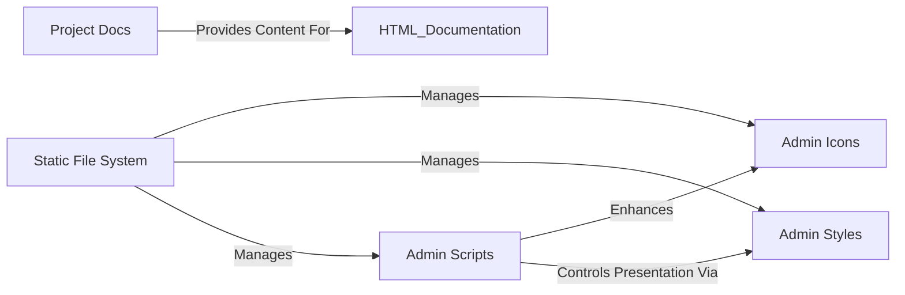

## Details

The Django project's frontend architecture primarily revolves around its built-in administrative interface and comprehensive documentation system. The administrative interface leverages dedicated Admin Icons, Admin Styles, and Admin Scripts to provide a rich and interactive user experience. These static assets are managed and served through Django's Static File System, which handles their collection and serving in production environments. Complementing the application, the Project Docs component provides extensive guides and references, generated from reStructuredText files, ensuring comprehensive understanding and usability of the framework.

### Admin Icons
Scalable Vector Graphics (SVG) files used for visual elements within the Django administration interface.

**Related Classes/Methods**:

- <a href="https://github.com/django/django/blob/main/django/contrib/admin/static/admin/img/icon-addlink.svg" target="_blank" rel="noopener noreferrer">`django/contrib/admin/static/admin/img/icon-addlink.svg`</a>
- <a href="https://github.com/django/django/blob/main/django/contrib/admin/static/admin/img/icon-calendar.svg" target="_blank" rel="noopener noreferrer">`django/contrib/admin/static/admin/img/icon-calendar.svg`</a>

### Admin Styles
Cascading Style Sheets (CSS) files that define the visual presentation and layout of the Django administration interface.

**Related Classes/Methods**:

- <a href="https://github.com/django/django/blob/main/django/contrib/admin/static/admin/css/base.css" target="_blank" rel="noopener noreferrer">`django/contrib/admin/static/admin/css/base.css`</a>
- <a href="https://github.com/django/django/blob/main/django/contrib/admin/static/admin/css/changelists.css" target="_blank" rel="noopener noreferrer">`django/contrib/admin/static/admin/css/changelists.css`</a>

### Admin Scripts
JavaScript files providing dynamic functionalities, interactive elements, and client-side logic for the Django administration interface.

**Related Classes/Methods**:

- <a href="https://github.com/django/django/blob/main/django/contrib/admin/static/admin/js/actions.js" target="_blank" rel="noopener noreferrer">`django/contrib/admin/static/admin/js/actions.js`</a>
- <a href="https://github.com/django/django/blob/main/django/contrib/admin/static/admin/js/admin/DateTimeShortcuts.js" target="_blank" rel="noopener noreferrer">`django/contrib/admin/static/admin/js/admin/DateTimeShortcuts.js`</a>

### Static File System
Django's built-in mechanism for collecting, managing, and serving static files (like icons, stylesheets, and JavaScript) in development and production environments.

**Related Classes/Methods**: _None_

### Project Docs
reStructuredText source files that comprise the official documentation for the Django project, which are compiled into HTML for user consumption.

**Related Classes/Methods**:

### [FAQ](https://github.com/CodeBoarding/GeneratedOnBoardings/tree/main?tab=readme-ov-file#faq)