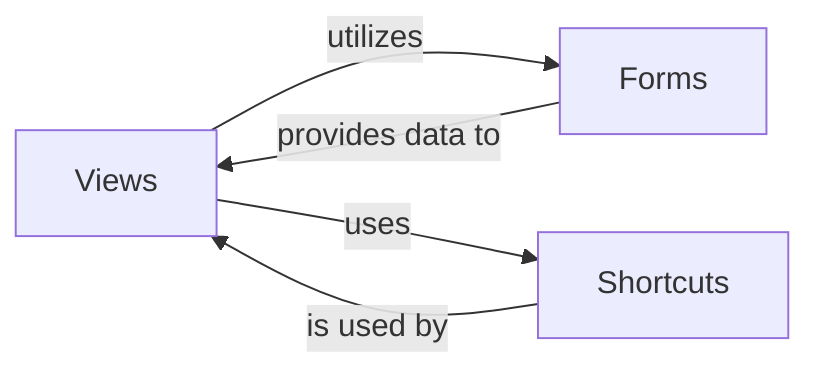

## Details

The Application Logic (Views & Forms) subsystem in Django primarily encompasses the Views, Forms, and Shortcuts components. These components are responsible for handling incoming web requests, processing user input, orchestrating business logic, and preparing data for presentation.

### Views
The core of Django's application logic, responsible for processing web requests, interacting with models to retrieve or manipulate data, and preparing the context for templates. Views encapsulate the business logic and act as the primary interface between the URL dispatcher and the data/presentation layers.

**Related Classes/Methods**:

- <a href="https://github.com/django/django/blob/main/django/views/__init__.py" target="_blank" rel="noopener noreferrer">`django.views`</a>

### Forms
Provides a robust framework for defining, validating, and processing user input submitted via HTML forms. It ensures data integrity and simplifies the conversion of raw HTTP request data into Python objects, bridging the gap between the user interface and the application's data models.

**Related Classes/Methods**:

- <a href="https://github.com/django/django/blob/main/django/forms/__init__.py" target="_blank" rel="noopener noreferrer">`django.forms`</a>

### Shortcuts
A collection of utility functions designed to simplify common patterns and reduce boilerplate code within views. These functions include operations like rendering templates, redirecting HTTP requests, or retrieving objects, thereby enhancing the efficiency and readability of view implementations.

**Related Classes/Methods**:

- <a href="https://github.com/django/django/blob/main/django/shortcuts.py" target="_blank" rel="noopener noreferrer">`django.shortcuts`</a>

### [FAQ](https://github.com/CodeBoarding/GeneratedOnBoardings/tree/main?tab=readme-ov-file#faq)