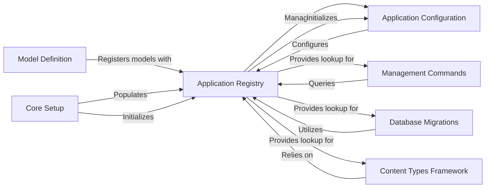

## Component Details

This is the final component overview for the Application Registry subsystem, detailing its structure, flow, and purpose, along with its interactions with other fundamental Django components.

### Application Registry
The `django.apps.registry.Apps` class is the central singleton instance that serves as the authoritative repository for all installed Django applications and their models. It maintains a comprehensive, thread-safe registry of `AppConfig` instances and all loaded models, providing cached lookup methods for efficient access. It's fundamental because it provides the authoritative state of the project's applications and models, enabling Django to understand its own structure and allowing other components to discover and interact with application components and models.

**Related Classes/Methods**:

- <a href="https://github.com/django/django/blob/master/django/apps/registry.py#L12-L433" target="_blank" rel="noopener noreferrer">`django.apps.registry.Apps` (12:433)</a>

### Application Configuration
Represented by `django.apps.config.AppConfig`, this component encapsulates the configuration and metadata for a single Django application. Each installed application has an `AppConfig` instance within the `Application Registry`, which holds properties like the application name, label, and path, and provides a `ready()` method for application-specific initialization logic. It's fundamental as it allows individual applications to be discoverable, configurable, and to define their initialization logic within the Django ecosystem.

**Related Classes/Methods**:

- <a href="https://github.com/django/django/blob/master/django/apps/config.py#L12-L273" target="_blank" rel="noopener noreferrer">`django.apps.config.AppConfig` (12:273)</a>

### Core Setup
The `django.setup()` function is the primary entry point for initializing the Django environment. Its critical role is to orchestrate the population of the `Application Registry` by invoking `Apps.populate()`, which in turn loads all installed applications and their models. This component is fundamental because no Django application can function without this initial setup, which builds the entire application and model graph, making the project's structure available to the rest of the framework.

**Related Classes/Methods**:

- <a href="https://github.com/django/django/blob/master/django/template/backends/django.py#L1-L1" target="_blank" rel="noopener noreferrer">`django.setup` (1:1)</a>

### Model Definition
The `django.db.models.base.ModelBase` is the metaclass responsible for creating all Django models. During the model creation process, it interacts directly with the `Application Registry` by calling `apps.register_model()` to register the newly defined model and associate it with its corresponding `AppConfig`. This component is fundamental because it ensures that all models, which are the core data structures of a Django application, are properly integrated into the application registry, making them accessible to the ORM and other Django features.

**Related Classes/Methods**:

- <a href="https://github.com/django/django/blob/master/django/db/models/base.py#L93-L457" target="_blank" rel="noopener noreferrer">`django.db.models.base.ModelBase` (93:457)</a>

### Management Commands
This module (`django.core.management`) provides the framework for Django's command-line utilities (e.g., `migrate`, `runserver`, `makemigrations`). These commands frequently interact with the `Application Registry` to discover and operate on installed applications and their models (e.g., `get_app_configs()`, `get_model()`). It's fundamental as it represents the primary interface for developers to manage and interact with their Django projects, relying on the registry for project introspection and access to the loaded application and model graph.

**Related Classes/Methods**:

- <a href="https://github.com/django/django/blob/master/django/template/backends/django.py#L1-L1" target="_blank" rel="noopener noreferrer">`django.core.management` (1:1)</a>

### Database Migrations
The `django.db.migrations` subsystem is responsible for handling schema changes to Django models. It heavily utilizes the `Application Registry` to discover migration modules for each application, resolve model references, and build the project's historical state for migration planning and application. This component is fundamental for maintaining database schema consistency and evolving the project's data model over time, as it needs a complete understanding of all models and their relationships, which is provided by the registry.

**Related Classes/Methods**:

- <a href="https://github.com/django/django/blob/master/django/template/backends/django.py#L1-L1" target="_blank" rel="noopener noreferrer">`django.db.migrations` (1:1)</a>

### Content Types Framework
The `django.contrib.contenttypes` framework provides a generic interface for working with different models across installed applications, often used for generic foreign keys. It critically relies on the `Application Registry`'s `get_model()` method to dynamically retrieve model classes based on their application label and model name. This component is fundamental as it showcases a powerful use case for the registry, enabling flexible and generic relationships between data, which is a common and powerful pattern in Django applications.

**Related Classes/Methods**:

- <a href="https://github.com/django/django/blob/master/django/template/backends/django.py#L1-L1" target="_blank" rel="noopener noreferrer">`django.contrib.contenttypes` (1:1)</a>

### [FAQ](https://github.com/CodeBoarding/GeneratedOnBoardings/tree/main?tab=readme-ov-file#faq)