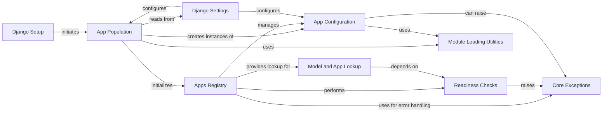

## Component Details

The `Apps Registry Core` subsystem is the foundational mechanism in Django for managing the lifecycle and metadata of all installed applications and their models. It ensures that Django has a complete and consistent view of the project's application structure, enabling features like model lookups, signal dispatching, and proper application initialization.

### Apps Registry
This is the central singleton class (`apps`) that acts as the authoritative repository for all `AppConfig` instances and their associated models. It orchestrates the entire application lifecycle, from initial loading to providing lookup mechanisms, and ensures models are fully loaded and ready before access. It's fundamental because it's the single source of truth for all registered applications and models.

**Related Classes/Methods**:

- <a href="https://github.com/django/django/blob/master/django/apps/registry.py#L12-L433" target="_blank" rel="noopener noreferrer">`django.apps.registry.Apps` (12:433)</a>

### App Configuration
This class represents the configuration and metadata for a single Django application. Each installed application has an `AppConfig` instance, which can define app-specific settings, signals, and a `ready()` method for initialization tasks. It's fundamental as it encapsulates the identity and behavior of individual applications within the registry.

**Related Classes/Methods**:

- <a href="https://github.com/django/django/blob/master/django/apps/config.py#L12-L273" target="_blank" rel="noopener noreferrer">`django.apps.config.AppConfig` (12:273)</a>

### App Population
This function is responsible for the discovery, loading, and initialization of all applications listed in `INSTALLED_APPS`. It iterates through the list, creates `AppConfig` instances, imports their models, and performs necessary readiness checks. It's fundamental because it's the primary mechanism that builds the `Apps Registry` during Django's startup.

**Related Classes/Methods**:

- <a href="https://github.com/django/django/blob/master/django/apps/registry.py#L0-L0" target="_blank" rel="noopener noreferrer">`django.apps.registry.populate` (0:0)</a>

### Model and App Lookup
These methods provide the public interface for retrieving registered models and `AppConfig` instances from the `Apps` registry. They include internal checks to ensure the registry is fully initialized. They are fundamental as they are the primary way other Django components and user code interact with the registry to access application and model information.

**Related Classes/Methods**:

- <a href="https://github.com/django/django/blob/master/django/apps/registry.py#L187-L212" target="_blank" rel="noopener noreferrer">`django.apps.registry.Apps.get_model` (187:212)</a>
- <a href="https://github.com/django/django/blob/master/django/apps/registry.py#L149-L164" target="_blank" rel="noopener noreferrer">`django.apps.registry.Apps.get_app_config` (149:164)</a>
- <a href="https://github.com/django/django/blob/master/django/apps/registry.py#L144-L147" target="_blank" rel="noopener noreferrer">`django.apps.registry.Apps.get_app_configs` (144:147)</a>

### Readiness Checks
These are internal methods within the `Apps` registry that verify whether all applications and their models have been fully loaded and are ready for use. They are crucial for maintaining the integrity of the application state and preventing operations on an uninitialized registry. They are fundamental for ensuring the stability and correctness of operations relying on the registry.

**Related Classes/Methods**:

- <a href="https://github.com/django/django/blob/master/django/apps/registry.py#L128-L137" target="_blank" rel="noopener noreferrer">`django.apps.registry.Apps.check_apps_ready` (128:137)</a>
- <a href="https://github.com/django/django/blob/master/django/apps/registry.py#L139-L142" target="_blank" rel="noopener noreferrer">`django.apps.registry.Apps.check_models_ready` (139:142)</a>

### Django Settings
The Django settings module provides configuration for the entire project, most notably the `INSTALLED_APPS` list. This list dictates which applications the `Apps Registry Core` needs to load and manage. It's fundamental because it provides the initial input that drives the entire app loading process.

**Related Classes/Methods**:

- <a href="https://github.com/django/django/blob/master/django/template/backends/django.py#L0-L0" target="_blank" rel="noopener noreferrer">`django.conf.settings` (0:0)</a>

### Core Exceptions
This module defines standard Django exceptions, including `AppRegistryNotReady`, which is specifically raised by the `Apps Registry` when an attempt is made to access it before it has been fully initialized. It's fundamental for signaling critical state issues and ensuring proper error handling during application startup.

**Related Classes/Methods**:

- <a href="https://github.com/django/django/blob/master/django/core/exceptions.py#L0-L0" target="_blank" rel="noopener noreferrer">`django.core.exceptions.AppRegistryNotReady` (0:0)</a>

### Module Loading Utilities
This utility module provides functions like `import_string` and `module_has_submodule` that are essential for dynamically importing modules and classes. It is heavily utilized during the app population phase to load `AppConfig` classes and their associated models. It's fundamental as it provides the dynamic loading capabilities necessary for Django's pluggable application architecture.

**Related Classes/Methods**:

- <a href="https://github.com/django/django/blob/master/django/utils/module_loading.py#L0-L0" target="_blank" rel="noopener noreferrer">`django.utils.module_loading` (0:0)</a>

### Django Setup
This is the main entry point for initializing the Django environment. It orchestrates the entire startup process, including calling `populate()` to load the apps registry, configuring settings, and performing other necessary setup tasks. It's fundamental because it's the top-level function that initiates and coordinates the entire app loading and registry initialization process.

**Related Classes/Methods**:

- <a href="https://github.com/django/django/blob/master/django/template/backends/django.py#L0-L0" target="_blank" rel="noopener noreferrer">`django.setup` (0:0)</a>

### [FAQ](https://github.com/CodeBoarding/GeneratedOnBoardings/tree/main?tab=readme-ov-file#faq)