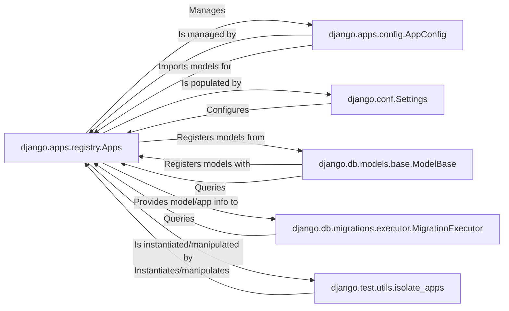

## Component Details

Overview of the Django Apps Registry subsystem, its core components, and their interactions.

### django.apps.registry.Apps
The central registry for all installed Django applications and their models. It is typically a singleton instance (`django.apps.apps`) that orchestrates the loading, configuration, and provides a unified interface for accessing information about applications and their models throughout the Django project lifecycle. It maintains internal mappings of app labels to `AppConfig` instances and app labels to model classes.

**Related Classes/Methods**:

- <a href="https://github.com/django/django/blob/master/django/apps/registry.py#L12-L433" target="_blank" rel="noopener noreferrer">`django.apps.registry.Apps` (12:433)</a>

### django.apps.config.AppConfig
A class representing the configuration and metadata for a single Django application. Each entry in `INSTALLED_APPS` corresponds to an `AppConfig` instance managed by the `Apps` registry. It encapsulates application-specific details like its name, label, filesystem path, and provides methods to access the models defined within that application. It also offers a `ready()` method for application-specific initialization code.

**Related Classes/Methods**:

- <a href="https://github.com/django/django/blob/master/django/apps/config.py#L12-L273" target="_blank" rel="noopener noreferrer">`django.apps.config.AppConfig` (12:273)</a>

### django.db.models.base.ModelBase
This is the metaclass for all Django models (`django.db.models.Model`). During the creation of any Django model class, `ModelBase.__new__` is invoked. A crucial responsibility of this metaclass is to register the newly created model class with the `Apps` registry, making it available for Django's ORM and other parts of the framework.

**Related Classes/Methods**:

- <a href="https://github.com/django/django/blob/master/django/db/models/base.py#L93-L457" target="_blank" rel="noopener noreferrer">`django.db.models.base.ModelBase` (93:457)</a>

### django.conf.Settings
Django's global configuration object, typically loaded from a project's `settings.py` file. It holds all project-wide settings, including `INSTALLED_APPS`, which is a list of strings specifying the Python paths to all applications enabled for the current Django project.

**Related Classes/Methods**:

- <a href="https://github.com/django/django/blob/master/django/template/backends/django.py#L0-L0" target="_blank" rel="noopener noreferrer">`django.conf.Settings` (0:0)</a>

### django.db.migrations.executor.MigrationExecutor
This component is responsible for executing database migrations, which involve applying or reverting schema changes. To perform its duties, `MigrationExecutor` queries the `Apps` registry to understand the current and target states of models and applications, ensuring that schema changes are applied correctly based on the defined models.

**Related Classes/Methods**:

- <a href="https://github.com/django/django/blob/master/django/db/migrations/executor.py#L9-L411" target="_blank" rel="noopener noreferrer">`django.db.migrations.executor.MigrationExecutor` (9:411)</a>

### django.test.utils.isolate_apps
A utility primarily used within Django's testing framework. It acts as a decorator or context manager to create an isolated `Apps` registry for the duration of a test. This isolation prevents test-specific model definitions or application configurations from interfering with the global `Apps` registry, ensuring that tests are independent and do not have side effects on other tests.

**Related Classes/Methods**:

- <a href="https://github.com/django/django/blob/master/django/test/utils.py#L910-L938" target="_blank" rel="noopener noreferrer">`django.test.utils.isolate_apps` (910:938)</a>

### [FAQ](https://github.com/CodeBoarding/GeneratedOnBoardings/tree/main?tab=readme-ov-file#faq)