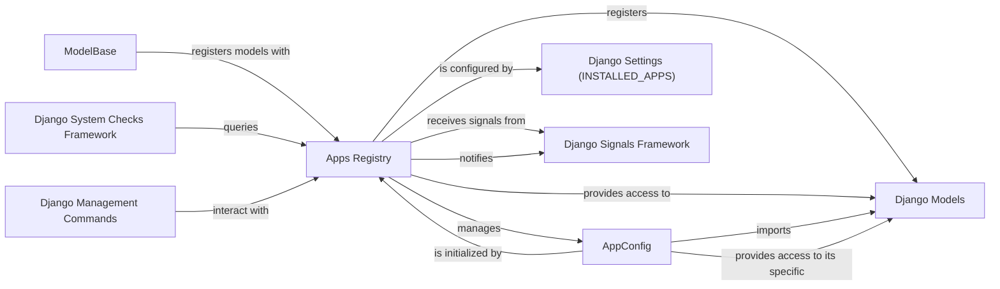

## Component Details

Overview of the `Apps` subsystem in Django, detailing its central components and their relationships.

### Apps Registry
The core registry responsible for loading, configuring, and managing all installed Django applications. It maintains a comprehensive map of AppConfig instances and all registered Django models, ensuring they are properly initialized and accessible throughout the project. Its populate() method orchestrates the entire application loading process.

**Related Classes/Methods**:

- <a href="https://github.com/django/django/blob/master/django/apps/registry.py#L12-L433" target="_blank" rel="noopener noreferrer">`django.apps.registry.Apps` (12:433)</a>
- <a href="https://github.com/django/django/blob/master/django/apps/registry.py#L60-L126" target="_blank" rel="noopener noreferrer">`django.apps.registry.Apps:populate` (60:126)</a>

### AppConfig
A class representing the configuration and metadata for a single Django application. Each installed application has an AppConfig instance that holds its name, label, path, and is responsible for importing its models and executing app-specific startup logic via its ready() method.

**Related Classes/Methods**:

- <a href="https://github.com/django/django/blob/master/django/apps/config.py#L12-L273" target="_blank" rel="noopener noreferrer">`django.apps.config.AppConfig` (12:273)</a>
- <a href="https://github.com/django/django/blob/master/django/apps/config.py#L270-L273" target="_blank" rel="noopener noreferrer">`django.apps.config.AppConfig:ready` (270:273)</a>

### Django Models
Python classes that define the structure of application data, typically mapping to database tables. These models are automatically registered with the Apps registry when they are imported, making them discoverable and manageable by Django.

**Related Classes/Methods**:

- `django.db.models.Model` (0:0)

### Django Settings (INSTALLED_APPS)
A crucial list defined in the project's settings.py file, specifying the Python paths to all applications that Django should load and enable for the current project. This setting directly dictates which AppConfig instances the Apps registry will process.

**Related Classes/Methods**:

- `INSTALLED_APPS` (0:0)

### ModelBase
The metaclass responsible for the creation of all Django model classes. During the model creation process, ModelBase.__new__ automatically calls the apps.register_model() method, ensuring that each new model class is added to the central Apps registry.

**Related Classes/Methods**:

- <a href="https://github.com/django/django/blob/master/django/db/models/base.py#L93-L457" target="_blank" rel="noopener noreferrer">`django.db.models.base.ModelBase` (93:457)</a>
- <a href="https://github.com/django/django/blob/master/django/db/models/base.py#L96-L388" target="_blank" rel="noopener noreferrer">`django.db.models.base.ModelBase:__new__` (96:388)</a>
- <a href="https://github.com/django/django/blob/master/django/apps/registry.py#L214-L239" target="_blank" rel="noopener noreferrer">`django.apps.registry.Apps:register_model` (214:239)</a>

### Django Signals Framework
A decoupled communication system within Django that allows different parts of the framework to send and receive notifications when specific actions occur. The Apps registry interacts with this framework, notably by responding to the setting_changed signal to re-initialize or clear caches.

**Related Classes/Methods**:

- <a href="https://github.com/django/django/blob/master/django/dispatch/dispatcher.py#L0-L0" target="_blank" rel="noopener noreferrer">`django.dispatch.dispatcher` (0:0)</a>
- `django.conf.signals.setting_changed` (0:0)

### Django System Checks Framework
A diagnostic tool that performs various checks on the Django project's configuration, installed applications, and models to identify common issues and potential problems. It queries the Apps registry to validate the state and integrity of applications and their models.

**Related Classes/Methods**:

- <a href="https://github.com/django/django/blob/master/django/core/checks/registry.py#L0-L0" target="_blank" rel="noopener noreferrer">`django.core.checks.registry` (0:0)</a>

### Django Management Commands
Command-line utilities (e.g., runserver, makemigrations, migrate) that developers use to interact with and manage their Django projects. Many of these commands depend on the Apps registry to access and manipulate loaded applications and models.

**Related Classes/Methods**:

- <a href="https://github.com/django/django/blob/master/django/template/backends/django.py#L0-L0" target="_blank" rel="noopener noreferrer">`django.core.management` (0:0)</a>

### [FAQ](https://github.com/CodeBoarding/GeneratedOnBoardings/tree/main?tab=readme-ov-file#faq)