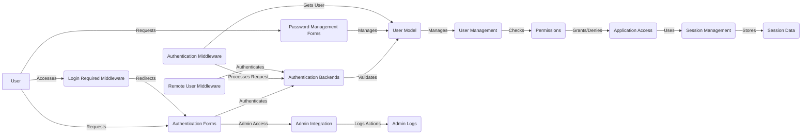

### Component Descriptions:

*   **User:** Represents the end-user interacting with the application. The user initiates requests that require authentication and authorization.
    *   **Relevant source files:** N/A (Represents an external entity)

*   **Authentication Forms:** Handles the presentation of login forms to the user and collects credentials. It validates the input and passes it to the authentication backends.
    *   **Purpose:** Provides a user interface for authentication.
    *   **Interactions:** Receives requests from the User, authenticates via Authentication Backends, and provides Admin Access.
    *   **Relevant source files:** `django.contrib.auth.forms.AuthenticationForm`, `django.contrib.auth.forms.AdminAuthenticationForm`

*   **Authentication Backends:** Validates user credentials against the User Model. It provides a pluggable way to authenticate users using different methods.
    *   **Purpose:** Authenticates users against different backends (e.g., database, LDAP).
    *   **Interactions:** Receives credentials from Authentication Forms, validates against User Model, and interacts with Permissions.
    *   **Relevant source files:** `django.contrib.auth.backends.ModelBackend`, `django.contrib.auth.backends.RemoteUserBackend`

*   **User Model:** Represents the user data and provides methods for user-related operations. It stores user information and manages relationships with permissions.
    *   **Purpose:** Stores and manages user data.
    *   **Interactions:** Validated by Authentication Backends, managed by User Management, and used by Permissions.
    *   **Relevant source files:** `django.contrib.auth.models.User`, `django.contrib.auth.models.AbstractUser`

*   **User Management:** Handles user creation, modification, and deletion. It provides methods for managing user accounts and their attributes.
    *   **Purpose:** Manages user accounts.
    *   **Interactions:** Manages the User Model and checks Permissions.
    *   **Relevant source files:** `django.contrib.auth.models.UserManager`

*   **Permissions:** Manages user permissions and determines whether a user has access to specific resources or functionalities. It checks permissions at both the object and module level.
    *   **Purpose:** Manages user permissions.
    *   **Interactions:** Checked by User Management and grants/denies access to Application Access.
    *   **Relevant source files:** `django.contrib.auth.models.PermissionsMixin`, `django.contrib.auth.models.Permission`

*   **Application Access:** Represents the application's resources and functionalities that are protected by authentication and authorization. It grants or denies access based on user permissions.
    *   **Purpose:** Controls access to application resources.
    *   **Interactions:** Granted/denied access based on Permissions and uses Session Management.
    *   **Relevant source files:** N/A (Represents the application's views and logic)

*   **Session Management:** Manages user sessions, storing session data and ensuring that users remain authenticated across multiple requests. It handles session creation, retrieval, and expiration.
    *   **Purpose:** Manages user sessions.
    *   **Interactions:** Used by Application Access and stores data in Session Data.
    *   **Relevant source files:** `django.contrib.sessions.middleware.SessionMiddleware`, `django.contrib.sessions.backends.db.SessionStore`

*   **Session Data:** Stores the actual session data, such as user ID and other session-related information. It is typically stored in a database or cache.
    *   **Purpose:** Stores session data.
    *   **Interactions:** Stores data for Session Management.
    *   **Relevant source files:** `django.contrib.sessions.models.Session`

*   **Admin Integration:** Integrates user management with the Django admin interface, providing a user-friendly way to manage users, groups, and permissions. It also logs user actions for auditing purposes.
    *   **Purpose:** Integrates user management with the Django admin interface.
    *   **Interactions:** Provides Admin Access from Authentication Forms and logs actions to Admin Logs.
    *   **Relevant source files:** `django.contrib.auth.admin`

*   **Admin Logs:** Stores logs of user actions performed in the Django admin interface. This allows administrators to track changes and audit user activity.
    *   **Purpose:** Stores logs of admin actions.
    *   **Interactions:** Receives logs from Admin Integration.
    *   **Relevant source files:** `django.contrib.admin.models.LogEntry`

*   **Password Management Forms:** Handles password change and reset functionalities through forms. It provides a user interface for managing passwords.
    *   **Purpose:** Manages password changes and resets.
    *   **Interactions:** Receives requests from the User and manages the User Model.
    *   **Relevant source files:** `django.contrib.auth.forms.PasswordChangeForm`, `django.contrib.auth.forms.PasswordResetForm`

*   **Login Required Middleware:** Redirects users to the login page if they try to access a login-required page. It ensures that only authenticated users can access certain resources.
    *   **Purpose:** Redirects unauthenticated users to the login page.
    *   **Interactions:** Redirects to Authentication Forms.
    *   **Relevant source files:** `django.contrib.auth.middleware.LoginRequiredMiddleware`

*   **Authentication Middleware:** Handles user authentication during request processing. It retrieves the user from the session and attaches it to the request.
    *   **Purpose:** Authenticates users during request processing.
    *   **Interactions:** Processes requests and gets the user from the User Model, authenticates via Authentication Backends.
    *   **Relevant source files:** `django.contrib.auth.middleware.AuthenticationMiddleware`

*   **Remote User Middleware:** Handles authentication for remote users, typically using HTTP headers. It allows authentication to be handled by an external system.
    *   **Purpose:** Authenticates remote users.
    *   **Interactions:** Authenticates via Authentication Backends.
    *   **Relevant source files:** `django.contrib.auth.middleware.RemoteUserMiddleware`