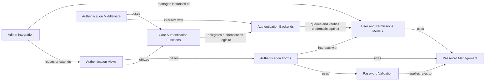

## Component Details

This component provides a robust and extensible framework for managing user accounts, authenticating users (verifying identities), and controlling their access to resources (authorization) based on permissions and groups. It integrates seamlessly with Django's session management and ORM.

### User and Permissions Models
This component defines the fundamental data structures for users, groups, and permissions. It provides abstract base classes (`AbstractBaseUser`, `AbstractUser`) that allow for customization of the user model, and a `PermissionsMixin` for granular permission management. This forms the bedrock upon which all authentication and authorization operations are built.

**Related Classes/Methods**:

- <a href="https://github.com/django/django/blob/master/django/contrib/auth/models.py#L0-L0" target="_blank" rel="noopener noreferrer">`django.contrib.auth.models` (0:0)</a>
- <a href="https://github.com/django/django/blob/master/django/contrib/auth/base_user.py#L0-L0" target="_blank" rel="noopener noreferrer">`django.contrib.auth.base_user` (0:0)</a>

### Authentication Backends
This component encapsulates the logic for authenticating users. Backends are pluggable mechanisms responsible for verifying user credentials (e.g., username and password) against various data sources. `ModelBackend` is the default, authenticating against the Django user model.

**Related Classes/Methods**:

- <a href="https://github.com/django/django/blob/master/django/contrib/auth/backends.py#L0-L0" target="_blank" rel="noopener noreferrer">`django.contrib.auth.backends` (0:0)</a>

### Password Management
This component ensures the secure storage and verification of user passwords. It includes various hashing algorithms (`hashers.py`) to prevent plain-text password storage and provides utilities for generating and checking one-time tokens for functionalities like password resets (`tokens.py`).

**Related Classes/Methods**:

- <a href="https://github.com/django/django/blob/master/django/contrib/auth/hashers.py#L0-L0" target="_blank" rel="noopener noreferrer">`django.contrib.auth.hashers` (0:0)</a>
- <a href="https://github.com/django/django/blob/master/django/contrib/auth/tokens.py#L0-L0" target="_blank" rel="noopener noreferrer">`django.contrib.auth.tokens` (0:0)</a>

### Authentication Views
This component offers pre-built Django views for common authentication-related tasks, such as user login, logout, password change, and password reset. These views handle the HTTP request/response cycle, rendering forms, processing submissions, and redirecting users.

**Related Classes/Methods**:

- <a href="https://github.com/django/django/blob/master/django/contrib/auth/views.py#L0-L0" target="_blank" rel="noopener noreferrer">`django.contrib.auth.views` (0:0)</a>

### Authentication Forms
This component provides Django `Form` classes specifically designed for user authentication, user creation, and password management. These forms are crucial for handling user input, performing data validation, and interacting with the user models and authentication backends.

**Related Classes/Methods**:

- <a href="https://github.com/django/django/blob/master/django/contrib/auth/forms.py#L0-L0" target="_blank" rel="noopener noreferrer">`django.contrib.auth.forms` (0:0)</a>

### Authentication Middleware
This component integrates the authentication system seamlessly into Django's request/response processing pipeline. The `AuthenticationMiddleware` is responsible for attaching the authenticated user object to the `request` object, making user information readily available throughout the application.

**Related Classes/Methods**:

- <a href="https://github.com/django/django/blob/master/django/contrib/auth/middleware.py#L0-L0" target="_blank" rel="noopener noreferrer">`django.contrib.auth.middleware` (0:0)</a>

### Password Validation
This component provides a flexible framework for enforcing password policies. It allows developers to define and apply rules for password strength, such as minimum length, character complexity requirements, and checks against common or easily guessable passwords.

**Related Classes/Methods**:

- <a href="https://github.com/django/django/blob/master/django/contrib/auth/password_validation.py#L0-L0" target="_blank" rel="noopener noreferrer">`django.contrib.auth.password_validation` (0:0)</a>

### Admin Integration
This component facilitates the integration of user and group management into the Django administration interface. It provides custom admin views (`UserAdmin`, `GroupAdmin`) for managing authentication-related models, leveraging Django's built-in permission system.

**Related Classes/Methods**:

- <a href="https://github.com/django/django/blob/master/django/contrib/auth/admin.py#L0-L0" target="_blank" rel="noopener noreferrer">`django.contrib.auth.admin` (0:0)</a>
- <a href="https://github.com/django/django/blob/master/django/contrib/admin/options.py#L0-L0" target="_blank" rel="noopener noreferrer">`django.contrib.admin.options` (0:0)</a>

### Core Authentication Functions
This component contains high-level utility functions that serve as the primary public API for interacting with the authentication system. These functions orchestrate the authentication process, including `authenticate()` (to verify credentials), `login()` (to establish a user session), `logout()` (to terminate a session), `get_user_model()` (to retrieve the active user model), and `get_user()` (to get the current user from the request).

**Related Classes/Methods**:

- <a href="https://github.com/django/django/blob/master/django/template/backends/django.py#L0-L0" target="_blank" rel="noopener noreferrer">`django.contrib.auth` (0:0)</a>
- <a href="https://github.com/django/django/blob/master/django/contrib/auth/decorators.py#L0-L0" target="_blank" rel="noopener noreferrer">`django.contrib.auth.decorators` (0:0)</a>
- <a href="https://github.com/django/django/blob/master/django/contrib/auth/mixins.py#L0-L0" target="_blank" rel="noopener noreferrer">`django.contrib.auth.mixins` (0:0)</a>

### [FAQ](https://github.com/CodeBoarding/GeneratedOnBoardings/tree/main?tab=readme-ov-file#faq)