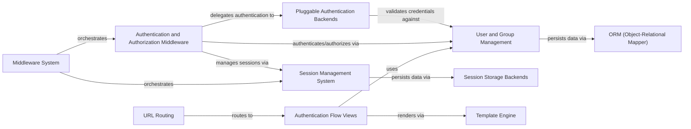

## Component Details

The Authentication & User Management subsystem provides a comprehensive framework for handling user identities, access control, and session persistence within the Django application. It orchestrates the flow from user login requests, through authentication and authorization checks, to the management of user sessions and the secure storage of user data. This system integrates with Django's core components like URL routing, middleware, ORM, and template engine to deliver a seamless and secure user experience.

### User and Group Management
Manages user and group data, including user creation, password hashing, and permission assignment. It defines the core models for users and groups within the Django authentication system.

**Related Classes/Methods**:

- <a href="https://github.com/django/django/blob/master/django/contrib/auth/models.py#L516-L525" target="_blank" rel="noopener noreferrer">`django.contrib.auth.models.User` (516:525)</a>
- <a href="https://github.com/django/django/blob/master/django/contrib/auth/models.py#L101-L136" target="_blank" rel="noopener noreferrer">`django.contrib.auth.models.Group` (101:136)</a>
- <a href="https://github.com/django/django/blob/master/django/contrib/auth/models.py#L38-L84" target="_blank" rel="noopener noreferrer">`django.contrib.auth.models.Permission` (38:84)</a>
- `django.contrib.auth.forms` (full file reference)
- `django.contrib.auth.hashers` (full file reference)
- `django.contrib.auth.password_validation` (full file reference)
- `django.contrib.auth.tokens` (full file reference)

### Authentication Flow Views
Provides the web interface for user authentication actions such as login, logout, password change, and password reset, handling the presentation and processing of user input.

**Related Classes/Methods**:

- `django.contrib.auth.views` (full file reference)

### Authentication and Authorization Middleware
Intercepts HTTP requests and responses to manage user authentication status, attach user objects to requests, and enforce access control based on user permissions.

**Related Classes/Methods**:

- `django.contrib.auth.middleware` (full file reference)

### Session Management System
Manages user sessions, including the creation, storage, and retrieval of session data, enabling persistent user states across multiple requests.

**Related Classes/Methods**:

- `django.contrib.sessions.middleware` (full file reference)
- <a href="https://github.com/django/django/blob/master/django/contrib/sessions/models.py#L7-L34" target="_blank" rel="noopener noreferrer">`django.contrib.sessions.models.Session` (7:34)</a>

### Session Storage Backends
Offers various pluggable mechanisms for persisting session data, such as storing sessions in a database, file system, or cache.

**Related Classes/Methods**:

- `django.contrib.sessions.backends` (full file reference)

### Pluggable Authentication Backends
Defines the interface and provides implementations for authenticating users against different sources, such as the database or external systems.

**Related Classes/Methods**:

- `django.contrib.auth.backends` (full file reference)

### Middleware System
The Middleware System provides a hook into Django's request/response processing. Middleware components can perform actions at various stages of the request lifecycle, such as modifying requests or responses, handling sessions, or enforcing security policies.

**Related Classes/Methods**:

- <a href="https://github.com/django/django/blob/master/django/middleware/common.py#L12-L114" target="_blank" rel="noopener noreferrer">`django.middleware.common.CommonMiddleware` (12:114)</a>

### URL Routing
The URL Routing component is responsible for mapping incoming HTTP request URLs to the appropriate view functions or class-based views within the Django application. It uses URL patterns to resolve the correct handler for a given request path.

**Related Classes/Methods**:

- `django.urls.resolvers.URLResolver` (full file reference)
- `django.urls.resolvers.URLPattern` (full file reference)
- <a href="https://github.com/django/django/blob/master/django/urls/conf.py#L16-L58" target="_blank" rel="noopener noreferrer">`django.urls.conf.include` (16:58)</a>

### ORM (Object-Relational Mapper)
The ORM component provides an abstraction layer for interacting with the database. It allows developers to define database models as Python classes and perform database operations using Python objects, abstracting away raw SQL queries.

**Related Classes/Methods**:

- `django.db.models.Model` (full file reference)
- `django.db.models.query.QuerySet` (full file reference)

### Template Engine
The Template Engine is responsible for rendering dynamic content into HTML or other text-based formats. It processes template files, inserts data provided by views, and generates the final output that is sent as part of the HTTP response.

**Related Classes/Methods**:

- <a href="https://github.com/django/django/blob/master/django/template/engine.py#L12-L213" target="_blank" rel="noopener noreferrer">`django.template.engine.Engine` (12:213)</a>
- <a href="https://github.com/django/django/blob/master/django/template/loader.py#L4-L18" target="_blank" rel="noopener noreferrer">`django.template.loader.get_template` (4:18)</a>

### [FAQ](https://github.com/CodeBoarding/GeneratedOnBoardings/tree/main?tab=readme-ov-file#faq)