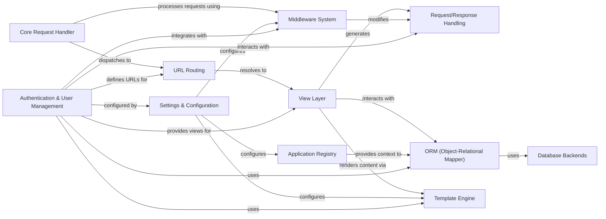

## Component Details

The 'Authentication & User Management' component provides a robust system for user authentication, authorization, and session management within the Django framework. It encompasses models for defining users and groups, views for handling common authentication flows like login, logout, and password management, and middleware components that manage user sessions and enforce permissions across HTTP requests. This component is crucial for securing the application and managing user access.

### Request/Response Handling
This component is responsible for encapsulating HTTP requests received by the Django application and constructing HTTP responses to be sent back to the client. It defines the fundamental objects for handling web communication.

**Related Classes/Methods**:

- <a href="https://github.com/django/django/blob/master/django/http/request.py#L52-L469" target="_blank" rel="noopener noreferrer">`django.http.request.HttpRequest` (52:469)</a>
- <a href="https://github.com/django/django/blob/master/django/http/response.py#L364-L434" target="_blank" rel="noopener noreferrer">`django.http.response.HttpResponse` (364:434)</a>

### URL Routing
The URL Routing component is responsible for mapping incoming HTTP request URLs to the appropriate view functions or class-based views within the Django application. It uses URL patterns to resolve the correct handler for a given request path.

**Related Classes/Methods**:

- <a href="https://github.com/django/django/blob/master/django/urls/resolvers.py#L1-L1" target="_blank" rel="noopener noreferrer">`django.urls.resolvers.URLResolver` (1:1)</a>
- <a href="https://github.com/django/django/blob/master/django/urls/resolvers.py#L1-L1" target="_blank" rel="noopener noreferrer">`django.urls.resolvers.URLPattern` (1:1)</a>
- <a href="https://github.com/django/django/blob/master/django/urls/conf.py#L16-L58" target="_blank" rel="noopener noreferrer">`django.urls.conf.include` (16:58)</a>

### View Layer
The View Layer processes incoming requests, interacts with the ORM to retrieve or manipulate data, and prepares the context data to be rendered by the template engine. It contains both function-based and class-based views, including generic views for common patterns.

**Related Classes/Methods**:

- <a href="https://github.com/django/django/blob/master/django/template/backends/django.py#L1-L1" target="_blank" rel="noopener noreferrer">`django.views.View` (1:1)</a>
- <a href="https://github.com/django/django/blob/master/django/views/generic/base.py#L221-L228" target="_blank" rel="noopener noreferrer">`django.views.generic.base.TemplateView` (221:228)</a>

### ORM (Object-Relational Mapper)
The ORM component provides an abstraction layer for interacting with the database. It allows developers to define database models as Python classes and perform database operations using Python objects, abstracting away raw SQL queries.

**Related Classes/Methods**:

- `django.db.models.Model` (1:1)
- <a href="https://github.com/django/django/blob/master/django/db/models/query.py#L1-L1" target="_blank" rel="noopener noreferrer">`django.db.models.query.QuerySet` (1:1)</a>

### Database Backends
This component provides the specific implementations for connecting to and interacting with different database systems (e.g., PostgreSQL, MySQL, SQLite). It handles the low-level details of database communication and query execution.

**Related Classes/Methods**:

- <a href="https://github.com/django/django/blob/master/django/db/backends/base/base.py#L29-L791" target="_blank" rel="noopener noreferrer">`django.db.backends.base.base.BaseDatabaseWrapper` (29:791)</a>

### Template Engine
The Template Engine is responsible for rendering dynamic content into HTML or other text-based formats. It processes template files, inserts data provided by views, and generates the final output that is sent as part of the HTTP response.

**Related Classes/Methods**:

- <a href="https://github.com/django/django/blob/master/django/template/engine.py#L12-L213" target="_blank" rel="noopener noreferrer">`django.template.engine.Engine` (12:213)</a>
- <a href="https://github.com/django/django/blob/master/django/template/loader.py#L4-L18" target="_blank" rel="noopener noreferrer">`django.template.loader.get_template` (4:18)</a>

### Application Registry
The Application Registry manages the configuration and metadata of all installed Django applications. It provides a central place to access information about models, signals, and other components registered by each application.

**Related Classes/Methods**:

- <a href="https://github.com/django/django/blob/master/django/apps/registry.py#L12-L433" target="_blank" rel="noopener noreferrer">`django.apps.registry.Apps` (12:433)</a>
- <a href="https://github.com/django/django/blob/master/django/apps/config.py#L12-L273" target="_blank" rel="noopener noreferrer">`django.apps.config.AppConfig` (12:273)</a>

### Settings & Configuration
This component handles the global settings and configurations for a Django project. It provides access to various parameters that control the behavior of the framework, such as database connections, installed apps, middleware, and template settings.

**Related Classes/Methods**:

- <a href="https://github.com/django/django/blob/master/django/template/backends/django.py#L1-L1" target="_blank" rel="noopener noreferrer">`django.conf.settings` (1:1)</a>

### Middleware System
The Middleware System provides a hook into Django's request/response processing. Middleware components can perform actions at various stages of the request lifecycle, such as modifying requests or responses, handling sessions, or enforcing security policies.

**Related Classes/Methods**:

- <a href="https://github.com/django/django/blob/master/django/middleware/common.py#L12-L114" target="_blank" rel="noopener noreferrer">`django.middleware.common.CommonMiddleware` (12:114)</a>
- <a href="https://github.com/django/django/blob/master/django/middleware/csrf.py#L1-L1" target="_blank" rel="noopener noreferrer">`django.middleware.csrf.CsrfViewMiddleware` (1:1)</a>

### Core Request Handler
The Core Request Handler is the central entry point for processing web requests in Django. It orchestrates the entire request-response cycle, dispatching requests to the appropriate URL resolvers, views, and middleware components.

**Related Classes/Methods**:

- <a href="https://github.com/django/django/blob/master/django/core/handlers/wsgi.py#L112-L143" target="_blank" rel="noopener noreferrer">`django.core.handlers.wsgi.WSGIHandler` (112:143)</a>
- <a href="https://github.com/django/django/blob/master/django/core/handlers/asgi.py#L138-L380" target="_blank" rel="noopener noreferrer">`django.core.handlers.asgi.ASGIHandler` (138:380)</a>

### Authentication & User Management
Provides a robust system for user authentication, authorization, and session management. It includes models for users and groups, views for login/logout, password management, and middleware for handling user sessions and permissions across requests.

**Related Classes/Methods**:

- <a href="https://github.com/django/django/blob/master/django/contrib/auth/models.py#L516-L525" target="_blank" rel="noopener noreferrer">`django.contrib.auth.models.User` (516:525)</a>
- <a href="https://github.com/django/django/blob/master/django/contrib/auth/models.py#L101-L136" target="_blank" rel="noopener noreferrer">`django.contrib.auth.models.Group` (101:136)</a>
- <a href="https://github.com/django/django/blob/master/django/contrib/auth/models.py#L38-L84" target="_blank" rel="noopener noreferrer">`django.contrib.auth.models.Permission` (38:84)</a>
- <a href="https://github.com/django/django/blob/master/django/contrib/auth/views.py#L1-L1" target="_blank" rel="noopener noreferrer">`django.contrib.auth.views` (1:1)</a>
- <a href="https://github.com/django/django/blob/master/django/contrib/auth/middleware.py#L1-L1" target="_blank" rel="noopener noreferrer">`django.contrib.auth.middleware` (1:1)</a>
- <a href="https://github.com/django/django/blob/master/django/contrib/sessions/middleware.py#L1-L1" target="_blank" rel="noopener noreferrer">`django.contrib.sessions.middleware` (1:1)</a>
- <a href="https://github.com/django/django/blob/master/django/contrib/sessions/backends/base.py#L1-L1" target="_blank" rel="noopener noreferrer">`django.contrib.sessions.backends.base.BaseSessionManager` (1:1)</a>
- <a href="https://github.com/django/django/blob/master/django/contrib/auth/backends.py#L1-L1" target="_blank" rel="noopener noreferrer">`django.contrib.auth.backends` (1:1)</a>
- <a href="https://github.com/django/django/blob/master/django/contrib/auth/forms.py#L1-L1" target="_blank" rel="noopener noreferrer">`django.contrib.auth.forms` (1:1)</a>
- <a href="https://github.com/django/django/blob/master/django/contrib/auth/hashers.py#L1-L1" target="_blank" rel="noopener noreferrer">`django.contrib.auth.hashers` (1:1)</a>
- <a href="https://github.com/django/django/blob/master/django/contrib/auth/password_validation.py#L1-L1" target="_blank" rel="noopener noreferrer">`django.contrib.auth.password_validation` (1:1)</a>
- <a href="https://github.com/django/django/blob/master/django/contrib/auth/tokens.py#L1-L1" target="_blank" rel="noopener noreferrer">`django.contrib.auth.tokens` (1:1)</a>
- <a href="https://github.com/django/django/blob/master/django/contrib/auth/mixins.py#L1-L1" target="_blank" rel="noopener noreferrer">`django.contrib.auth.mixins` (1:1)</a>
- <a href="https://github.com/django/django/blob/master/django/contrib/auth/admin.py#L1-L1" target="_blank" rel="noopener noreferrer">`django.contrib.auth.admin` (1:1)</a>

### [FAQ](https://github.com/CodeBoarding/GeneratedOnBoardings/tree/main?tab=readme-ov-file#faq)