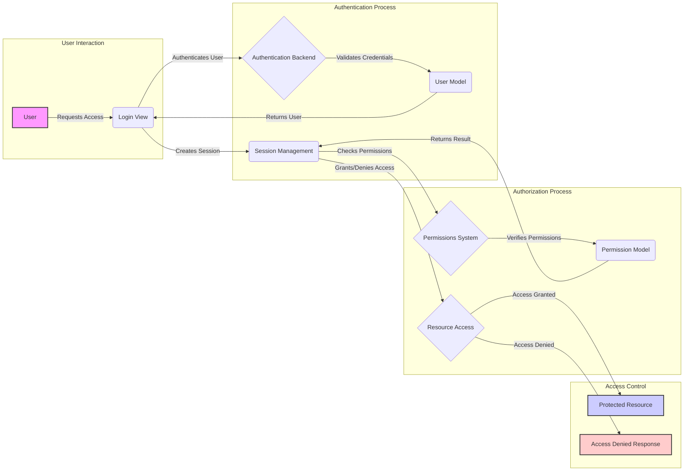

## Authentication and Authorization Flow

This diagram illustrates the flow of authentication and authorization within a Django application, focusing on the interaction between different components.

### Component Descriptions:

*   **User:** Represents the end-user interacting with the application. It initiates the process by requesting access to protected resources. **Relevant files:** N/A

*   **Login View:** Presents the login form to the user and handles the authentication process. It interacts with the Authentication Backend to validate user credentials. **Relevant files:** `django.contrib.auth.views.LoginView`, `django.contrib.auth.forms.AuthenticationForm`

*   **Authentication Backend:** Responsible for authenticating users based on provided credentials. It validates the credentials against the User Model. **Relevant files:** `django.contrib.auth.authenticate`, `django.contrib.auth.get_backends`, `django.contrib.auth.load_backend`

*   **User Model:** Represents the user data stored in the database. It provides methods for validating credentials and retrieving user information. **Relevant files:** `django.contrib.auth.models.User`, `django.contrib.auth.models.AbstractUser`

*   **Session Management:** Manages user sessions after successful authentication. It stores session data and provides mechanisms for tracking user activity. It checks permissions before granting access to resources. **Relevant files:** `django.contrib.sessions.middleware.SessionMiddleware`

*   **Permissions System:** Determines whether a user has the necessary permissions to access a specific resource. It interacts with the Permission Model to verify permissions. **Relevant files:** `django.contrib.auth.get_backends`, `django.contrib.auth.load_backend`, `django.contrib.auth.models.PermissionsMixin`

*   **Permission Model:** Represents the permissions that can be assigned to users or groups. It stores information about which users or groups have access to specific resources. **Relevant files:** `django.contrib.auth.models.Permission`

*   **Resource Access:** Represents the protected resource that the user is trying to access. It relies on the Session Management component to determine whether to grant or deny access. **Relevant files:** N/A

*   **Protected Resource:** The resource that the user is trying to access, which is only accessible after successful authentication and authorization. **Relevant files:** N/A

*   **Access Denied Response:** The response returned to the user when access to a resource is denied due to insufficient permissions. **Relevant files:** N/A