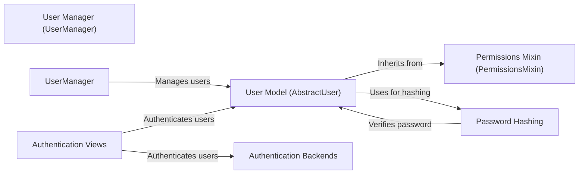

## Component Details

### User Model (AbstractUser)
The AbstractUser class serves as a base for custom user models in Django. It provides essential fields like username, email, first name, last name, password, and flags for active status and staff privileges. It inherits from AbstractBaseUser and PermissionsMixin, incorporating password management and permission handling capabilities. It interacts with UserManager for user creation and management.
- **Related Classes/Methods**: `django.contrib.auth.models.AbstractUser`

### User Manager (UserManager)
The UserManager class is responsible for managing user accounts, including creating new users and superusers. It provides methods for setting passwords, normalizing email addresses and usernames, and handling user-related queries. It is used by AbstractUser to perform user management operations.
- **Related Classes/Methods**: `django.contrib.auth.models.UserManager`

### Permissions Mixin (PermissionsMixin)
The PermissionsMixin class provides the necessary fields and methods for handling user permissions and group memberships. It includes fields for superuser status, group assignments, and individual user permissions. It is designed to be mixed into a user model, such as AbstractUser, to add permission-related functionality.
- **Related Classes/Methods**: `django.contrib.auth.models.PermissionsMixin`

### Authentication Views
Django provides a set of built-in views for handling common authentication tasks such as login, logout, password reset, and password change. These views use forms to interact with the user and authentication backends to validate credentials and manage user sessions. They interact with the User model and authentication backends to authenticate users and manage their sessions.
- **Related Classes/Methods**: `django.contrib.auth.views.LoginView`, `django.contrib.auth.views.LogoutView`, `django.contrib.auth.views.PasswordResetView`, `django.contrib.auth.views.PasswordResetConfirmView`, `django.contrib.auth.views.PasswordChangeView`

### Password Hashing
Django's password hashing system provides a secure way to store user passwords. It uses various hashing algorithms, such as PBKDF2, Argon2, and bcrypt, to generate irreversible hashes of passwords. The system also includes functions for verifying passwords against their hashes. It interacts with the User model to store and verify passwords.
- **Related Classes/Methods**: `django.contrib.auth.hashers.make_password`, `django.contrib.auth.hashers.verify_password`, `django.contrib.auth.hashers.PBKDF2PasswordHasher`, `django.contrib.auth.hashers.Argon2PasswordHasher`, `django.contrib.auth.hashers.BCryptSHA256PasswordHasher`

### Authentication Backends
Authentication backends are pluggable modules that define how users are authenticated. Django provides a default backend that authenticates users against the database, but custom backends can be created to authenticate against other sources, such as LDAP or social media providers. They interact with the Authentication Views to authenticate users.
- **Related Classes/Methods**: `django.contrib.auth.backends`
