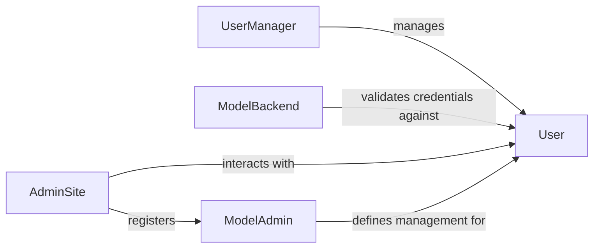

## Details

The `Authentication & Admin` subsystem encompasses all functionalities related to user authentication, authorization, and the administrative interface for managing application data within the Django framework.

### User
Represents the core user model, storing user credentials (username, password hash), permissions, and other user-related data. It is the primary entity for user identification and authorization.

**Related Classes/Methods**:

- <a href="https://github.com/django/django//blob/django/contrib/auth/models.py#L517-L526" target="_blank" rel="noopener noreferrer">`django.contrib.auth.models.User`:517-526</a>

### UserManager
A custom manager for the `User` model, providing methods to create, retrieve, and manage `User` instances, including standard users and superusers. It extends Django's ORM capabilities for user-specific operations.

**Related Classes/Methods**:

- <a href="https://github.com/django/django//blob/django/contrib/auth/models.py#L140-L239" target="_blank" rel="noopener noreferrer">`django.contrib.auth.models.UserManager`:140-239</a>

### ModelBackend
An authentication backend that verifies user credentials (e.g., username and password) against the `User` model. It's responsible for authenticating users during login processes.

**Related Classes/Methods**:

- <a href="https://github.com/django/django//blob/django/contrib/auth/backends.py#L54-L242" target="_blank" rel="noopener noreferrer">`django.contrib.auth.backends.ModelBackend`:54-242</a>

### AdminSite
The central registry and controller for the Django administration interface. It manages the registration of Django models and their corresponding `ModelAdmin` configurations, orchestrating the overall admin site functionality.

**Related Classes/Methods**:

- <a href="https://github.com/django/django//blob/django/contrib/admin/sites.py#L30-L606" target="_blank" rel="noopener noreferrer">`django.contrib.admin.sites.AdminSite`:30-606</a>

### ModelAdmin
A configuration class that defines how a specific Django model should be displayed, edited, and managed within the Django admin interface. It allows customization of list displays, search fields, form fields, and other admin-specific behaviors for a given model.

**Related Classes/Methods**:

- <a href="https://github.com/django/django//blob/django/contrib/admin/options.py#L635-L2341" target="_blank" rel="noopener noreferrer">`django.contrib.admin.options.ModelAdmin`:635-2341</a>

### [FAQ](https://github.com/CodeBoarding/GeneratedOnBoardings/tree/main?tab=readme-ov-file#faq)