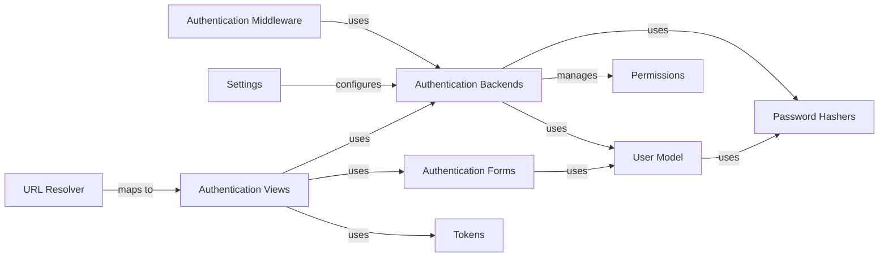

## Component Details

This overview focuses on the Authentication Backends subsystem within Django's authentication framework, detailing its structure, flow, and purpose, along with its interactions with other fundamental components.

### Authentication Backends
A flexible, pluggable system (ModelBackend) that defines the core logic for authenticating users. It allows Django to verify user credentials against various sources, such as the database (default ModelBackend). It also handles user permission retrieval.

**Related Classes/Methods**:

- <a href="https://github.com/django/django/blob/master/django/contrib/auth/backends.py#L0-L0" target="_blank" rel="noopener noreferrer">`django.contrib.auth.backends` (0:0)</a>

### User Model
Defines the structure and behavior of user accounts, including fields for username, password, email, and permissions. It is the primary entity against which authentication backends verify credentials and manage user data.

**Related Classes/Methods**:

- <a href="https://github.com/django/django/blob/master/django/contrib/auth/models.py#L0-L0" target="_blank" rel="noopener noreferrer">`django.contrib.auth.models` (0:0)</a>

### Password Hashers
Provides utilities for securely hashing and verifying user passwords, ensuring that passwords are not stored in plain text. The User Model relies on these hashers.

**Related Classes/Methods**:

- <a href="https://github.com/django/django/blob/master/django/contrib/auth/hashers.py#L0-L0" target="_blank" rel="noopener noreferrer">`django.contrib.auth.hashers` (0:0)</a>

### Authentication Middleware
A middleware component that processes incoming requests to authenticate users and attach the authenticated user object to the HttpRequest object. It orchestrates the use of configured authentication backends.

**Related Classes/Methods**:

- <a href="https://github.com/django/django/blob/master/django/contrib/auth/middleware.py#L0-L0" target="_blank" rel="noopener noreferrer">`django.contrib.auth.middleware` (0:0)</a>

### Settings
Django's configuration system, defining various settings for an application, including the list of active authentication backends (AUTHENTICATION_BACKENDS).

**Related Classes/Methods**:

- <a href="https://github.com/django/django/blob/master/tests/flatpages_tests/settings.py#L0-L0" target="_blank" rel="noopener noreferrer">`settings` (0:0)</a>

### Authentication Views
Pre-built views for common authentication tasks like login, logout, password change, and password reset, simplifying the development of authentication flows. These views interact with the authentication system.

**Related Classes/Methods**:

- <a href="https://github.com/django/django/blob/master/django/contrib/auth/views.py#L0-L0" target="_blank" rel="noopener noreferrer">`django.contrib.auth.views` (0:0)</a>

### Authentication Forms
Provides forms for user-related operations such as login, user creation, and password changes, handling input validation and interaction with the User Model.

**Related Classes/Methods**:

- <a href="https://github.com/django/django/blob/master/django/contrib/auth/forms.py#L0-L0" target="_blank" rel="noopener noreferrer">`django.contrib.auth.forms` (0:0)</a>

### Permissions
Represents the granular access control system in Django. While primarily for authorization, Authentication Backends (like ModelBackend) are responsible for retrieving and managing user and group permissions.

**Related Classes/Methods**:

- <a href="https://github.com/django/django/blob/master/django/contrib/auth/models.py#L0-L0" target="_blank" rel="noopener noreferrer">`django.contrib.auth.models` (0:0)</a>

### Tokens
Provides utilities for generating and checking one-time tokens, primarily used for secure password reset functionality. Used by authentication views.

**Related Classes/Methods**:

- <a href="https://github.com/django/django/blob/master/django/contrib/auth/tokens.py#L0-L0" target="_blank" rel="noopener noreferrer">`django.contrib.auth.tokens` (0:0)</a>

### URL Resolver
Django's mechanism for mapping URLs to views, enabling access to authentication-related views.

**Related Classes/Methods**:

- <a href="https://github.com/django/django/blob/master/django/template/backends/django.py#L0-L0" target="_blank" rel="noopener noreferrer">`django.urls` (0:0)</a>

### [FAQ](https://github.com/CodeBoarding/GeneratedOnBoardings/tree/main?tab=readme-ov-file#faq)