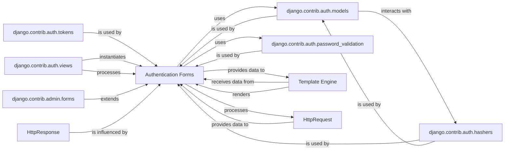

## Component Details

This section provides a detailed overview of the `Authentication Forms` component within Django's authentication subsystem, outlining its structure, flow, and purpose, along with its interactions with other fundamental components.

### Authentication Forms
Django `Form` classes (e.g., `AuthenticationForm`, `UserCreationForm`, `PasswordChangeForm`, `SetPasswordForm`, `PasswordResetForm`) designed to handle user input for authentication-related actions. They are responsible for data collection, validation, cleaning, and error handling, serving as the primary interface for user credential submission and management.

**Related Classes/Methods**:

- `Authentication Forms` (0:0)

### django.contrib.auth.models
Django's built-in user and group models, primarily the `User` model. This component defines the structure for storing user credentials, permissions, and other related information in the database.

**Related Classes/Methods**:

- <a href="https://github.com/django/django/blob/master/django/contrib/auth/models.py#L0-L0" target="_blank" rel="noopener noreferrer">`django.contrib.auth.models` (0:0)</a>

### django.contrib.auth.hashers
This module provides utilities for securely hashing and verifying user passwords. It ensures that passwords are not stored in plain text, enhancing security.

**Related Classes/Methods**:

- <a href="https://github.com/django/django/blob/master/django/contrib/auth/hashers.py#L0-L0" target="_blank" rel="noopener noreferrer">`django.contrib.auth.hashers` (0:0)</a>

### django.contrib.auth.password_validation
This module is responsible for enforcing password policies, providing functions to validate password strength, complexity, and common patterns.

**Related Classes/Methods**:

- <a href="https://github.com/django/django/blob/master/django/contrib/auth/password_validation.py#L0-L0" target="_blank" rel="noopener noreferrer">`django.contrib.auth.password_validation` (0:0)</a>

### django.contrib.auth.tokens
This module generates and validates one-time use tokens, primarily utilized for secure password reset links sent to users.

**Related Classes/Methods**:

- <a href="https://github.com/django/django/blob/master/django/contrib/auth/tokens.py#L0-L0" target="_blank" rel="noopener noreferrer">`django.contrib.auth.tokens` (0:0)</a>

### django.contrib.auth.views
Django's built-in authentication views (e.g., `LoginView`, `PasswordChangeView`, `PasswordResetView`). These views handle the HTTP request/response cycle, instantiate, and process authentication forms.

**Related Classes/Methods**:

- <a href="https://github.com/django/django/blob/master/django/contrib/auth/views.py#L0-L0" target="_blank" rel="noopener noreferrer">`django.contrib.auth.views` (0:0)</a>

### django.contrib.admin.forms
This component contains forms specifically designed for the Django administration interface. These forms often extend or reuse components from `django.contrib.auth.forms` for managing users and their authentication details within the admin site.

**Related Classes/Methods**:

- <a href="https://github.com/django/django/blob/master/django/contrib/admin/forms.py#L0-L0" target="_blank" rel="noopener noreferrer">`django.contrib.admin.forms` (0:0)</a>

### Template Engine
Django's templating system, responsible for rendering dynamic content, including HTML forms, into a final response that is sent to the user's browser.

**Related Classes/Methods**: _None_

### HttpRequest
An object representing an incoming HTTP request from a client. It encapsulates all request-related information, including submitted form data, headers, and user session.

**Related Classes/Methods**: _None_

### HttpResponse
An object representing an outgoing HTTP response sent back to the client. It contains the rendered content (e.g., HTML form, success message) or instructions for the browser (e.g., redirects).

**Related Classes/Methods**: _None_

### [FAQ](https://github.com/CodeBoarding/GeneratedOnBoardings/tree/main?tab=readme-ov-file#faq)