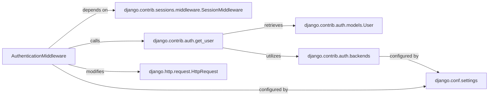

## Component Details

This subsystem focuses on the core mechanism by which Django identifies and associates an authenticated user with an incoming HTTP request. The `AuthenticationMiddleware` acts as the central orchestrator, leveraging several other fundamental Django components to achieve this.

### AuthenticationMiddleware
This middleware class is the entry point for user authentication in Django's request-response cycle. It intercepts every incoming `HttpRequest` and, if a session exists, attempts to retrieve and attach the corresponding `User` object (or an `AnonymousUser` if not authenticated) to `request.user`. This makes user information universally accessible to views, templates, and other middleware.

**Related Classes/Methods**:

- `AuthenticationMiddleware` (0:0)

### django.contrib.auth.get_user
A utility function directly invoked by `AuthenticationMiddleware`. Its responsibility is to retrieve the `User` object associated with the current session. It does this by looking up the user ID stored in the session and then using the configured authentication backends to fetch the actual user instance.

**Related Classes/Methods**:

- `django.contrib.auth.get_user` (0:0)

### django.http.request.HttpRequest
The fundamental object representing an incoming HTTP request. `AuthenticationMiddleware` directly modifies this object by adding the `user` attribute, which holds the authenticated `User` instance.

**Related Classes/Methods**:

- <a href="https://github.com/django/django/blob/master/django/http/request.py#L52-L480" target="_blank" rel="noopener noreferrer">`django.http.request.HttpRequest` (52:480)</a>

### django.contrib.auth.models.User
Represents an authenticated user in the Django application. This model (or a custom model defined by `AUTH_USER_MODEL`) is the type of object that `request.user` is populated with by `AuthenticationMiddleware` via `get_user`.

**Related Classes/Methods**:

- <a href="https://github.com/django/django/blob/master/django/contrib/auth/models.py#L516-L525" target="_blank" rel="noopener noreferrer">`django.contrib.auth.models.User` (516:525)</a>

### django.contrib.sessions.middleware.SessionMiddleware
This middleware is responsible for enabling session support in Django. `AuthenticationMiddleware` explicitly depends on it, as user authentication state is typically stored in the session. Without `SessionMiddleware`, `AuthenticationMiddleware` cannot function correctly.

**Related Classes/Methods**:

- <a href="https://github.com/django/django/blob/master/django/contrib/sessions/middleware.py#L11-L76" target="_blank" rel="noopener noreferrer">`django.contrib.sessions.middleware.SessionMiddleware` (11:76)</a>

### django.contrib.auth.backends
A module containing classes that define how users are authenticated (e.g., by username and password, or via external systems). The `get_user` function implicitly relies on these configured backends to validate credentials and retrieve `User` objects.

**Related Classes/Methods**:

- <a href="https://github.com/django/django/blob/master/django/contrib/auth/backends.py#L0-L0" target="_blank" rel="noopener noreferrer">`django.contrib.auth.backends` (0:0)</a>

### django.conf.settings
Django's global settings object. It influences `AuthenticationMiddleware`'s behavior, particularly through the `MIDDLEWARE` setting (which dictates the order of middleware, ensuring `SessionMiddleware` runs before `AuthenticationMiddleware`) and `AUTHENTICATION_BACKENDS` (which lists the backends `get_user` will use).

**Related Classes/Methods**:

- <a href="https://github.com/django/django/blob/master/django/template/backends/django.py#L0-L0" target="_blank" rel="noopener noreferrer">`django.conf.settings` (0:0)</a>

### [FAQ](https://github.com/CodeBoarding/GeneratedOnBoardings/tree/main?tab=readme-ov-file#faq)