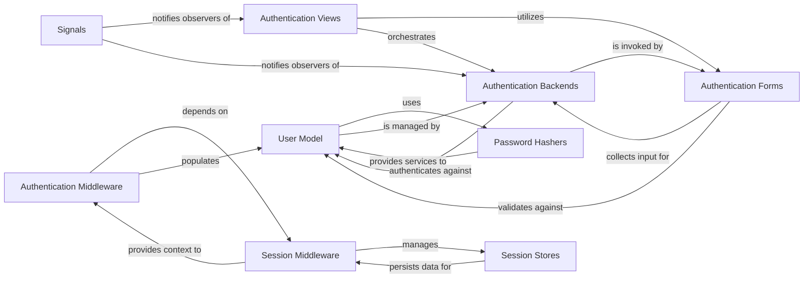

## Component Details

This component provides a comprehensive system for user authentication (verifying user identity), authorization (managing permissions), and maintaining user-specific state across multiple HTTP requests (sessions). It includes pluggable backends for various authentication methods and session storage mechanisms.

### User Model
The core data models (`AbstractBaseUser`, `User`) that define how user accounts are structured and stored in the database. `AbstractBaseUser` provides fundamental user fields and methods for password management and authentication status.

**Related Classes/Methods**:

- <a href="https://github.com/django/django/blob/master/django/contrib/auth/models.py#L0-L0" target="_blank" rel="noopener noreferrer">`django/contrib/auth/models.py` (0:0)</a>
- <a href="https://github.com/django/django/blob/master/django/contrib/auth/base_user.py#L0-L0" target="_blank" rel="noopener noreferrer">`django/contrib/auth/base_user.py` (0:0)</a>

### Password Hashers
A collection of classes (e.g., `PBKDF2PasswordHasher`) that implement secure cryptographic hashing algorithms for user passwords. This component ensures that passwords are never stored in plaintext, enhancing security.

**Related Classes/Methods**:

- <a href="https://github.com/django/django/blob/master/django/contrib/auth/hashers.py#L0-L0" target="_blank" rel="noopener noreferrer">`django/contrib/auth/hashers.py` (0:0)</a>

### Authentication Backends
A flexible, pluggable system (`ModelBackend`) that defines the logic for authenticating users. It allows Django to verify user credentials against various sources, such as the database (default `ModelBackend`).

**Related Classes/Methods**:

- <a href="https://github.com/django/django/blob/master/django/contrib/auth/backends.py#L0-L0" target="_blank" rel="noopener noreferrer">`django/contrib/auth/backends.py` (0:0)</a>

### Authentication Forms
Django `Form` classes (e.g., `AuthenticationForm`) designed to handle user input for authentication-related actions, including validation and data cleaning. They serve as the interface for user credential submission.

**Related Classes/Methods**:

- <a href="https://github.com/django/django/blob/master/django/contrib/auth/forms.py#L0-L0" target="_blank" rel="noopener noreferrer">`django/contrib/auth/forms.py` (0:0)</a>

### Authentication Views
Pre-built generic views (e.g., `LoginView`, `LogoutView`) that handle common user-facing authentication flows. These views abstract away much of the boilerplate code for login, logout, password changes, and password resets.

**Related Classes/Methods**:

- <a href="https://github.com/django/django/blob/master/django/contrib/auth/views.py#L0-L0" target="_blank" rel="noopener noreferrer">`django/contrib/auth/views.py` (0:0)</a>

### Authentication Middleware
A middleware class (`AuthenticationMiddleware`) that processes every incoming HTTP request. Its primary responsibility is to populate the `request.user` attribute with the authenticated `User` object, making user information readily available to views and templates.

**Related Classes/Methods**:

- <a href="https://github.com/django/django/blob/master/django/contrib/auth/middleware.py#L0-L0" target="_blank" rel="noopener noreferrer">`django/contrib/auth/middleware.py` (0:0)</a>

### Session Middleware
A middleware class (`SessionMiddleware`) that manages the lifecycle of session data for each request. It loads existing session data from the session store at the beginning of a request and saves any modified session data back to the store at the end, providing the `request.session` dictionary.

**Related Classes/Methods**:

- <a href="https://github.com/django/django/blob/master/django/contrib/sessions/middleware.py#L0-L0" target="_blank" rel="noopener noreferrer">`django/contrib/sessions/middleware.py` (0:0)</a>

### Session Stores
A set of classes (e.g., `SessionBase`, `DbSessionStore`) that define the underlying mechanism for storing and retrieving session data. `SessionBase` provides the abstract interface, while concrete implementations handle storage in databases, caches, files, or signed cookies.

**Related Classes/Methods**:

- <a href="https://github.com/django/django/blob/master/django/contrib/sessions/backends/base.py#L0-L0" target="_blank" rel="noopener noreferrer">`django/contrib/sessions/backends/base.py` (0:0)</a>
- <a href="https://github.com/django/django/blob/master/django/contrib/sessions/backends/db.py#L0-L0" target="_blank" rel="noopener noreferrer">`django/contrib/sessions/backends/db.py` (0:0)</a>

### Signals
A set of Django signals (`user_logged_in`, `user_logged_out`, `user_login_failed`) that are emitted at various points during the authentication process. These signals allow other parts of the application to react to authentication events in a decoupled manner.

**Related Classes/Methods**:

- <a href="https://github.com/django/django/blob/master/django/contrib/auth/signals.py#L0-L0" target="_blank" rel="noopener noreferrer">`django/contrib/auth/signals.py` (0:0)</a>

### [FAQ](https://github.com/CodeBoarding/GeneratedOnBoardings/tree/main?tab=readme-ov-file#faq)