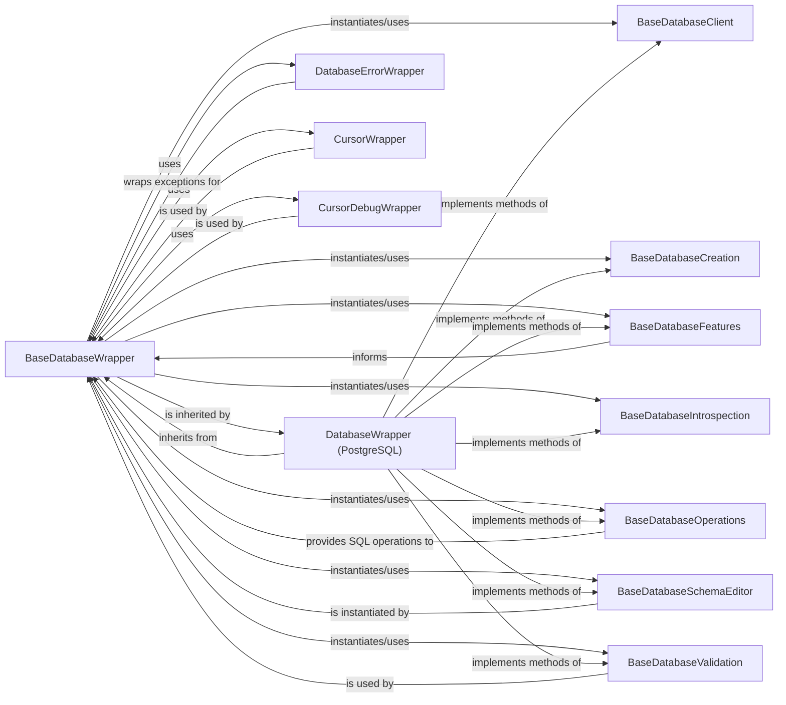

## Component Details

This analysis focuses on the `BaseDatabaseWrapper` component, which is central to Django's database abstraction layer. It defines the fundamental interface and core functionalities for all database connections, enabling Django to interact with various database systems uniformly. These components are fundamental because they collectively form the robust and extensible foundation of Django's Object-Relational Mapper (ORM) and its interaction with various database systems. `BaseDatabaseWrapper` is the abstraction core. `DatabaseWrapper (PostgreSQL)` (and its siblings for other databases) are the concrete implementations. `DatabaseErrorWrapper` ensures consistent error handling. `CursorWrapper` and `CursorDebugWrapper` are essential for query execution and introspection. `BaseDatabaseValidation`, `BaseDatabaseFeatures`, `BaseDatabaseOperations`, and `BaseDatabaseSchemaEditor` are crucial for database adaptability and management. Together, these components ensure that Django can reliably and efficiently connect to, query, and manage data across diverse database environments, making the database layer both powerful and flexible.

### BaseDatabaseWrapper
The abstract base class for all Django database backends. It defines the common interface for establishing and closing database connections, creating cursors, executing SQL, and managing transaction states (commit, rollback, savepoints). It also handles connection pooling, thread safety, and health checks.

**Related Classes/Methods**:

- `BaseDatabaseWrapper` (1:1)

### DatabaseWrapper (PostgreSQL)
A concrete implementation of `BaseDatabaseWrapper` specifically for PostgreSQL databases. It overrides abstract methods to provide PostgreSQL-specific logic for connection parameters, cursor creation, transaction management, and data type mappings. This component represents any concrete database backend implementation (e.g., MySQL, SQLite).

**Related Classes/Methods**:

- `DatabaseWrapper` (1:1)

### DatabaseErrorWrapper
A context manager used by `BaseDatabaseWrapper` to catch backend-specific database exceptions and re-raise them as Django's common `DatabaseError`. This ensures consistent error handling across different database backends.

**Related Classes/Methods**:

- `DatabaseErrorWrapper` (1:1)

### CursorWrapper
A basic wrapper around database cursors, providing a standardized interface for executing SQL queries. `BaseDatabaseWrapper` uses this to create cursors for database interaction.

**Related Classes/Methods**:

- `CursorWrapper` (1:1)

### CursorDebugWrapper
An extension of `CursorWrapper` that logs all executed SQL queries when Django's debug mode is enabled or explicitly forced. This is crucial for debugging and performance analysis.

**Related Classes/Methods**:

- `CursorDebugWrapper` (1:1)

### BaseDatabaseValidation
The base class for database-specific validation logic. Concrete database wrappers implement this to perform checks on database settings and compatibility.

**Related Classes/Methods**:

- `BaseDatabaseValidation` (1:1)

### BaseDatabaseFeatures
Defines the capabilities and features supported by a specific database backend (e.g., support for savepoints, JSON fields, etc.). `BaseDatabaseWrapper` uses this to adapt its behavior based on the database's capabilities.

**Related Classes/Methods**:

- `BaseDatabaseFeatures` (1:1)

### BaseDatabaseOperations
Provides database-specific SQL operations and utilities, such as quoting identifiers, handling date/time functions, and managing transactions. `BaseDatabaseWrapper` delegates certain SQL generation tasks to this component.

**Related Classes/Methods**:

- `BaseDatabaseOperations` (1:1)

### BaseDatabaseSchemaEditor
The base class for database-specific schema manipulation. It defines methods for creating, altering, and dropping tables, columns, and indexes, forming the core of Django's migration system. `BaseDatabaseWrapper` provides access to an instance of this class.

**Related Classes/Methods**:

- `BaseDatabaseSchemaEditor` (1:1)

### BaseDatabaseClient
The base class for database-specific client utilities, such as running the database's command-line client.

**Related Classes/Methods**:

- `BaseDatabaseClient` (1:1)

### BaseDatabaseCreation
The base class for database-specific creation and destruction of databases and test databases.

**Related Classes/Methods**:

- `BaseDatabaseCreation` (1:1)

### BaseDatabaseIntrospection
The base class for database-specific introspection, allowing Django to inspect the database schema and retrieve information about tables, columns, and indexes.

**Related Classes/Methods**:

- `BaseDatabaseIntrospection` (1:1)

### [FAQ](https://github.com/CodeBoarding/GeneratedOnBoardings/tree/main?tab=readme-ov-file#faq)