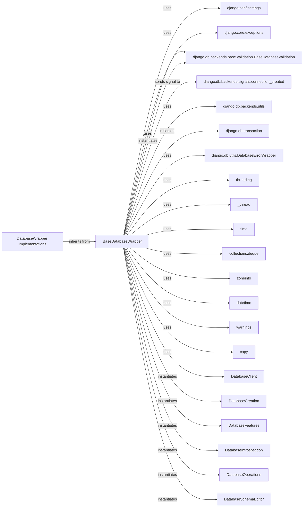

## Component Details

The BaseDatabaseWrapper is a foundational component in Django's database layer, serving as an abstract interface for all database backends. It encapsulates the core logic for managing database connections, transactions, and cursor operations, allowing specific database implementations to inherit and extend its functionality.

### BaseDatabaseWrapper
An abstract base class that defines the interface for Django's database backends. It manages the actual database connection, handles transaction management (autocommit, savepoints), and provides methods for creating cursors and executing SQL. Specific database implementations (e.g., PostgreSQL, MySQL, SQLite) inherit from this class.

**Related Classes/Methods**:

- <a href="https://github.com/django/django/blob/master/django/template/backends/django.py#L0-L0" target="_blank" rel="noopener noreferrer">`django.conf.settings` (0:0)</a>
- <a href="https://github.com/django/django/blob/master/django/core/exceptions.py#L0-L0" target="_blank" rel="noopener noreferrer">`django.core.exceptions` (0:0)</a>
- <a href="https://github.com/django/django/blob/master/django/db/backends/base/validation.py#L0-L0" target="_blank" rel="noopener noreferrer">`django.db.backends.base.validation.BaseDatabaseValidation` (0:0)</a>
- <a href="https://github.com/django/django/blob/master/django/db/backends/signals.py#L0-L0" target="_blank" rel="noopener noreferrer">`django.db.backends.signals.connection_created` (0:0)</a>
- <a href="https://github.com/django/django/blob/master/django/db/backends/utils.py#L0-L0" target="_blank" rel="noopener noreferrer">`django.db.backends.utils` (0:0)</a>
- <a href="https://github.com/django/django/blob/master/django/db/transaction.py#L0-L0" target="_blank" rel="noopener noreferrer">`django.db.transaction` (0:0)</a>
- <a href="https://github.com/django/django/blob/master/django/db/utils.py#L52-L102" target="_blank" rel="noopener noreferrer">`django.db.utils.DatabaseErrorWrapper` (52:102)</a>
- `threading` (0:0)
- `_thread` (0:0)
- `time` (0:0)
- <a href="https://github.com/django/django/blob/master/django/contrib/gis/geos/collections.py#L0-L0" target="_blank" rel="noopener noreferrer">`collections.deque` (0:0)</a>
- `zoneinfo` (0:0)
- <a href="https://github.com/django/django/blob/master/django/db/models/functions/datetime.py#L0-L0" target="_blank" rel="noopener noreferrer">`datetime` (0:0)</a>
- `warnings` (0:0)
- <a href="https://github.com/django/django/blob/master/django/utils/copy.py#L0-L0" target="_blank" rel="noopener noreferrer">`copy` (0:0)</a>

### DatabaseWrapper Implementations
These are the concrete implementations that provide the actual database connectivity and SQL dialect specifics. They inherit from BaseDatabaseWrapper and override its abstract methods to interact with their respective databases.

**Related Classes/Methods**: _None_

### django.conf.settings
Provides the necessary configuration parameters (e.g., database name, user, password, timezone settings, autocommit behavior) that BaseDatabaseWrapper uses to establish and manage connections.

**Related Classes/Methods**: _None_

### django.core.exceptions
Provides a standardized set of exceptions that BaseDatabaseWrapper and its subclasses use to communicate various database-related errors to the Django application, ensuring consistency and predictability.

**Related Classes/Methods**: _None_

### django.db.backends.base.validation.BaseDatabaseValidation
Responsible for validating the database setup and ensuring compatibility. It's a key dependency for BaseDatabaseWrapper to perform initial checks before establishing a connection.

**Related Classes/Methods**: _None_

### django.db.backends.signals.connection_created
Allows other parts of the Django framework or third-party applications to hook into the database connection lifecycle, enabling actions like custom connection initialization or logging.

**Related Classes/Methods**: _None_

### django.db.backends.utils
This module provides utility classes like CursorDebugWrapper and CursorWrapper that wrap database cursors. These wrappers are fundamental for features like query logging (in debug mode) and ensuring consistent cursor behavior across different backends.

**Related Classes/Methods**:

- <a href="https://github.com/django/django/blob/master/django/db/backends/utils.py#L116-L162" target="_blank" rel="noopener noreferrer">`django.db.backends.utils.CursorDebugWrapper` (116:162)</a>
- <a href="https://github.com/django/django/blob/master/django/db/backends/utils.py#L16-L113" target="_blank" rel="noopener noreferrer">`django.db.backends.utils.CursorWrapper` (16:113)</a>

### django.db.utils.DatabaseErrorWrapper
This context manager is vital for abstracting database-specific exceptions into Django's generic DatabaseError. This abstraction is crucial for maintaining a consistent API for database interactions, regardless of the underlying database engine.

**Related Classes/Methods**: _None_

### threading
Database connections often have thread-safety considerations. These modules are fundamental for BaseDatabaseWrapper to implement mechanisms that prevent accidental sharing of connections across threads, which can lead to data corruption or unexpected behavior.

**Related Classes/Methods**: _None_

### _thread
Database connections often have thread-safety considerations. These modules are fundamental for BaseDatabaseWrapper to implement mechanisms that prevent accidental sharing of connections across threads, which can lead to data corruption or unexpected behavior.

**Related Classes/Methods**: _None_

### django.db.transaction
While not directly imported as django.db.transaction, the BaseDatabaseWrapper heavily relies on the concepts and mechanisms of Django's transaction management, including atomic blocks and on_commit hooks.

**Related Classes/Methods**: _None_

### time
Used for time.monotonic() to manage connection close_at times for connection health checks.

**Related Classes/Methods**: _None_

### collections.deque
Used for self.queries_log to store a limited number of queries for debugging purposes.

**Related Classes/Methods**: _None_

### zoneinfo
Used for timezone handling when USE_TZ is enabled.

**Related Classes/Methods**: _None_

### datetime
Used for timezone handling when USE_TZ is enabled.

**Related Classes/Methods**: _None_

### warnings
Used to issue warnings when the query logging limit is exceeded.

**Related Classes/Methods**: _None_

### copy
Used in the copy method to create a deep copy of the settings_dict for new connection instances.

**Related Classes/Methods**: _None_

### DatabaseClient
Represents distinct aspects of database interaction (e.g., client-specific commands).

**Related Classes/Methods**: _None_

### DatabaseCreation
Represents distinct aspects of database interaction (e.g., database creation/destruction).

**Related Classes/Methods**: _None_

### DatabaseFeatures
Represents distinct aspects of database interaction (e.g., feature detection).

**Related Classes/Methods**: _None_

### DatabaseIntrospection
Represents distinct aspects of database interaction (e.g., schema manipulation).

**Related Classes/Methods**: _None_

### DatabaseOperations
Represents distinct aspects of database interaction (e.g., SQL operations).

**Related Classes/Methods**: _None_

### DatabaseSchemaEditor
Represents distinct aspects of database interaction (e.g., schema manipulation).

**Related Classes/Methods**: _None_

### [FAQ](https://github.com/CodeBoarding/GeneratedOnBoardings/tree/main?tab=readme-ov-file#faq)