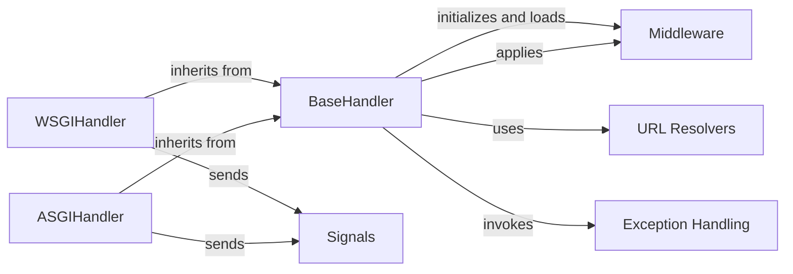

## Component Details

The `BaseHandler` subsystem in Django is a cornerstone of its request/response architecture, providing the foundational logic for processing web requests. The selected components are fundamental because they represent the core stages and mechanisms involved in transforming an incoming HTTP request into an outgoing HTTP response, all orchestrated by `BaseHandler`.

### BaseHandler
This abstract base class is the central orchestrator of the request/response lifecycle in Django. It defines the core logic for loading and applying middleware, resolving the URL to find the appropriate view, invoking the view, and handling exceptions that occur during this process. It acts as the backbone for both synchronous (WSGI) and asynchronous (ASGI) request handling.

**Related Classes/Methods**:

- <a href="https://github.com/django/django/blob/master/django/core/handlers/base.py#L25-L101" target="_blank" rel="noopener noreferrer">`django.core.handlers.base.BaseHandler:load_middleware` (25:101)</a>
- <a href="https://github.com/django/django/blob/master/django/core/handlers/base.py#L173-L225" target="_blank" rel="noopener noreferrer">`django.core.handlers.base.BaseHandler:_get_response` (173:225)</a>
- <a href="https://github.com/django/django/blob/master/django/core/handlers/base.py#L227-L297" target="_blank" rel="noopener noreferrer">`django.core.handlers.base.BaseHandler:_get_response_async` (227:297)</a>
- <a href="https://github.com/django/django/blob/master/django/core/handlers/base.py#L355-L364" target="_blank" rel="noopener noreferrer">`django.core.handlers.base.BaseHandler:process_exception_by_middleware` (355:364)</a>
- <a href="https://github.com/django/django/blob/master/django/core/handlers/base.py#L299-L314" target="_blank" rel="noopener noreferrer">`django.core.handlers.base.BaseHandler:resolve_request` (299:314)</a>

### WSGIHandler
A concrete implementation of `BaseHandler` tailored for the Web Server Gateway Interface (WSGI). It's the primary entry point for traditional synchronous Django applications, providing the `__call__` method expected by WSGI servers to handle synchronous requests.

**Related Classes/Methods**:

- <a href="https://github.com/django/django/blob/master/django/core/handlers/wsgi.py#L119-L143" target="_blank" rel="noopener noreferrer">`django.core.handlers.wsgi.WSGIHandler:__call__` (119:143)</a>

### ASGIHandler
A concrete implementation of `BaseHandler` designed for the Asynchronous Server Gateway Interface (ASGI). It handles asynchronous requests and responses, enabling Django to work with modern async web servers and providing the `__call__` method for ASGI servers.

**Related Classes/Methods**:

- <a href="https://github.com/django/django/blob/master/django/core/handlers/asgi.py#L149-L161" target="_blank" rel="noopener noreferrer">`django.core.handlers.asgi.ASGIHandler:__call__` (149:161)</a>

### Middleware
Middleware components are hooks into Django's request/response processing. They can modify requests, responses, or handle exceptions at various stages. `BaseHandler` is responsible for initializing and ordering these components (`load_middleware`) and applying them during the request lifecycle (e.g., `_get_response`, `process_exception_by_middleware`).

**Related Classes/Methods**:

- <a href="https://github.com/django/django/blob/master/django/core/handlers/base.py#L25-L101" target="_blank" rel="noopener noreferrer">`django.core.handlers.base.BaseHandler:load_middleware` (25:101)</a>
- <a href="https://github.com/django/django/blob/master/django/core/handlers/base.py#L173-L225" target="_blank" rel="noopener noreferrer">`django.core.handlers.base.BaseHandler:_get_response` (173:225)</a>
- <a href="https://github.com/django/django/blob/master/django/core/handlers/base.py#L355-L364" target="_blank" rel="noopener noreferrer">`django.core.handlers.base.BaseHandler:process_exception_by_middleware` (355:364)</a>

### URL Resolvers
This component contains the logic for mapping incoming URLs to the appropriate view functions or classes. `BaseHandler` relies on `get_resolver` to retrieve the root URL configuration and `URLResolver.resolve` to perform the actual URL matching, determining which view to execute for a given request.

**Related Classes/Methods**:

- <a href="https://github.com/django/django/blob/master/django/urls/resolvers.py#L0-L0" target="_blank" rel="noopener noreferrer">`django.urls.resolvers.get_resolver` (0:0)</a>
- <a href="https://github.com/django/django/blob/master/django/urls/resolvers.py#L0-L0" target="_blank" rel="noopener noreferrer">`django.urls.resolvers.URLResolver:resolve` (0:0)</a>

### Exception Handling
This component provides utilities for converting exceptions raised during request processing into appropriate HTTP responses. Functions like `convert_exception_to_response` and `process_exception_by_middleware` are key here, ensuring graceful error handling. `BaseHandler` integrates this to manage errors during view execution and middleware processing.

**Related Classes/Methods**:

- <a href="https://github.com/django/django/blob/master/django/core/handlers/exception.py#L23-L59" target="_blank" rel="noopener noreferrer">`django.core.handlers.exception.convert_exception_to_response` (23:59)</a>
- <a href="https://github.com/django/django/blob/master/django/core/handlers/exception.py#L0-L0" target="_blank" rel="noopener noreferrer">`django.core.handlers.exception.process_exception_by_middleware` (0:0)</a>

### Signals
Django's signaling framework allows decoupled applications to be notified when certain actions occur elsewhere in the framework. While `BaseHandler` itself doesn't directly dispatch signals, its concrete implementations (`WSGIHandler`, `ASGIHandler`) commonly send signals (e.g., `request_started`, `request_finished`) to allow other parts of the application to react to the request lifecycle.

**Related Classes/Methods**:

- `django.dispatch.signals.request_started` (0:0)
- `django.dispatch.signals.request_finished` (0:0)

### [FAQ](https://github.com/CodeBoarding/GeneratedOnBoardings/tree/main?tab=readme-ov-file#faq)