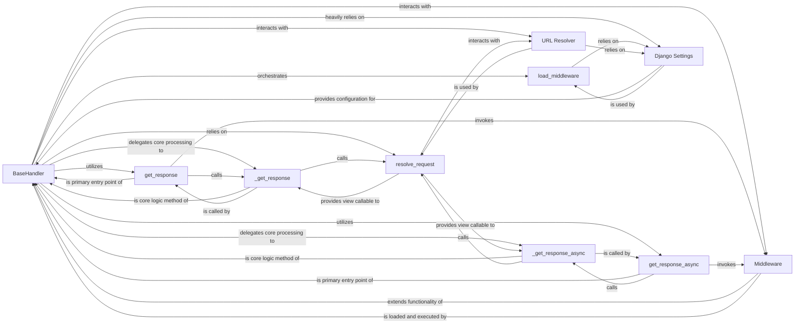

## Component Details

The `BaseHandler` component in Django serves as the central orchestrator for processing HTTP requests and generating responses. Its fundamental role lies in managing the entire request-response lifecycle, from initial request reception to final response delivery, incorporating middleware, URL resolution, view invocation, and exception handling.

### BaseHandler
The abstract base class that defines the core request/response processing logic. It acts as the orchestrator, managing the middleware chain, URL resolution, view invocation, and exception handling. It's the central control flow for a request within Django.

**Related Classes/Methods**:

- <a href="https://github.com/django/django/blob/master/django/core/handlers/base.py#L19-L364" target="_blank" rel="noopener noreferrer">`django.core.handlers.base.BaseHandler` (19:364)</a>

### load_middleware
Initializes and configures the middleware stack based on `settings.MIDDLEWARE`. It dynamically adapts middleware components for synchronous and asynchronous request handling, building the `_middleware_chain`.

**Related Classes/Methods**:

- <a href="https://github.com/django/django/blob/master/django/core/handlers/base.py#L25-L101" target="_blank" rel="noopener noreferrer">`django.core.handlers.base.BaseHandler:load_middleware` (25:101)</a>

### get_response
Primary public entry point for synchronous HTTP requests. It initiates the request processing, sets the URLconf, invokes the `_middleware_chain`, and performs post-processing.

**Related Classes/Methods**:

- <a href="https://github.com/django/django/blob/master/django/core/handlers/base.py#L135-L149" target="_blank" rel="noopener noreferrer">`django.core.handlers.base.BaseHandler:get_response` (135:149)</a>

### get_response_async
Primary public entry point for asynchronous HTTP requests. It initiates the request processing, sets the URLconf, invokes the `_middleware_chain`, and performs post-processing.

**Related Classes/Methods**:

- <a href="https://github.com/django/django/blob/master/django/core/handlers/base.py#L151-L171" target="_blank" rel="noopener noreferrer">`django.core.handlers.base.BaseHandler:get_response_async` (151:171)</a>

### _get_response
Contains the core internal logic for resolving the URL, applying view-specific middleware, calling the actual view, and handling exceptions and template responses.

**Related Classes/Methods**:

- <a href="https://github.com/django/django/blob/master/django/core/handlers/base.py#L173-L225" target="_blank" rel="noopener noreferrer">`django.core.handlers.base.BaseHandler:_get_response` (173:225)</a>

### _get_response_async
Contains the core internal logic for resolving the URL, applying view-specific middleware, calling the actual view, and handling exceptions and template responses for asynchronous requests.

**Related Classes/Methods**:

- <a href="https://github.com/django/django/blob/master/django/core/handlers/base.py#L227-L297" target="_blank" rel="noopener noreferrer">`django.core.handlers.base.BaseHandler:_get_response_async` (227:297)</a>

### resolve_request
Determines the appropriate URL configuration (URLconf) for the request and resolves the request's path to find the corresponding view callable and its arguments.

**Related Classes/Methods**:

- <a href="https://github.com/django/django/blob/master/django/core/handlers/base.py#L299-L314" target="_blank" rel="noopener noreferrer">`django.core.handlers.base.BaseHandler:resolve_request` (299:314)</a>

### Middleware
Pluggable components that can process requests and responses at various stages of the Django request-response cycle, extending the framework's capabilities.

**Related Classes/Methods**:

- <a href="https://github.com/django/django/blob/master/django/template/backends/django.py#L0-L0" target="_blank" rel="noopener noreferrer">`django.middleware` (0:0)</a>

### Django Settings
Django's configuration system, particularly `MIDDLEWARE` (used by `load_middleware`) and `ROOT_URLCONF` (used by `get_response`/`get_response_async`) for URL resolution.

**Related Classes/Methods**:

- <a href="https://github.com/django/django/blob/master/django/template/backends/django.py#L0-L0" target="_blank" rel="noopener noreferrer">`django.conf.settings` (0:0)</a>

### URL Resolver
Responsible for mapping a given URL path to the appropriate view function or class, along with any arguments extracted from the URL.

**Related Classes/Methods**:

- <a href="https://github.com/django/django/blob/master/django/template/backends/django.py#L0-L0" target="_blank" rel="noopener noreferrer">`django.urls` (0:0)</a>

### [FAQ](https://github.com/CodeBoarding/GeneratedOnBoardings/tree/main?tab=readme-ov-file#faq)