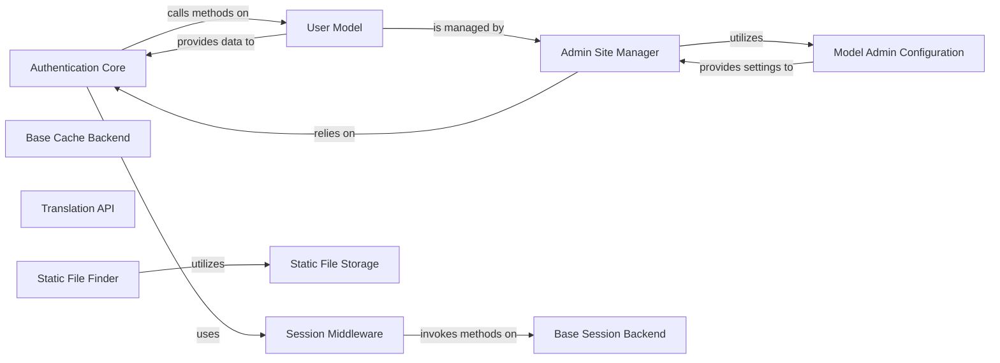

## Details

The Django framework's core architecture for authentication, administration, sessions, and static file handling is built around a set of interconnected components. The `Authentication Core` and `User Model` form the backbone of user management, with the `Admin Site Manager` and `Model Admin Configuration` providing the administrative interface. Session management is handled by the `Session Middleware` which interacts with the `Base Session Backend` for data persistence. Static file serving is facilitated by the `Static File Finder` and `Static File Storage`. The `Base Cache Backend` and `Translation API` provide underlying support for caching and internationalization, respectively.

### Authentication Core
Manages the core logic for user authentication, including login, logout, and user session handling. It acts as the primary interface for authentication operations.

**Related Classes/Methods**:

- <a href="https://github.com/django/django/blob/main/django/contrib/auth/__init__.py" target="_blank" rel="noopener noreferrer">`django.contrib.auth.__init__`</a>

### User Model
Defines the fundamental structure and behavior of user accounts within the application, including attributes like username, password, and permissions. It's the central entity for user management.

**Related Classes/Methods**:

- <a href="https://github.com/django/django/blob/main/django/contrib/auth/models.py#L517-L526" target="_blank" rel="noopener noreferrer">`django.contrib.auth.models.User`:517-526</a>

### Admin Site Manager
Serves as the central registry for all models exposed in the Django Admin interface. It orchestrates the admin's URL routing, view handling, and overall site configuration.

**Related Classes/Methods**:

- <a href="https://github.com/django/django/blob/main/django/contrib/admin/sites.py#L30-L606" target="_blank" rel="noopener noreferrer">`django.contrib.admin.sites.AdminSite`:30-606</a>

### Model Admin Configuration
Provides a customizable interface for managing individual models within the Django Admin. It defines how models are displayed, edited, and interacted with in the administrative backend.

**Related Classes/Methods**:

- <a href="https://github.com/django/django/blob/main/django/contrib/admin/options.py#L635-L2341" target="_blank" rel="noopener noreferrer">`django.contrib.admin.options.ModelAdmin`:635-2341</a>

### Session Middleware
Intercepts incoming HTTP requests and outgoing responses to manage user session data. It ensures that session information is loaded, saved, and made available throughout the request-response cycle.

**Related Classes/Methods**:

- <a href="https://github.com/django/django/blob/main/django/contrib/sessions/middleware.py#L12-L77" target="_blank" rel="noopener noreferrer">`django.contrib.sessions.middleware.SessionMiddleware`:12-77</a>

### Base Cache Backend
Defines the abstract interface for all caching strategies (e.g., get, set, delete). Concrete cache backends implement this interface to provide specific caching functionalities.

**Related Classes/Methods**:

- <a href="https://github.com/django/django/blob/main/django/core/cache/backends/base.py#L58-L390" target="_blank" rel="noopener noreferrer">`django.core.cache.backends.base.BaseCache`:58-390</a>

### Translation API
Provides public functions for internationalization and localization, enabling applications to support multiple languages.

**Related Classes/Methods**:

- <a href="https://github.com/django/django/blob/main/django/utils/translation/__init__.py" target="_blank" rel="noopener noreferrer">`django.utils.translation.__init__`</a>

### Static File Finder
Defines the abstract interface for locating static files across various locations (e.g., app directories, project-level static files). It's crucial for both development serving and deployment collection of static assets.

**Related Classes/Methods**:

- <a href="https://github.com/django/django/blob/main/django/contrib/staticfiles/finders.py#L46-L83" target="_blank" rel="noopener noreferrer">`django.contrib.staticfiles.finders.BaseFinder`:46-83</a>

### Base Session Backend
Provides the foundational interface for all session management backends, defining core methods for session creation, loading, saving, and deletion.

**Related Classes/Methods**:

- <a href="https://github.com/django/django/blob/main/django/contrib/sessions/backends/base.py#L35-L525" target="_blank" rel="noopener noreferrer">`django.contrib.sessions.backends.base.SessionBase`:35-525</a>

### Static File Storage
Manages the storage and retrieval of static files, typically serving them from the filesystem based on configured paths.

**Related Classes/Methods**:

- <a href="https://github.com/django/django/blob/main/django/contrib/staticfiles/storage.py#L16-L44" target="_blank" rel="noopener noreferrer">`django.contrib.staticfiles.storage.StaticFilesStorage`:16-44</a>

### [FAQ](https://github.com/CodeBoarding/GeneratedOnBoardings/tree/main?tab=readme-ov-file#faq)