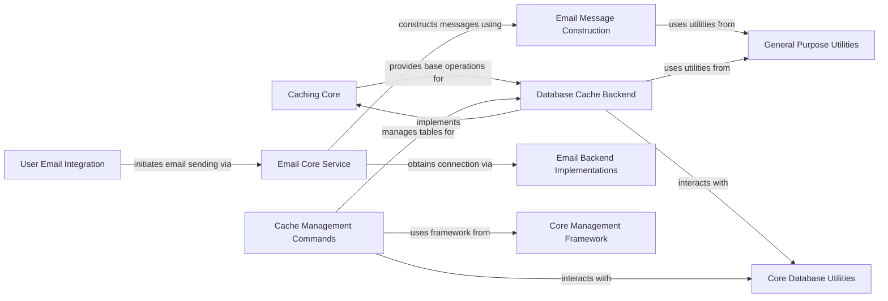

## Component Details

This graph illustrates the architecture of the Caching and Email Services subsystem within the project. It encompasses components responsible for managing application performance through various caching mechanisms, particularly focusing on database-backed caching, and providing a robust API for sending diverse types of emails. The main flow involves applications utilizing core caching and email services, which in turn interact with specific backend implementations and utility components for data storage, message construction, and command-line management. The purpose of this subsystem is to offer efficient data retrieval and reliable communication capabilities.

### Caching Core
This component defines the abstract interface for all cache backends and provides the central mechanism for retrieving and managing cache instances. It ensures a consistent API for interacting with different caching systems.

**Related Classes/Methods**:

- `django.core.cache` (full file reference)
- <a href="https://github.com/django/django/blob/master/django/core/cache/backends/base.py#L58-L390" target="_blank" rel="noopener noreferrer">`django.core.cache.backends.base.BaseCache` (58:390)</a>
- `django.core.cache.CacheHandler` (full file reference)
- <a href="https://github.com/django/django/blob/master/django/core/cache/backends/base.py#L13-L14" target="_blank" rel="noopener noreferrer">`django.core.cache.backends.base.InvalidCacheBackendError` (13:14)</a>

### Database Cache Backend
This component provides a concrete implementation of a cache backend that stores cache data directly within the application's database. It handles the specifics of database interactions for caching operations.

**Related Classes/Methods**:

- <a href="https://github.com/django/django/blob/master/django/core/cache/backends/db.py#L43-L294" target="_blank" rel="noopener noreferrer">`django.core.cache.backends.db.DatabaseCache` (43:294)</a>
- <a href="https://github.com/django/django/blob/master/django/core/cache/backends/db.py#L32-L40" target="_blank" rel="noopener noreferrer">`django.core.cache.backends.db.BaseDatabaseCache` (32:40)</a>

### Email Core Service
This component offers the primary API for sending various types of emails, including individual, bulk, and administrative messages. It orchestrates the email sending process by interacting with message construction and connection management.

**Related Classes/Methods**:

- `django.core.mail` (full file reference)
- `django.core.mail.send_mail` (full file reference)
- `django.core.mail.send_mass_mail` (full file reference)
- `django.core.mail.mail_admins` (full file reference)
- `django.core.mail.mail_managers` (full file reference)
- `django.core.mail.get_connection` (full file reference)

### Email Message Construction
This component is responsible for the detailed creation and formatting of email messages, including handling various parts like attachments, alternative content types, and MIME structures, preparing them for dispatch.

**Related Classes/Methods**:

- <a href="https://github.com/django/django/blob/master/django/core/mail/message.py#L198-L437" target="_blank" rel="noopener noreferrer">`django.core.mail.message.EmailMessage` (198:437)</a>
- <a href="https://github.com/django/django/blob/master/django/core/mail/message.py#L440-L520" target="_blank" rel="noopener noreferrer">`django.core.mail.message.EmailMultiAlternatives` (440:520)</a>
- <a href="https://github.com/django/django/blob/master/django/core/mail/message.py#L153-L157" target="_blank" rel="noopener noreferrer">`django.core.mail.message.SafeMIMEMessage` (153:157)</a>
- <a href="https://github.com/django/django/blob/master/django/core/mail/message.py#L182-L191" target="_blank" rel="noopener noreferrer">`django.core.mail.message.SafeMIMEMultipart` (182:191)</a>
- <a href="https://github.com/django/django/blob/master/django/core/mail/message.py#L160-L179" target="_blank" rel="noopener noreferrer">`django.core.mail.message.SafeMIMEText` (160:179)</a>

### Email Backend Implementations
This component provides various concrete implementations for sending emails through different protocols and methods, such as SMTP, console output, file-based storage, or in-memory storage. It extends the base email backend interface.

**Related Classes/Methods**:

- <a href="https://github.com/django/django/blob/master/django/core/mail/backends/base.py#L4-L62" target="_blank" rel="noopener noreferrer">`django.core.mail.backends.base.BaseEmailBackend` (4:62)</a>
- <a href="https://github.com/django/django/blob/master/django/core/mail/backends/smtp.py#L14-L162" target="_blank" rel="noopener noreferrer">`django.core.mail.backends.smtp.EmailBackend` (14:162)</a>
- <a href="https://github.com/django/django/blob/master/django/core/mail/backends/console.py#L11-L45" target="_blank" rel="noopener noreferrer">`django.core.mail.backends.console.EmailBackend` (11:45)</a>
- <a href="https://github.com/django/django/blob/master/django/core/mail/backends/dummy.py#L8-L10" target="_blank" rel="noopener noreferrer">`django.core.mail.backends.dummy.EmailBackend` (8:10)</a>
- <a href="https://github.com/django/django/blob/master/django/core/mail/backends/filebased.py#L11-L66" target="_blank" rel="noopener noreferrer">`django.core.mail.backends.filebased.EmailBackend` (11:66)</a>
- <a href="https://github.com/django/django/blob/master/django/core/mail/backends/locmem.py#L11-L33" target="_blank" rel="noopener noreferrer">`django.core.mail.backends.locmem.EmailBackend` (11:33)</a>

### User Email Integration
This component facilitates the sending of emails directly from user models, typically for actions like account activation, password resets, or notifications, by leveraging the core email services.

**Related Classes/Methods**:

- <a href="https://github.com/django/django/blob/master/django/contrib/auth/models.py#L512-L514" target="_blank" rel="noopener noreferrer">`django.contrib.auth.models.AbstractUser:email_user` (512:514)</a>

### Cache Management Commands
This component provides command-line utilities for managing cache-related operations, such as creating the necessary database tables for the database cache backend.

**Related Classes/Methods**:

- <a href="https://github.com/django/django/blob/master/django/core/management/commands/createcachetable.py#L15-L131" target="_blank" rel="noopener noreferrer">`django.core.management.commands.createcachetable.Command` (15:131)</a>

### Core Database Utilities
This component offers fundamental utilities for interacting with the database, including routing database operations, managing transactions, and handling database-specific expressions and field types. It serves as a foundational layer for database-backed features like the database cache.

**Related Classes/Methods**:

- `django.db.utils` (full file reference)
- `django.db.models.expressions` (full file reference)
- `django.db.models.fields` (full file reference)

### General Purpose Utilities
This component provides a collection of common utility functions that are broadly applicable across various Django subsystems, such as handling time zones and encoding/decoding bytes. These utilities support the functionality of both caching and email services.

**Related Classes/Methods**:

- `django.utils.timezone` (full file reference)
- `django.utils.encoding` (full file reference)

### Core Management Framework
This component provides the foundational elements and base classes for creating and executing Django management commands, including mechanisms for outputting information and handling command-specific errors. It is utilized by cache management commands.

**Related Classes/Methods**:

- `django.core.management.base` (full file reference)

### [FAQ](https://github.com/CodeBoarding/GeneratedOnBoardings/tree/main?tab=readme-ov-file#faq)