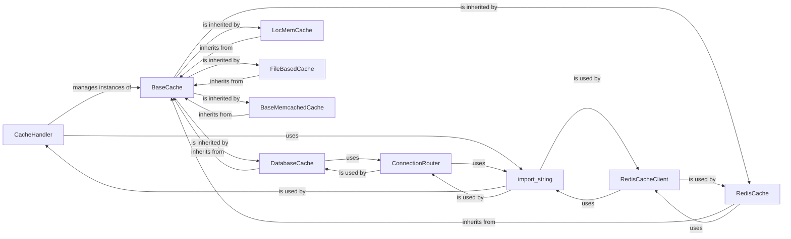

## Component Details

The Django Caching Framework is a flexible and extensible system designed to improve application performance by reducing redundant computations and database queries. It provides a unified API for interacting with various cache backends, making it fundamental for optimizing the performance and scalability of Django applications.

### CacheHandler
This component acts as the central registry and manager for all configured cache backend instances. It is responsible for initializing and providing access to different cache backends based on Django settings, offering a unified interface for the application to interact with the caching system.

**Related Classes/Methods**:

- `django.core.cache.caches` (1:1)

### BaseCache
An abstract base class that defines the standard interface and common functionalities for all cache operations (e.g., `get`, `set`, `add`, `delete`, `has_key`). All concrete cache backend implementations must inherit from this class, ensuring a consistent contract across different caching mechanisms. It also provides utility methods for key generation and timeout handling.

**Related Classes/Methods**:

- <a href="https://github.com/django/django/blob/master/django/core/cache/backends/base.py#L57-L389" target="_blank" rel="noopener noreferrer">`django.core.cache.backends.base.BaseCache` (57:389)</a>

### DatabaseCache
A concrete cache backend that persists cached data within a database table. It leverages Django's ORM and database utilities for storage and retrieval, making it suitable for applications that prefer to utilize their existing database infrastructure for caching. It handles serialization of data before storing it in the database.

**Related Classes/Methods**:

- <a href="https://github.com/django/django/blob/master/django/core/cache/backends/db.py#L42-L293" target="_blank" rel="noopener noreferrer">`django.core.cache.backends.db.DatabaseCache` (42:293)</a>

### LocMemCache
An in-memory cache backend that stores cached data directly within the Python process's memory. It is designed for simplicity and speed, typically used in single-process applications or for development and testing environments. It employs `OrderedDict` for cache storage and `Lock` for thread-safe access.

**Related Classes/Methods**:

- <a href="https://github.com/django/django/blob/master/django/core/cache/backends/locmem.py#L16-L117" target="_blank" rel="noopener noreferrer">`django.core.cache.backends.locmem.LocMemCache` (16:117)</a>

### FileBasedCache
A cache backend that stores cached data as individual files on the filesystem. It manages file I/O, implements locking mechanisms to prevent race conditions during file access, and handles the expiration of cache entries by deleting old files. It uses `zlib` for data compression.

**Related Classes/Methods**:

- <a href="https://github.com/django/django/blob/master/django/core/cache/backends/filebased.py#L16-L170" target="_blank" rel="noopener noreferrer">`django.core.cache.backends.filebased.FileBasedCache` (16:170)</a>

### BaseMemcachedCache
An abstract base class that provides common logic for interacting with Memcached servers. Concrete Memcached implementations (like `PyLibMCCache` or `PyMemcacheCache` in a full Django setup) extend this class to handle specific client library interactions. It manages server configurations and translates Django's timeout values to Memcached-compatible ones.

**Related Classes/Methods**:

- <a href="https://github.com/django/django/blob/master/django/core/cache/backends/memcached.py#L14-L140" target="_blank" rel="noopener noreferrer">`django.core.cache.backends.memcached.BaseMemcachedCache` (14:140)</a>

### RedisCache
A concrete cache backend that integrates with Redis, a popular in-memory data structure store. It delegates low-level Redis interactions to a `RedisCacheClient` instance, handling the overall cache operations while the client manages the connection and command execution.

**Related Classes/Methods**:

- <a href="https://github.com/django/django/blob/master/django/core/cache/backends/redis.py#L159-L233" target="_blank" rel="noopener noreferrer">`django.core.cache.backends.redis.RedisCache` (159:233)</a>

### RedisCacheClient
A helper class specifically designed for `RedisCache` to manage connections to Redis servers and execute Redis commands. It handles the serialization and deserialization of Python objects for storage in Redis and supports connection pooling. It can dynamically load custom serializers and connection pool classes.

**Related Classes/Methods**:

- <a href="https://github.com/django/django/blob/master/django/core/cache/backends/redis.py#L30-L156" target="_blank" rel="noopener noreferrer">`django.core.cache.backends.redis.RedisCacheClient` (30:156)</a>

### import_string
A utility function crucial for the pluggable architecture of Django's caching framework. It dynamically loads Python classes or callable objects from a given dotted path string. This allows users to specify cache backends and other configurable components in settings without hardcoding direct imports.

**Related Classes/Methods**:

- <a href="https://github.com/django/django/blob/master/django/utils/module_loading.py#L18-L34" target="_blank" rel="noopener noreferrer">`django.utils.module_loading.import_string` (18:34)</a>

### ConnectionRouter
This utility is primarily used by the `DatabaseCache` backend to determine which database connection should be used for read and write operations. In multi-database Django setups, it ensures that caching operations are directed to the correct database, adhering to the defined database routing rules. It also dynamically loads database routers.

**Related Classes/Methods**:

- <a href="https://github.com/django/django/blob/master/django/db/utils.py#L199-L280" target="_blank" rel="noopener noreferrer">`django.db.utils.ConnectionRouter` (199:280)</a>

### [FAQ](https://github.com/CodeBoarding/GeneratedOnBoardings/tree/main?tab=readme-ov-file#faq)