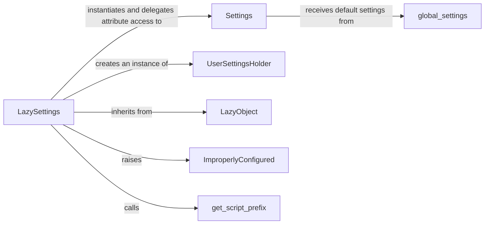

## Component Details

The Configuration subsystem in Django is fundamental to how the framework operates, providing a centralized and flexible way to manage all project-specific settings. Its core purpose is to define the operational parameters for a Django application, ranging from database connections and installed applications to middleware and template configurations. The lazy-loading mechanism employed by this subsystem is a key architectural decision, optimizing application startup by deferring the loading of settings until they are actually needed.

### LazySettings
This is the primary entry point for accessing Django's settings. LazySettings acts as a proxy, deferring the actual loading of settings until an attribute is accessed for the first time. This lazy evaluation is crucial for performance, preventing unnecessary imports and computations during application startup. It manages the initial setup, attribute access delegation, and allows for manual configuration via configure().

**Related Classes/Methods**:

- <a href="https://github.com/django/django/blob/master/django/template/backends/django.py#L1-L1" target="_blank" rel="noopener noreferrer">`django.conf.LazySettings` (1:1)</a>

### Settings
This concrete class holds the actual Django settings. Once LazySettings is triggered (e.g., by accessing a setting), it instantiates Settings. This class is responsible for loading default settings from global_settings and then overriding them with values from the user-defined settings module (specified by DJANGO_SETTINGS_MODULE).

**Related Classes/Methods**:

- <a href="https://github.com/django/django/blob/master/django/template/backends/django.py#L1-L1" target="_blank" rel="noopener noreferrer">`django.conf.Settings` (1:1)</a>

### global_settings
This Python module defines all of Django's default configuration settings. It serves as the baseline for any Django project's configuration. When the Settings class is initialized, it first populates itself with values from global_settings.py before applying any user-defined overrides.

**Related Classes/Methods**:

- <a href="https://github.com/django/django/blob/master/django/conf/global_settings.py#L1-L1" target="_blank" rel="noopener noreferrer">`django.conf.global_settings` (1:1)</a>

### UserSettingsHolder
A simple internal class used by LazySettings.configure() when settings are manually provided (e.g., in testing environments or specific scripts). It acts as a temporary container for these user-defined settings, allowing LazySettings to delegate attribute access to it, similar to how it delegates to a Settings instance.

**Related Classes/Methods**:

- <a href="https://github.com/django/django/blob/master/django/template/backends/django.py#L1-L1" target="_blank" rel="noopener noreferrer">`django.conf.UserSettingsHolder` (1:1)</a>

### LazyObject
Located in django.utils.functional, this is a generic utility class that provides the core lazy loading mechanism. LazySettings inherits from LazyObject, leveraging its _wrapped attribute and __getattr__ override to defer the initialization of the underlying settings object until an attribute is accessed.

**Related Classes/Methods**:

- <a href="https://github.com/django/django/blob/master/django/utils/functional.py#L258-L371" target="_blank" rel="noopener noreferrer">`django.utils.functional.LazyObject` (258:371)</a>

### ImproperlyConfigured
This is a custom exception class defined in django.core.exceptions. It is raised by LazySettings (and other Django components) when a critical configuration error is detected, such as the DJANGO_SETTINGS_MODULE environment variable not being set or a required setting (like SECRET_KEY) being empty.

**Related Classes/Methods**:

- <a href="https://github.com/django/django/blob/master/django/core/exceptions.py#L1-L1" target="_blank" rel="noopener noreferrer">`django.core.exceptions.ImproperlyConfigured` (1:1)</a>

### get_script_prefix
A utility function from django.urls.base that helps determine the URL script prefix (e.g., if the Django application is served from a subpath like /my_app/). LazySettings calls this function internally when MEDIA_URL or STATIC_URL are accessed to ensure these URLs are correctly prefixed.

**Related Classes/Methods**:

- <a href="https://github.com/django/django/blob/master/django/urls/base.py#L128-L134" target="_blank" rel="noopener noreferrer">`django.urls.base.get_script_prefix` (128:134)</a>

### [FAQ](https://github.com/CodeBoarding/GeneratedOnBoardings/tree/main?tab=readme-ov-file#faq)