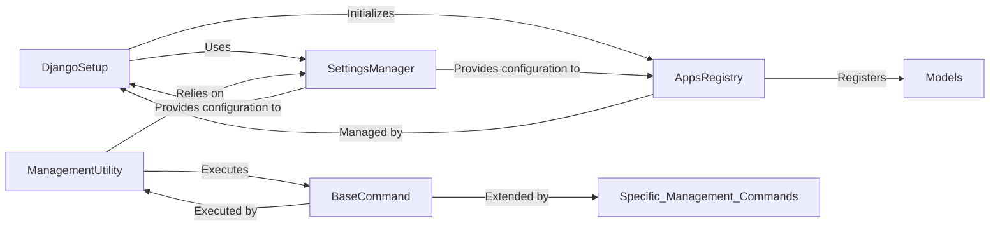

## Component Details

This section details the core components responsible for Django's initialization, application lifecycle management, settings handling, and command-line utility infrastructure. These components are fundamental as they establish the foundational environment for any Django project to run and manage its applications effectively.

### DjangoSetup
This is the primary function (`django.setup()`) responsible for initializing the entire Django environment. It orchestrates critical startup tasks, including configuring project settings, populating the application registry with installed applications and their models, and setting up logging and URL prefixing. It ensures that the Django framework is ready for operation.

**Related Classes/Methods**:

- <a href="https://github.com/django/django/blob/master/django/template/backends/django.py#L1-L1" target="_blank" rel="noopener noreferrer">`django.setup` (1:1)</a>

### AppsRegistry
This class (`django.apps.registry.Apps`) acts as the central registry for all installed Django applications and their models. Its core responsibility is to manage the loading, configuration, and readiness state of applications and their associated models, providing a unified interface to access them throughout the Django project.

**Related Classes/Methods**:

- <a href="https://github.com/django/django/blob/master/django/apps/registry.py#L12-L433" target="_blank" rel="noopener noreferrer">`django.apps.registry.Apps` (12:433)</a>

### SettingsManager
This component, primarily represented by `django.conf.LazySettings` and `django.conf.Settings`, is responsible for loading, managing, and providing access to Django's project-specific and global settings. `LazySettings` provides a performance-optimized lazy-loading proxy, deferring the actual loading of settings until they are first accessed, while `Settings` handles the merging of global defaults with user-defined configurations.

**Related Classes/Methods**:

- <a href="https://github.com/django/django/blob/master/django/template/backends/django.py#L1-L1" target="_blank" rel="noopener noreferrer">`django.conf.LazySettings` (1:1)</a>
- <a href="https://github.com/django/django/blob/master/django/template/backends/django.py#L1-L1" target="_blank" rel="noopener noreferrer">`django.conf.Settings` (1:1)</a>

### ManagementUtility
This class (`django.core.management.ManagementUtility`) serves as the central orchestrator for executing Django's command-line utilities (e.g., `runserver`, `makemigrations`). It is responsible for discovering available commands, parsing command-line arguments, loading the appropriate command class, and delegating the execution to that command.

**Related Classes/Methods**:

- `django.core.management.ManagementUtility` (1:1)

### BaseCommand
This abstract base class (`django.core.management.base.BaseCommand`) provides the fundamental structure and common functionalities for all Django management commands. It defines the interface for argument parsing (`create_parser`), command execution flow (`run_from_argv`, `execute`), and includes mechanisms for system and migration checks. Developers extend this class to create custom management commands by implementing the `handle()` method.

**Related Classes/Methods**:

- <a href="https://github.com/django/django/blob/master/django/core/management/base.py#L1-L1" target="_blank" rel="noopener noreferrer">`django.core.management.base.BaseCommand` (1:1)</a>

### [FAQ](https://github.com/CodeBoarding/GeneratedOnBoardings/tree/main?tab=readme-ov-file#faq)