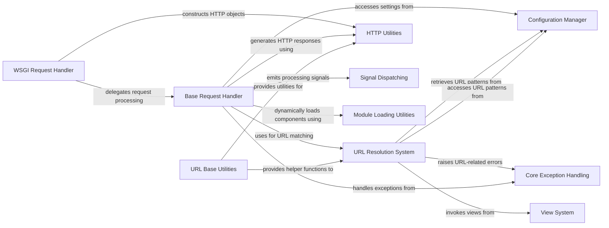

## Component Details

The foundational components of Django, responsible for handling HTTP requests and responses, URL routing, managing application settings, and providing essential utilities. It acts as the central orchestrator for Django applications.

### WSGI Request Handler
This component serves as the primary entry point for web requests, translating WSGI (Web Server Gateway Interface) requests into Django's internal request objects and delegating their processing. It orchestrates the initial stages of request handling, interacting with various core Django components to set up the request context and prepare for response generation.

**Related Classes/Methods**:

- <a href="https://github.com/django/django/blob/master/django/core/handlers/wsgi.py#L112-L143" target="_blank" rel="noopener noreferrer">`django.core.handlers.wsgi.WSGIHandler` (112:143)</a>

### Base Request Handler
The Base Request Handler provides the fundamental logic for processing HTTP requests and generating responses within Django. It manages the request-response cycle, including middleware application, URL resolution, view invocation, and exception handling, acting as a central coordinator for the application's core functionality.

**Related Classes/Methods**:

- <a href="https://github.com/django/django/blob/master/django/core/handlers/base.py#L19-L364" target="_blank" rel="noopener noreferrer">`django.core.handlers.base.BaseHandler` (19:364)</a>

### Configuration Manager
This component is responsible for managing Django's settings and configurations. It loads global settings, handles overrides from project-specific settings, and provides a centralized access point for various configuration parameters that influence the behavior of the entire Django application.

**Related Classes/Methods**:

- <a href="https://github.com/django/django/blob/master/django/template/backends/django.py#L1-L100" target="_blank" rel="noopener noreferrer">`django.conf` (1:100)</a>
- <a href="https://github.com/django/django/blob/master/django/conf/global_settings.py#L1-L500" target="_blank" rel="noopener noreferrer">`django.conf.global_settings` (1:500)</a>

### URL Resolution System
The URL Resolution System is crucial for mapping incoming URLs to the appropriate view functions or classes within a Django project. It parses URL patterns, resolves them against registered URL configurations, and extracts arguments to be passed to the corresponding view, enabling the routing of web requests.

**Related Classes/Methods**:

- <a href="https://github.com/django/django/blob/master/django/urls/resolvers.py#L1-L500" target="_blank" rel="noopener noreferrer">`django.urls.resolvers` (1:500)</a>
- <a href="https://github.com/django/django/blob/master/django/urls/converters.py#L1-L100" target="_blank" rel="noopener noreferrer">`django.urls.converters` (1:100)</a>
- <a href="https://github.com/django/django/blob/master/django/urls/exceptions.py#L1-L50" target="_blank" rel="noopener noreferrer">`django.urls.exceptions` (1:50)</a>
- <a href="https://github.com/django/django/blob/master/django/urls/utils.py#L1-L50" target="_blank" rel="noopener noreferrer">`django.urls.utils` (1:50)</a>
- <a href="https://github.com/django/django/blob/master/django/urls/resolvers.py#L400-L450" target="_blank" rel="noopener noreferrer">`django.urls.resolvers.path` (400:450)</a>

### HTTP Utilities
This component provides core utilities and classes for handling HTTP requests and responses. It defines the fundamental structures for representing incoming request data and outgoing response content, facilitating communication between the Django application and web clients.

**Related Classes/Methods**:

- <a href="https://github.com/django/django/blob/master/django/template/backends/django.py#L1-L100" target="_blank" rel="noopener noreferrer">`django.http` (1:100)</a>

### Core Exception Handling
This component defines and manages the standard exceptions used throughout the Django framework. It provides a consistent mechanism for signaling errors and exceptional conditions, allowing for structured error handling and reporting across different parts of the application.

**Related Classes/Methods**:

- <a href="https://github.com/django/django/blob/master/django/core/exceptions.py#L1-L200" target="_blank" rel="noopener noreferrer">`django.core.exceptions` (1:200)</a>

### Signal Dispatching
The Signal Dispatching component implements Django's decoupled communication mechanism, allowing different parts of the application to send and receive notifications without direct coupling. It enables a publish-subscribe pattern for events, promoting modularity and extensibility.

**Related Classes/Methods**:

- <a href="https://github.com/django/django/blob/master/django/core/signals.py#L1-L50" target="_blank" rel="noopener noreferrer">`django.core.signals` (1:50)</a>
- <a href="https://github.com/django/django/blob/master/django/template/backends/django.py#L1-L50" target="_blank" rel="noopener noreferrer">`django.dispatch` (1:50)</a>

### URL Base Utilities
This component provides foundational utilities and helper functions related to URL manipulation and generation. It supports common operations like reversing URLs and handling URL-related exceptions, complementing the main URL resolution system.

**Related Classes/Methods**:

- <a href="https://github.com/django/django/blob/master/django/urls/base.py#L1-L200" target="_blank" rel="noopener noreferrer">`django.urls.base` (1:200)</a>

### Module Loading Utilities
This component offers utilities for dynamically loading Python modules and classes at runtime. It is used by various parts of Django to discover and import components based on configuration or other criteria, enabling flexible and extensible application architectures.

**Related Classes/Methods**:

- <a href="https://github.com/django/django/blob/master/django/utils/module_loading.py#L1-L100" target="_blank" rel="noopener noreferrer">`django.utils.module_loading` (1:100)</a>

### View System
The View System encompasses the mechanisms for defining and handling web views in Django. It includes base classes and utilities for creating view functions and class-based views, which are responsible for processing requests and returning HTTP responses.

**Related Classes/Methods**:

- <a href="https://github.com/django/django/blob/master/django/template/backends/django.py#L1-L50" target="_blank" rel="noopener noreferrer">`django.views` (1:50)</a>
- <a href="https://github.com/django/django/blob/master/django/views/generic/base.py#L1-L200" target="_blank" rel="noopener noreferrer">`django.views.generic.base` (1:200)</a>

### [FAQ](https://github.com/CodeBoarding/GeneratedOnBoardings/tree/main?tab=readme-ov-file#faq)