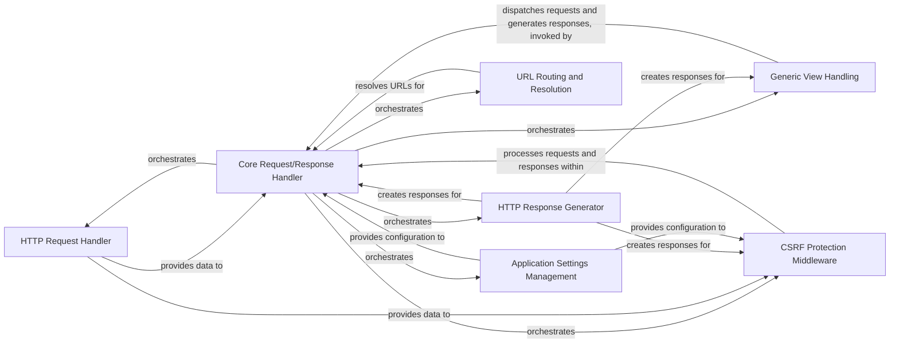

## Component Details

The Core Web Processing subsystem in Django manages the fundamental request-response cycle. It starts by parsing incoming HTTP requests, then resolves URLs to the appropriate views. These requests are processed through various middleware components, such as CSRF protection, before generating and sending back HTTP responses. The system also integrates with global application settings and serves as the entry point for web servers.

### HTTP Request Handler
This component is responsible for encapsulating and processing incoming HTTP requests. It handles parsing request headers, body content, URL paths, and cookies, providing a structured interface for accessing request data.

**Related Classes/Methods**:

- <a href="https://github.com/django/django/blob/master/django/http/request.py#L53-L470" target="_blank" rel="noopener noreferrer">`django.http.request.HttpRequest` (53:470)</a>
- <a href="https://github.com/django/django/blob/master/django/http/request.py#L524-L692" target="_blank" rel="noopener noreferrer">`django.http.request.QueryDict` (524:692)</a>
- <a href="https://github.com/django/django/blob/master/django/utils/datastructures.py#L49-L217" target="_blank" rel="noopener noreferrer">`django.utils.datastructures.MultiValueDict` (49:217)</a>
- <a href="https://github.com/django/django/blob/master/django/http/request.py#L473-L521" target="_blank" rel="noopener noreferrer">`django.http.request.HttpHeaders` (473:521)</a>
- <a href="https://github.com/django/django/blob/master/django/http/request.py#L695-L773" target="_blank" rel="noopener noreferrer">`django.http.request.MediaType` (695:773)</a>
- <a href="https://github.com/django/django/blob/master/django/utils/http.py#L319-L341" target="_blank" rel="noopener noreferrer">`django.utils.http.parse_header_parameters` (319:341)</a>
- <a href="https://github.com/django/django/blob/master/django/core/exceptions.py#L54-L57" target="_blank" rel="noopener noreferrer">`django.core.exceptions.DisallowedHost` (54:57)</a>
- <a href="https://github.com/django/django/blob/master/django/utils/encoding.py#L191-L205" target="_blank" rel="noopener noreferrer">`django.utils.encoding.escape_uri_path` (191:205)</a>
- <a href="https://github.com/django/django/blob/master/django/utils/encoding.py#L107-L135" target="_blank" rel="noopener noreferrer">`django.utils.encoding.iri_to_uri` (107:135)</a>
- <a href="https://github.com/django/django/blob/master/django/core/signing.py#L109-L115" target="_blank" rel="noopener noreferrer">`django.core.signing.get_cookie_signer` (109:115)</a>
- <a href="https://github.com/django/django/blob/master/django/core/exceptions.py#L123-L126" target="_blank" rel="noopener noreferrer">`django.core.exceptions.ImproperlyConfigured` (123:126)</a>
- <a href="https://github.com/django/django/blob/master/django/core/files/uploadhandler.py#L239-L252" target="_blank" rel="noopener noreferrer">`django.core.files.uploadhandler.load_handler` (239:252)</a>
- <a href="https://github.com/django/django/blob/master/django/http/multipartparser.py#L48-L413" target="_blank" rel="noopener noreferrer">`django.http.multipartparser.MultiPartParser` (48:413)</a>
- <a href="https://github.com/django/django/blob/master/django/http/request.py#L43-L50" target="_blank" rel="noopener noreferrer">`django.http.request.RawPostDataException` (43:50)</a>
- <a href="https://github.com/django/django/blob/master/django/core/exceptions.py#L84-L90" target="_blank" rel="noopener noreferrer">`django.core.exceptions.RequestDataTooBig` (84:90)</a>
- <a href="https://github.com/django/django/blob/master/django/http/request.py#L39-L40" target="_blank" rel="noopener noreferrer">`django.http.request.UnreadablePostError` (39:40)</a>
- <a href="https://github.com/django/django/blob/master/django/core/exceptions.py#L99-L102" target="_blank" rel="noopener noreferrer">`django.core.exceptions.BadRequest` (99:102)</a>

### HTTP Response Generator
This component is responsible for constructing and managing HTTP responses. It provides functionalities to set response headers, cookies, and content, and to serialize the response for sending back to the client.

**Related Classes/Methods**:

- <a href="https://github.com/django/django/blob/master/django/http/response.py#L365-L435" target="_blank" rel="noopener noreferrer">`django.http.response.HttpResponse` (365:435)</a>
- <a href="https://github.com/django/django/blob/master/django/http/response.py#L103-L362" target="_blank" rel="noopener noreferrer">`django.http.response.HttpResponseBase` (103:362)</a>
- <a href="https://github.com/django/django/blob/master/django/http/response.py#L33-L96" target="_blank" rel="noopener noreferrer">`django.http.response.ResponseHeaders` (33:96)</a>
- <a href="https://github.com/django/django/blob/master/django/utils/timezone.py#L224-L234" target="_blank" rel="noopener noreferrer">`django.utils.timezone.is_naive` (224:234)</a>
- <a href="https://github.com/django/django/blob/master/django/utils/timezone.py#L237-L245" target="_blank" rel="noopener noreferrer">`django.utils.timezone.make_aware` (237:245)</a>
- <a href="https://github.com/django/django/blob/master/django/utils/http.py#L86-L97" target="_blank" rel="noopener noreferrer">`django.utils.http.http_date` (86:97)</a>
- <a href="https://github.com/django/django/blob/master/django/core/signing.py#L109-L115" target="_blank" rel="noopener noreferrer">`django.core.signing.get_cookie_signer` (109:115)</a>
- <a href="https://github.com/django/django/blob/master/django/dispatch/dispatcher.py#L25-L488" target="_blank" rel="noopener noreferrer">`django.dispatch.dispatcher.Signal` (25:488)</a>

### URL Routing and Resolution
This component manages the mapping of URLs to view functions or classes. It includes mechanisms for compiling URL patterns, resolving incoming requests to the correct view, and reversing URLs to generate paths from view names.

**Related Classes/Methods**:

- <a href="https://github.com/django/django/blob/master/django/urls/resolvers.py#L501-L839" target="_blank" rel="noopener noreferrer">`django.urls.resolvers.URLResolver` (501:839)</a>
- <a href="https://github.com/django/django/blob/master/django/urls/resolvers.py#L130-L155" target="_blank" rel="noopener noreferrer">`django.urls.resolvers.LocaleRegexDescriptor` (130:155)</a>
- <a href="https://github.com/django/django/blob/master/django/urls/resolvers.py#L158-L189" target="_blank" rel="noopener noreferrer">`django.urls.resolvers.CheckURLMixin` (158:189)</a>
- <a href="https://github.com/django/django/blob/master/django/urls/resolvers.py#L192-L239" target="_blank" rel="noopener noreferrer">`django.urls.resolvers.RegexPattern` (192:239)</a>
- <a href="https://github.com/django/django/blob/master/django/urls/resolvers.py#L293-L311" target="_blank" rel="noopener noreferrer">`django.urls.resolvers.LocaleRegexRouteDescriptor` (293:311)</a>
- <a href="https://github.com/django/django/blob/master/django/urls/resolvers.py#L314-L383" target="_blank" rel="noopener noreferrer">`django.urls.resolvers.RoutePattern` (314:383)</a>
- <a href="https://github.com/django/django/blob/master/django/urls/resolvers.py#L386-L417" target="_blank" rel="noopener noreferrer">`django.urls.resolvers.LocalePrefixPattern` (386:417)</a>
- <a href="https://github.com/django/django/blob/master/django/urls/resolvers.py#L420-L498" target="_blank" rel="noopener noreferrer">`django.urls.resolvers.URLPattern` (420:498)</a>
- `django.utils.translation.get_language` (full file reference)
- <a href="https://github.com/django/django/blob/master/django/core/exceptions.py#L123-L126" target="_blank" rel="noopener noreferrer">`django.core.exceptions.ImproperlyConfigured` (123:126)</a>
- <a href="https://github.com/django/django/blob/master/django/core/checks/messages.py#L69-L71" target="_blank" rel="noopener noreferrer">`django.core.checks.messages.Warning` (69:71)</a>
- <a href="https://github.com/django/django/blob/master/django/core/checks/messages.py#L74-L76" target="_blank" rel="noopener noreferrer">`django.core.checks.messages.Error` (74:76)</a>
- <a href="https://github.com/django/django/blob/master/django/urls/resolvers.py#L34-L105" target="_blank" rel="noopener noreferrer">`django.urls.resolvers.ResolverMatch` (34:105)</a>
- <a href="https://github.com/django/django/blob/master/django/core/checks/urls.py#L20-L30" target="_blank" rel="noopener noreferrer">`django.core.checks.urls.check_resolver` (20:30)</a>
- <a href="https://github.com/django/django/blob/master/django/utils/datastructures.py#L49-L217" target="_blank" rel="noopener noreferrer">`django.utils.datastructures.MultiValueDict` (49:217)</a>
- <a href="https://github.com/django/django/blob/master/django/utils/regex_helper.py#L42-L193" target="_blank" rel="noopener noreferrer">`django.utils.regex_helper.normalize` (42:193)</a>
- <a href="https://github.com/django/django/blob/master/django/urls/utils.py#L9-L56" target="_blank" rel="noopener noreferrer">`django.urls.utils.get_callable` (9:56)</a>
- <a href="https://github.com/django/django/blob/master/django/utils/http.py#L308-L316" target="_blank" rel="noopener noreferrer">`django.utils.http.escape_leading_slashes` (308:316)</a>
- <a href="https://github.com/django/django/blob/master/django/urls/exceptions.py#L8-L9" target="_blank" rel="noopener noreferrer">`django.urls.exceptions.NoReverseMatch` (8:9)</a>
- <a href="https://github.com/django/django/blob/master/django/urls/exceptions.py#L4-L5" target="_blank" rel="noopener noreferrer">`django.urls.exceptions.Resolver404` (4:5)</a>

### Core Request/Response Handler
This central component orchestrates the entire request-response lifecycle in Django. It loads and applies middleware, resolves URLs to views, handles exceptions, and ensures the proper flow of data from the incoming request to the outgoing response.

**Related Classes/Methods**:

- <a href="https://github.com/django/django/blob/master/django/core/handlers/base.py#L20-L365" target="_blank" rel="noopener noreferrer">`django.core.handlers.base.BaseHandler` (20:365)</a>
- <a href="https://github.com/django/django/blob/master/django/urls/base.py#L148-L158" target="_blank" rel="noopener noreferrer">`django.urls.base.set_urlconf` (148:158)</a>
- <a href="https://github.com/django/django/blob/master/django/utils/log.py#L217-L262" target="_blank" rel="noopener noreferrer">`django.utils.log.log_response` (217:262)</a>
- <a href="https://github.com/django/django/blob/master/django/core/handlers/exception.py#L24-L60" target="_blank" rel="noopener noreferrer">`django.core.handlers.exception.convert_exception_to_response` (24:60)</a>
- <a href="https://github.com/django/django/blob/master/django/utils/module_loading.py#L19-L35" target="_blank" rel="noopener noreferrer">`django.utils.module_loading.import_string` (19:35)</a>
- <a href="https://github.com/django/django/blob/master/django/urls/resolvers.py#L108-L111" target="_blank" rel="noopener noreferrer">`django.urls.resolvers.get_resolver` (108:111)</a>
- <a href="https://github.com/django/django/blob/master/django/db/transaction.py#L316-L323" target="_blank" rel="noopener noreferrer">`django.db.transaction.atomic` (316:323)</a>

### Application Settings Management
This component provides a mechanism for managing Django's configuration settings. It allows for lazy loading of settings, ensuring that settings are only loaded when accessed, and handles potential misconfigurations.

**Related Classes/Methods**:

- `django.conf.LazySettings` (full file reference)
- <a href="https://github.com/django/django/blob/master/django/core/exceptions.py#L123-L126" target="_blank" rel="noopener noreferrer">`django.core.exceptions.ImproperlyConfigured` (123:126)</a>
- `django.conf.Settings` (full file reference)
- `django.conf.UserSettingsHolder` (full file reference)
- <a href="https://github.com/django/django/blob/master/django/utils/functional.py#L259-L372" target="_blank" rel="noopener noreferrer">`django.utils.functional.LazyObject` (259:372)</a>
- <a href="https://github.com/django/django/blob/master/django/urls/base.py#L129-L135" target="_blank" rel="noopener noreferrer">`django.urls.base.get_script_prefix` (129:135)</a>

### CSRF Protection Middleware
This middleware component is dedicated to protecting against Cross-Site Request Forgery attacks. It validates CSRF tokens in incoming requests and manages the CSRF cookie in responses to ensure secure interactions.

**Related Classes/Methods**:

- <a href="https://github.com/django/django/blob/master/django/middleware/csrf.py#L165-L483" target="_blank" rel="noopener noreferrer">`django.middleware.csrf.CsrfViewMiddleware` (165:483)</a>
- <a href="https://github.com/django/django/blob/master/django/middleware/csrf.py#L50-L52" target="_blank" rel="noopener noreferrer">`django.middleware.csrf._get_failure_view` (50:52)</a>
- <a href="https://github.com/django/django/blob/master/django/utils/log.py#L217-L262" target="_blank" rel="noopener noreferrer">`django.utils.log.log_response` (217:262)</a>
- <a href="https://github.com/django/django/blob/master/django/core/exceptions.py#L123-L126" target="_blank" rel="noopener noreferrer">`django.core.exceptions.ImproperlyConfigured` (123:126)</a>
- <a href="https://github.com/django/django/blob/master/django/middleware/csrf.py#L130-L140" target="_blank" rel="noopener noreferrer">`django.middleware.csrf._check_token_format` (130:140)</a>
- <a href="https://github.com/django/django/blob/master/django/middleware/csrf.py#L71-L81" target="_blank" rel="noopener noreferrer">`django.middleware.csrf._unmask_cipher_token` (71:81)</a>
- <a href="https://github.com/django/django/blob/master/django/utils/cache.py#L299-L324" target="_blank" rel="noopener noreferrer">`django.utils.cache.patch_vary_headers` (299:324)</a>
- <a href="https://github.com/django/django/blob/master/django/utils/http.py#L225-L242" target="_blank" rel="noopener noreferrer">`django.utils.http.is_same_domain` (225:242)</a>
- <a href="https://github.com/django/django/blob/master/django/middleware/csrf.py#L160-L162" target="_blank" rel="noopener noreferrer">`django.middleware.csrf.RejectRequest` (160:162)</a>
- <a href="https://github.com/django/django/blob/master/django/http/request.py#L491-L496" target="_blank" rel="noopener noreferrer">`django.http.request.HttpHeaders.parse_header_name` (491:496)</a>
- <a href="https://github.com/django/django/blob/master/django/middleware/csrf.py#L143-L157" target="_blank" rel="noopener noreferrer">`django.middleware.csrf._does_token_match` (143:157)</a>
- <a href="https://github.com/django/django/blob/master/django/middleware/csrf.py#L84-L93" target="_blank" rel="noopener noreferrer">`django.middleware.csrf._add_new_csrf_cookie` (84:93)</a>

### Generic View Handling
This component provides a base class for implementing class-based views in Django. It offers a structured way to handle different HTTP methods (GET, POST, etc.) and provides common functionalities for view setup and dispatching.

**Related Classes/Methods**:

- <a href="https://github.com/django/django/blob/master/django/views/generic/base.py#L37-L181" target="_blank" rel="noopener noreferrer">`django.views.generic.base.View` (37:181)</a>
- <a href="https://github.com/django/django/blob/master/django/core/exceptions.py#L123-L126" target="_blank" rel="noopener noreferrer">`django.core.exceptions.ImproperlyConfigured` (123:126)</a>
- <a href="https://github.com/django/django/blob/master/django/http/response.py#L693-L706" target="_blank" rel="noopener noreferrer">`django.http.response.HttpResponseNotAllowed` (693:706)</a>
- <a href="https://github.com/django/django/blob/master/django/http/response.py#L365-L435" target="_blank" rel="noopener noreferrer">`django.http.response.HttpResponse` (365:435)</a>
- <a href="https://github.com/django/django/blob/master/django/utils/log.py#L217-L262" target="_blank" rel="noopener noreferrer">`django.utils.log.log_response` (217:262)</a>

### [FAQ](https://github.com/CodeBoarding/GeneratedOnBoardings/tree/main?tab=readme-ov-file#faq)