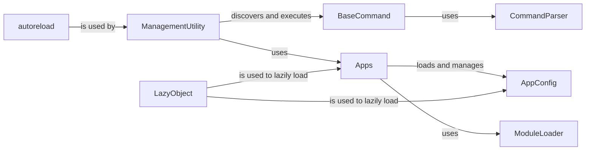

## Details

This analysis provides a comprehensive overview of the Core Utilities & CLI subsystem within the Django framework. The components selected are fundamental to the framework's operation, covering the command-line interface, application management, and essential utility functions.

### ManagementUtility
The main entry point for running management commands from the command line. It parses the command-line arguments, determines which command to execute, and delegates the execution to the appropriate command object. This class is central to the functioning of `manage.py` and `django-admin`.

**Related Classes/Methods**:

- `ManagementUtility`

### BaseCommand
The abstract base class for all management commands. It provides a standardized structure for creating new commands, including argument parsing, option handling, and writing output. Developers subclass `BaseCommand` and implement the `handle()` method to define the command's logic.

**Related Classes/Methods**:

- `BaseCommand`

### AppConfig
Represents the configuration for a single Django application. It holds metadata about the application, such as its name, label, and path. It also provides hooks that allow applications to perform initialization tasks, such as registering signal handlers, when the application is ready.

**Related Classes/Methods**:

- `AppConfig`

### Apps
A registry that stores the configuration of all installed applications in a Django project. It is responsible for loading `AppConfig` instances, discovering models, and managing dependencies between applications. The `Apps` registry is a critical component for the ORM, migrations, and other parts of the framework.

**Related Classes/Methods**:

- `Apps`

### LazyObject
A proxy class that delays the instantiation of an object until it is first accessed. This is a key performance optimization used throughout Django to avoid loading unnecessary code and data into memory.

**Related Classes/Methods**:

- `LazyObject`

### autoreload
A utility that monitors project files for changes and automatically reloads the development server when a file is modified. This provides a seamless development experience by eliminating the need for manual server restarts.

**Related Classes/Methods**:

- `autoreload`

### CommandParser
A customized argument parser, based on Python's `argparse`, used by `BaseCommand` to handle command-line arguments and options. It provides a consistent and powerful way to define the interface for management commands.

**Related Classes/Methods**:

- `CommandParser`

### ModuleLoader
A utility for dynamically loading Python modules. It is used throughout Django to load modules on demand, which is essential for the framework's pluggable architecture.

**Related Classes/Methods**:

- `ModuleLoader`

### [FAQ](https://github.com/CodeBoarding/GeneratedOnBoardings/tree/main?tab=readme-ov-file#faq)