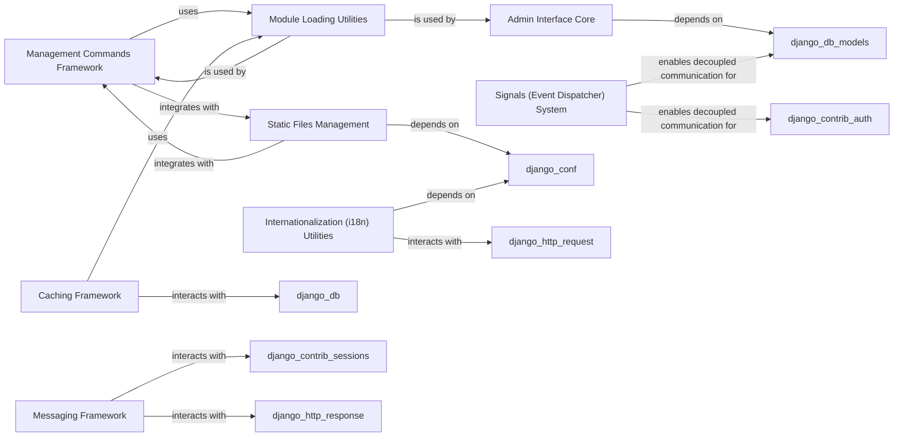

## Component Details

One paragraph explaining the functionality which is represented by this graph. What the main flow is and what is its purpose.

### Management Commands Framework
This component provides the core infrastructure for Django's command-line utilities. It defines the base classes and mechanisms for creating and executing custom management commands (e.g., `runserver`, `migrate`, `collectstatic`), enabling developers to automate various project tasks. It's fundamental as it provides the primary interface for interacting with and managing Django projects from the command line.

**Related Classes/Methods**:

- <a href="https://github.com/django/django/blob/master/django/core/management/base.py#L1-L1" target="_blank" rel="noopener noreferrer">`django.core.management.base` (1:1)</a>

### Module Loading Utilities
A critical utility component responsible for dynamically loading Python modules, classes, and functions from string paths. This flexibility is vital for Django's pluggable architecture, allowing various parts of the framework to be configured and extended at runtime. It's fundamental because many other Django components rely on its ability to dynamically resolve and import code.

**Related Classes/Methods**:

- <a href="https://github.com/django/django/blob/master/django/utils/module_loading.py#L1-L1" target="_blank" rel="noopener noreferrer">`django.utils.module_loading` (1:1)</a>

### Admin Interface Core
This component provides the foundational elements for Django's powerful, automatically generated administrative interface. It allows developers to quickly create a web-based backend for managing application data, including user authentication, content types, and model-specific configurations. It's fundamental as it offers a rapid way to manage application data without writing custom views.

**Related Classes/Methods**:

- <a href="https://github.com/django/django/blob/master/django/contrib/admin/sites.py#L1-L1" target="_blank" rel="noopener noreferrer">`django.contrib.admin.sites` (1:1)</a>
- <a href="https://github.com/django/django/blob/master/django/contrib/admin/options.py#L1-L1" target="_blank" rel="noopener noreferrer">`django.contrib.admin.options` (1:1)</a>

### Static Files Management
This component is dedicated to handling the collection, discovery, and serving of static assets (like CSS, JavaScript, and images) for Django projects. It's particularly important for efficiently managing static files in production environments. It's fundamental for any web application serving static content.

**Related Classes/Methods**:

- <a href="https://github.com/django/django/blob/master/django/contrib/staticfiles/finders.py#L1-L1" target="_blank" rel="noopener noreferrer">`django.contrib.staticfiles.finders` (1:1)</a>
- <a href="https://github.com/django/django/blob/master/django/contrib/staticfiles/storage.py#L1-L1" target="_blank" rel="noopener noreferrer">`django.contrib.staticfiles.storage` (1:1)</a>

### Caching Framework
Offers a flexible and extensible system for caching data to improve application performance by reducing redundant computations or database queries. It provides a unified API for interacting with various cache backends. It's fundamental for optimizing the performance and scalability of Django applications.

**Related Classes/Methods**:

- <a href="https://github.com/django/django/blob/master/django/template/backends/django.py#L1-L1" target="_blank" rel="noopener noreferrer">`django.core.cache` (1:1)</a>
- <a href="https://github.com/django/django/blob/master/django/core/cache/backends/base.py#L1-L1" target="_blank" rel="noopener noreferrer">`django.core.cache.backends.base` (1:1)</a>

### Signals (Event Dispatcher) System
Implements a publish-subscribe pattern within Django, allowing different parts of the application to send notifications (signals) and register functions (receivers) to respond to those signals. This promotes decoupled communication and extensibility. It's fundamental for building loosely coupled and extensible Django applications.

**Related Classes/Methods**:

- <a href="https://github.com/django/django/blob/master/django/dispatch/dispatcher.py#L1-L1" target="_blank" rel="noopener noreferrer">`django.dispatch.dispatcher` (1:1)</a>

### Messaging Framework
Provides a mechanism for temporarily storing and displaying "one-off" notification messages to users across HTTP requests. These messages are typically displayed after a redirect or on the next page load. It's fundamental for providing user feedback in web applications.

**Related Classes/Methods**:

- <a href="https://github.com/django/django/blob/master/django/contrib/messages/api.py#L1-L1" target="_blank" rel="noopener noreferrer">`django.contrib.messages.api` (1:1)</a>
- <a href="https://github.com/django/django/blob/master/django/contrib/messages/storage/base.py#L1-L1" target="_blank" rel="noopener noreferrer">`django.contrib.messages.storage.base` (1:1)</a>
- <a href="https://github.com/django/django/blob/master/django/contrib/messages/middleware.py#L1-L1" target="_blank" rel="noopener noreferrer">`django.contrib.messages.middleware` (1:1)</a>

### Internationalization (i18n) Utilities
Offers a comprehensive set of tools for enabling multi-language support in Django applications. This includes functions for marking strings for translation, activating specific locales, and handling locale-aware formatting. It's fundamental for developing applications that cater to a global audience.

**Related Classes/Methods**:

- <a href="https://github.com/django/django/blob/master/django/template/backends/django.py#L1-L1" target="_blank" rel="noopener noreferrer">`django.utils.translation` (1:1)</a>
- <a href="https://github.com/django/django/blob/master/django/utils/translation/trans_real.py#L1-L1" target="_blank" rel="noopener noreferrer">`django.utils.translation.trans_real` (1:1)</a>

### [FAQ](https://github.com/CodeBoarding/GeneratedOnBoardings/tree/main?tab=readme-ov-file#faq)