## Details

Core Web Processing: This component serves as the primary interface for all web traffic within the Django framework. It orchestrates the reception, parsing, routing, and response generation for HTTP requests, abstracting the underlying web server (WSGI/ASGI) specifics.

### HttpRequest
Represents an incoming HTTP request from a client. It encapsulates all request-related data, such as headers, body content, GET/POST parameters, cookies, and user information. This object is the primary input to Django's view functions and methods.

**Related Classes/Methods**:

- <a href="https://github.com/django/django/blob/master/django/http/request.py#L52-L480" target="_blank" rel="noopener noreferrer">`django.http.request.HttpRequest` (52:480)</a>

### HttpResponse
Represents an outgoing HTTP response that Django sends back to the client. It contains the response body, HTTP headers, and the HTTP status code. Views are responsible for constructing and returning `HttpResponse` objects.

**Related Classes/Methods**:

- <a href="https://github.com/django/django/blob/master/django/http/response.py#L364-L434" target="_blank" rel="noopener noreferrer">`django.http.response.HttpResponse` (364:434)</a>

### BaseHandler
An abstract base class that defines the fundamental request-response processing cycle for Django applications. It provides the core logic for handling incoming requests, applying middleware, resolving URLs, and generating responses, regardless of the specific server interface (WSGI/ASGI).

**Related Classes/Methods**:

- <a href="https://github.com/django/django/blob/master/django/core/handlers/base.py#L19-L364" target="_blank" rel="noopener noreferrer">`django.core.handlers.base.BaseHandler` (19:364)</a>

### WSGIHandler
A concrete implementation of `BaseHandler` tailored for WSGI (Web Server Gateway Interface) environments. It acts as the entry point for WSGI-compliant web servers, translating WSGI environment data into `HttpRequest` objects and converting `HttpResponse` objects into WSGI-compatible iterables.

**Related Classes/Methods**:

- <a href="https://github.com/django/django/blob/master/django/core/handlers/wsgi.py#L112-L143" target="_blank" rel="noopener noreferrer">`django.core.handlers.wsgi.WSGIHandler` (112:143)</a>

### ASGIHandler
A concrete implementation of `BaseHandler` designed for ASGI (Asynchronous Server Gateway Interface) environments. It serves as the entry point for asynchronous web servers, handling ASGI scopes and events to create `HttpRequest` objects and manage the asynchronous response flow.

**Related Classes/Methods**:

- <a href="https://github.com/django/django/blob/master/django/core/handlers/asgi.py#L138-L378" target="_blank" rel="noopener noreferrer">`django.core.handlers.asgi.ASGIHandler` (138:378)</a>

### URLResolver
This component is central to Django's URL dispatching system. It takes an incoming URL path and, based on the project's configured URL patterns (`urlpatterns`), determines which view function or class should handle the request, extracting any URL parameters in the process.

**Related Classes/Methods**:

- <a href="https://github.com/django/django/blob/master/django/urls/resolvers.py#L1-L1" target="_blank" rel="noopener noreferrer">`django.urls.resolvers.URLResolver` (1:1)</a>

### View
A fundamental callable (function or class) in Django that receives an `HttpRequest` object as its primary argument and is responsible for returning an `HttpResponse` object. It encapsulates the application's specific business logic for a particular URL endpoint. `django.views.generic.base.View` serves as the base for all class-based views.

**Related Classes/Methods**:

- <a href="https://github.com/django/django/blob/master/django/views/generic/base.py#L36-L180" target="_blank" rel="noopener noreferrer">`django.views.generic.base.View` (36:180)</a>

### MiddlewareMixin
A utility mixin commonly used by Django's middleware classes. Middleware components are hooks that process requests before they reach the view and responses before they are sent back to the client, allowing for global modifications like session management, authentication, or CSRF protection.

**Related Classes/Methods**:

- <a href="https://github.com/django/django/blob/master/django/utils/deprecation.py#L85-L141" target="_blank" rel="noopener noreferrer">`django.utils.deprecation.MiddlewareMixin` (85:141)</a>

### QueryDict
A specialized dictionary-like class used within `HttpRequest` to handle HTTP query parameters (GET) and form data (POST). It is designed to correctly manage cases where multiple values are associated with a single key.

**Related Classes/Methods**:

- <a href="https://github.com/django/django/blob/master/django/http/request.py#L534-L702" target="_blank" rel="noopener noreferrer">`django.http.request.QueryDict` (534:702)</a>

### ResponseHeaders
A case-insensitive dictionary-like object used by `HttpResponse` instances to manage and store HTTP response headers. It ensures that header names are handled consistently regardless of their casing.

**Related Classes/Methods**:

- <a href="https://github.com/django/django/blob/master/django/http/response.py#L32-L95" target="_blank" rel="noopener noreferrer">`django.http.response.ResponseHeaders` (32:95)</a>

### [FAQ](https://github.com/CodeBoarding/GeneratedOnBoardings/tree/main?tab=readme-ov-file#faq)