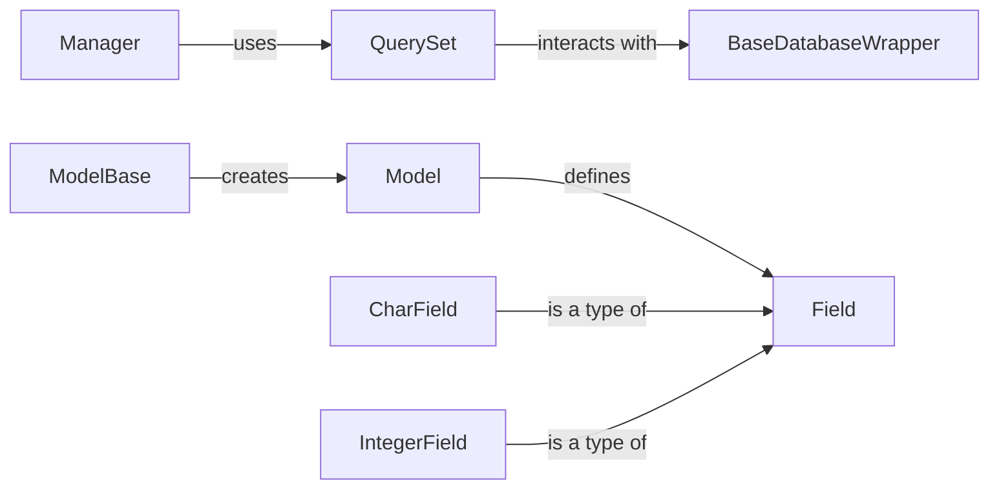

## Component Details

The Django ORM provides a way to interact with databases using Python code. It defines models as Python classes, which represent database tables. The ORM handles the translation between Python objects and database records, allowing developers to perform database operations using a high-level API. Key components include Model (representing a table), Field (representing a column), QuerySet (representing a collection of objects), and DatabaseWrapper (handling the connection to the database).

### Model
The Model class is the base class for all Django models. It represents a database table and provides methods for saving, deleting, and retrieving data. Models define the structure of the data and how it is stored in the database.
- **Related Classes/Methods**: `django.db.models.base.Model`

### Field
The Field class is the base class for all model fields. It represents a column in the database table and provides methods for validation, data conversion, and database interaction. Different field types (CharField, IntegerField) map to different database column types.
- **Related Classes/Methods**: `django.db.models.fields.Field`, `django.db.models.fields.CharField`, `django.db.models.fields.IntegerField`

### QuerySet
QuerySet represents a collection of objects from the database. It provides methods for filtering, ordering, and retrieving data. QuerySets are lazily evaluated, meaning that the database query is not executed until the results are needed.
- **Related Classes/Methods**: `django.db.models.query.QuerySet`

### BaseDatabaseWrapper
BaseDatabaseWrapper provides an interface to the database. It handles connection management, transaction management, and query execution. It abstracts away the specifics of the underlying database engine.
- **Related Classes/Methods**: `django.db.backends.base.base.BaseDatabaseWrapper`

### Manager
Manager is a class that provides an interface to the database for a specific model. It is responsible for creating and returning QuerySets. Each model has a default manager, and custom managers can be defined to add model-specific functionality.
- **Related Classes/Methods**: `django.db.models.manager.Manager`

### ModelBase
ModelBase is a metaclass responsible for creating model classes, setting up fields, and handling inheritance. It prepares the model for use in the ORM.
- **Related Classes/Methods**: `django.db.models.base.ModelBase`
