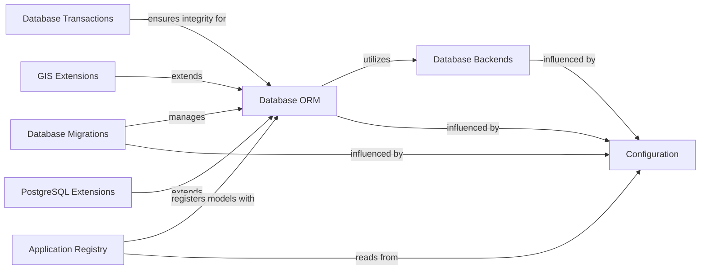

## Component Details

Django's Data Management subsystem provides a robust and extensible framework for interacting with databases. At its core, the Database ORM allows developers to define data models as Python classes and interact with database records as Python objects, abstracting away raw SQL. This ORM relies on various Database Backends to communicate with specific database systems like PostgreSQL, MySQL, or SQLite, providing a consistent API across different databases. Database Migrations enable the evolution of the database schema in a controlled manner, tracking changes to models and applying them incrementally. Data integrity during complex operations is ensured by the Database Transactions component. Furthermore, Django extends its data management capabilities with specialized modules like GIS Extensions for handling geographic data and PostgreSQL Extensions for leveraging advanced PostgreSQL features. The entire data management process is tightly integrated with the Application Registry, which discovers and registers models from installed applications, and is heavily influenced by the global Configuration settings of the Django project.

### Database ORM
Django's core Object-Relational Mapper, providing an API for interacting with databases using Python objects (models). It includes functionalities for defining models, querying data, and managing database relationships.

**Related Classes/Methods**:

- <a href="https://github.com/django/django/blob/master/django/db/models/base.py#L480-L2406" target="_blank" rel="noopener noreferrer">`django.db.models.base.Model` (480:2406)</a>

### Database Backends
Handles the low-level communication and specific implementations for different database systems (e.g., PostgreSQL, MySQL, SQLite, Oracle). It provides an abstraction layer for database operations.

**Related Classes/Methods**:

- `django.db.backends.base.BaseDatabaseWrapper` (full file reference)

### Database Migrations
Manages changes to the database schema over time, allowing developers to evolve their database models without losing data. It includes tools for creating, applying, and reverting migrations.

**Related Classes/Methods**:

- <a href="https://github.com/django/django/blob/master/django/db/migrations/migration.py#L8-L221" target="_blank" rel="noopener noreferrer">`django.db.migrations.Migration` (8:221)</a>

### Database Transactions
Provides mechanisms for managing database transactions, ensuring data integrity and atomicity of operations.

**Related Classes/Methods**:

- <a href="https://github.com/django/django/blob/master/django/db/transaction.py#L315-L322" target="_blank" rel="noopener noreferrer">`django.db.transaction.atomic` (315:322)</a>

### GIS Extensions
Extends Django's ORM with support for Geographic Information Systems (GIS) data types and operations, enabling spatial queries and data manipulation.

**Related Classes/Methods**:

- <a href="https://github.com/django/django/blob/master/django/contrib/gis/db/models/fields.py#L224-L321" target="_blank" rel="noopener noreferrer">`django.contrib.gis.db.models.fields.GeometryField` (224:321)</a>

### PostgreSQL Extensions
Provides PostgreSQL-specific database features and field types, such as JSONField and ArrayField, enhancing Django's ORM capabilities for PostgreSQL databases.

**Related Classes/Methods**:

- <a href="https://github.com/django/django/blob/master/django/contrib/postgres/fields/jsonb.py#L5-L13" target="_blank" rel="noopener noreferrer">`django.contrib.postgres.fields.jsonb.JSONField` (5:13)</a>

### Application Registry
Responsible for discovering and managing the installed applications within a Django project, providing a central registry for application-specific configurations and models.

**Related Classes/Methods**:

- <a href="https://github.com/django/django/blob/master/django/apps/registry.py#L12-L433" target="_blank" rel="noopener noreferrer">`django.apps.registry.Apps` (12:433)</a>
- <a href="https://github.com/django/django/blob/master/django/apps/config.py#L12-L273" target="_blank" rel="noopener noreferrer">`django.apps.config.AppConfig` (12:273)</a>

### Configuration
Manages the project-wide settings and global configurations, influencing the behavior of various Django components.

**Related Classes/Methods**:

- `django.conf.settings` (full file reference)

### [FAQ](https://github.com/CodeBoarding/GeneratedOnBoardings/tree/main?tab=readme-ov-file#faq)