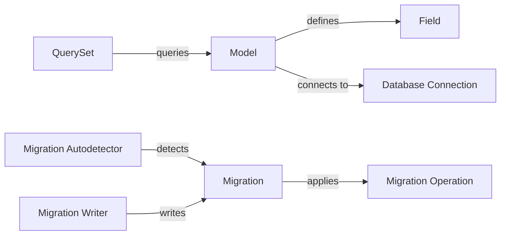

## Component Details

### Model
Represents a database table and provides an interface for querying, creating, updating, and deleting data. It defines the structure of the table and provides methods for interacting with the data. Models are typically defined as Python classes that inherit from `django.db.models.Model`.
- **Related Classes/Methods**: `django.db.models.base.Model`

### Field
Represents a column in a database table and defines the data type, constraints, and other properties of the column. It handles the conversion of data between Python objects and database values. Fields are defined as instances of classes like `CharField`, `IntegerField`, etc., and are associated with a Model.
- **Related Classes/Methods**: `django.db.models.fields`

### QuerySet
Represents a collection of objects from the database and provides methods for filtering, ordering, and retrieving data. It allows for efficient querying of the database and provides a fluent interface for building complex queries. QuerySets are typically obtained from a Model's `objects` manager.
- **Related Classes/Methods**: `django.db.models.query.QuerySet`

### Database Connection
Handles the connection to the database. It abstracts the underlying database connection details and provides a consistent interface for interacting with the database. The connection is managed by `django.db.backends.base.base.BaseDatabaseWrapper` and its subclasses for specific database backends.
- **Related Classes/Methods**: `django.db.backends.base.base.BaseDatabaseWrapper`

### Migration
Represents a change to the database schema and provides a way to apply and revert changes to the database. It allows for managing the evolution of the database schema over time. Migrations are defined as Python classes that inherit from `django.db.migrations.migration.Migration`.
- **Related Classes/Methods**: `django.db.migrations.migration.Migration`

### Migration Autodetector
Detects changes to the database schema and generates migrations to apply those changes. It automates the process of creating migrations based on changes to the models. The autodetector is implemented in `django.db.migrations.autodetector.MigrationAutodetector`.
- **Related Classes/Methods**: `django.db.migrations.autodetector.MigrationAutodetector`

### Migration Operation
Represents a single change to the database schema, such as creating a table or adding a column. It encapsulates the logic for applying and reverting a specific change to the database. Migration operations are defined as classes in `django.db.migrations.operations`.
- **Related Classes/Methods**: `django.db.migrations.operations.Operation`

### Migration Writer
Writes the migration files to disk. It handles the serialization of the migration operations and writes them to a file that can be applied to the database. The writer is implemented in `django.db.migrations.writer.MigrationWriter`.
- **Related Classes/Methods**: `django.db.migrations.writer.MigrationWriter`
