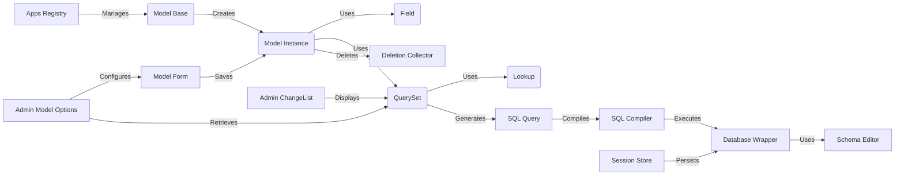

### Component Descriptions:

*   **Apps Registry**: Manages the configuration of Django applications, including loading, storing, and providing access to application models. It is a central point for accessing models and their configurations. It manages the Model Base.
    *   Relevant source files: `repos.django.django.apps.registry.Apps`, `repos.django.django.apps.config.AppConfig`

*   **Model Base**: Metaclass for models, responsible for creating the model class and setting up its options. It interacts with the Apps Registry to register models and sets up the model's options. It creates Model Instances.
    *   Relevant source files: `repos.django.django.db.models.base.ModelBase`, `django.db.models.options.Options`

*   **Model Instance**: Represents a single instance of a model, providing methods for saving, deleting, and accessing data. It interacts with the Database Wrapper to persist data to the database. It uses Fields and QuerySets.
    *   Relevant source files: `repos.django.django.db.models.base.Model`

*   **Field**: Represents a field in a model, defining its type, constraints, and behavior. It contributes to the class by adding attributes and interacts with the Schema Editor to create database columns. It is used by Model Instance.
    *   Relevant source files: `repos.django.django.db.models.fields.Field`

*   **QuerySet**: Represents a collection of objects from the database, providing methods for filtering, ordering, and retrieving data. It interacts with the SQL Query and SQL Compiler to generate and execute database queries. It uses Lookups and generates SQL Queries.
    *   Relevant source files: `repos.django.django.db.models.query.QuerySet`

*   **Lookup**: Represents a lookup (e.g., equality, less than) in a query, used for filtering data. It interacts with the Field to prepare values for database comparison. It is used by QuerySet.
    *   Relevant source files: `repos.django.django.db.models.lookups.Lookup`

*   **SQL Query**: Represents a SQL query, responsible for generating the SQL statement and executing it against the database. It interacts with the SQL Compiler to generate the SQL and the Database Wrapper to execute it. It is generated by QuerySet and compiled by SQL Compiler.
    *   Relevant source files: `repos.django.django.db.models.sql.query.Query`

*   **SQL Compiler**: Compiles a Query object into SQL. It interacts with the SQL Query to receive the query object and generates SQL. It executes on the Database Wrapper.
    *   Relevant source files: `repos.django.django.db.models.sql.compiler.SQLCompiler`

*   **Database Wrapper**: Provides an interface to the database, handling connection management, transaction control, and query execution. It interacts with the Schema Editor to perform schema operations and executes SQL queries. It is used by SQL Compiler, Schema Editor, Deletion Collector and Session Store.
    *   Relevant source files: `repos.django.django.db.backends.base.base.BaseDatabaseWrapper`

*   **Schema Editor**: Provides an interface for performing schema operations, such as creating and altering tables. It interacts with the Database Wrapper to execute SQL statements. It is used by Database Wrapper.
    *   Relevant source files: `repos.django.django.db.backends.base.schema.BaseDatabaseSchemaEditor`

*   **Deletion Collector**: Collects objects to be deleted and performs the deletion in a consistent manner. It interacts with the Model Instance to delete objects and the Database Wrapper to perform database operations. It deletes Model Instances.
    *   Relevant source files: `repos.django.django.db.models.deletion.Collector`

*   **Model Form**: Binds a form to a model, allowing for easy creation and updating of model instances from form data. It interacts with the Model Instance to save data and the Field to validate data. It saves Model Instances.
    *   Relevant source files: `repos.django.django.forms.models.BaseModelForm`

*   **Admin Model Options**: Configures the admin interface for a model, defining how it is displayed and edited. It interacts with the Model Form to generate forms and the QuerySet to retrieve data. It configures Model Forms and retrieves QuerySets.
    *   Relevant source files: `repos.django.django.contrib.admin.options.BaseModelAdmin`, `repos.django.django.contrib.admin.options.ModelAdmin`

*   **Admin ChangeList**: Handles the display of a list of objects in the admin interface, including filtering, sorting, and pagination. It interacts with the QuerySet to retrieve data and the Admin Model Options to configure the display. It displays QuerySets.
    *   Relevant source files: `repos.django.django.contrib.admin.views.main.ChangeList`

*   **Session Store**: Manages the storage and retrieval of session data. It interacts with the Database Wrapper to persist session data. It persists data to the Database Wrapper.
    *   Relevant source files: `repos.django.django.contrib.sessions.backends.db.SessionStore`
