```mermaid
graph LR
    django_db_models_base_Model["django.db.models.base.Model"]
    django_db_models_manager_BaseManager["django.db.models.manager.BaseManager"]
    django_db_models_query_QuerySet["django.db.models.query.QuerySet"]
    django_db_models_fields["django.db.models.fields"]
    django_db_models_sql_query_Query["django.db.models.sql.query.Query"]
    django_db_backends_base_base_BaseDatabaseWrapper["django.db.backends.base.base.BaseDatabaseWrapper"]
    django_db_transaction["django.db.transaction"]
    django_db_migrations_executor_MigrationExecutor["django.db.migrations.executor.MigrationExecutor"]
    django_contrib_gis_geos_geometry_GEOSGeometry["django.contrib.gis.geos.geometry.GEOSGeometry"]
    django_contrib_gis_gdal_geometries_OGRGeometry["django.contrib.gis.gdal.geometries.OGRGeometry"]
    django_db_backends_base_operations_BaseDatabaseOperations["django.db.backends.base.operations.BaseDatabaseOperations"]
    django_db_backends_base_schema_BaseDatabaseSchemaEditor["django.db.backends.base.schema.BaseDatabaseSchemaEditor"]
    django_db_migrations_loader_MigrationLoader["django.db.migrations.loader.MigrationLoader"]
    django_contrib_gis_geos_libgeos["django.contrib.gis.geos.libgeos"]
    django_contrib_gis_gdal_libgdal["django.contrib.gis.gdal.libgdal"]
    django_contrib_gis_db_models_fields["django.contrib.gis.db.models.fields"]
    django_db_models_base_Model -- "Exposes database interaction through" --> django_db_models_manager_BaseManager
    django_db_models_base_Model -- "Utilizes" --> django_db_models_fields
    django_db_models_base_Model -- "Interacts with" --> django_db_transaction
    django_db_models_manager_BaseManager -- "Returns" --> django_db_models_query_QuerySet
    django_db_models_base_Model -- "Uses" --> django_db_models_manager_BaseManager
    django_db_models_manager_BaseManager -- "Creates and manipulates" --> django_db_models_query_QuerySet
    django_db_models_query_QuerySet -- "Relies on" --> django_db_models_sql_query_Query
    django_db_models_query_QuerySet -- "Interacts with" --> django_db_backends_base_base_BaseDatabaseWrapper
    django_db_models_base_Model -- "Uses" --> django_db_models_fields
    django_db_backends_base_base_BaseDatabaseWrapper -- "Processes" --> django_db_models_fields
    django_db_models_query_QuerySet -- "Builds" --> django_db_models_sql_query_Query
    django_db_models_sql_query_Query -- "Is compiled into SQL by" --> django_db_backends_base_base_BaseDatabaseWrapper
    django_db_backends_base_base_BaseDatabaseWrapper -- "Uses" --> django_db_backends_base_operations_BaseDatabaseOperations
    django_db_backends_base_base_BaseDatabaseWrapper -- "Implements transaction commands orchestrated by" --> django_db_transaction
    django_db_backends_base_base_BaseDatabaseWrapper -- "Provides connection and cursor to" --> django_db_models_query_QuerySet
    django_db_transaction -- "Delegates transaction operations to" --> django_db_backends_base_base_BaseDatabaseWrapper
    django_db_models_base_Model -- "Uses" --> django_db_transaction
    django_db_models_query_QuerySet -- "Uses" --> django_db_transaction
    django_db_migrations_executor_MigrationExecutor -- "Uses" --> django_db_backends_base_schema_BaseDatabaseSchemaEditor
    django_db_migrations_executor_MigrationExecutor -- "Interacts with" --> django_db_migrations_loader_MigrationLoader
    django_contrib_gis_geos_geometry_GEOSGeometry -- "Relies on" --> django_contrib_gis_geos_libgeos
    django_contrib_gis_geos_geometry_GEOSGeometry -- "Can convert to and from" --> django_contrib_gis_gdal_geometries_OGRGeometry
    django_contrib_gis_db_models_fields -- "Uses" --> django_contrib_gis_geos_geometry_GEOSGeometry
    django_contrib_gis_gdal_geometries_OGRGeometry -- "Relies on" --> django_contrib_gis_gdal_libgdal
    django_contrib_gis_gdal_geometries_OGRGeometry -- "Can convert to and from" --> django_contrib_gis_geos_geometry_GEOSGeometry
    django_contrib_gis_db_models_fields -- "Uses" --> django_contrib_gis_gdal_geometries_OGRGeometry
```

## Component Details

The `Data Persistence & Geospatial Services` component in Django provides a robust and extensible framework for interacting with relational databases and handling complex geospatial data. Its core purpose is to abstract the complexities of SQL and underlying GIS libraries, allowing developers to work with data using Python objects.

### django.db.models.base.Model
The foundational class for defining database models. Each subclass maps to a database table, and instances represent rows. It provides the core API for data manipulation (create, retrieve, update, delete).

**Related Classes/Methods**:

- <a href="https://github.com/django/django/blob/master/django/db/models/base.py#L480-L2407" target="_blank" rel="noopener noreferrer">`django.db.models.base.Model` (480:2407)</a>

### django.db.models.manager.BaseManager
The primary interface through which database query operations are provided to Django models. It acts as the entry point for all database interactions for a given model.

**Related Classes/Methods**:

- <a href="https://github.com/django/django/blob/master/django/db/models/manager.py#L9-L172" target="_blank" rel="noopener noreferrer">`django.db.models.manager.BaseManager` (9:172)</a>

### django.db.models.query.QuerySet
A lazy, iterable object representing a collection of database queries. It allows for building complex queries by chaining multiple filtering, ordering, and annotation methods, executing the query only when results are needed.

**Related Classes/Methods**:

- <a href="https://github.com/django/django/blob/master/django/db/models/query.py#L1-L1" target="_blank" rel="noopener noreferrer">`django.db.models.query.QuerySet` (1:1)</a>

### django.db.models.fields
This represents the collection of various field types (e.g., CharField, IntegerField, GeometryField) used to define columns within Django models. These fields handle data type mapping to the database, validation, and Python-to-database value conversion.

**Related Classes/Methods**:

- `django.db.models.fields` (1:1)

### django.db.models.sql.query.Query
The internal representation of a database query. It holds the parsed components of a query (e.g., SELECT, FROM, WHERE, JOIN clauses) and is responsible for generating the final SQL string.

**Related Classes/Methods**:

- <a href="https://github.com/django/django/blob/master/django/db/models/sql/query.py#L1-L1" target="_blank" rel="noopener noreferrer">`django.db.models.sql.query.Query` (1:1)</a>

### django.db.backends.base.base.BaseDatabaseWrapper
An abstract base class for all database backend wrappers. It provides a standardized interface for establishing and managing database connections, handling cursors, and controlling transactions.

**Related Classes/Methods**:

- <a href="https://github.com/django/django/blob/master/django/db/backends/base/base.py#L29-L791" target="_blank" rel="noopener noreferrer">`django.db.backends.base.base.BaseDatabaseWrapper` (29:791)</a>

### django.db.transaction
A module providing functions and decorators for managing database transactions. It ensures that a series of database operations are treated as a single, atomic unit, guaranteeing data consistency.

**Related Classes/Methods**:

- <a href="https://github.com/django/django/blob/master/django/db/transaction.py#L1-L1" target="_blank" rel="noopener noreferrer">`django.db.transaction` (1:1)</a>

### django.db.migrations.executor.MigrationExecutor
The central component for managing and executing database schema migrations. It determines the migration plan and applies or unapplies changes to bring the database schema to a desired state.

**Related Classes/Methods**:

- <a href="https://github.com/django/django/blob/master/django/db/migrations/executor.py#L9-L411" target="_blank" rel="noopener noreferrer">`django.db.migrations.executor.MigrationExecutor` (9:411)</a>

### django.contrib.gis.geos.geometry.GEOSGeometry
The primary Python object for representing and manipulating GEOS (Geometry Engine - Open Source) geometries. It provides methods for spatial analysis, geometric operations, and validation, directly interfacing with the underlying GEOS C library.

**Related Classes/Methods**:

- <a href="https://github.com/django/django/blob/master/django/contrib/gis/geos/geometry.py#L1-L1" target="_blank" rel="noopener noreferrer">`django.contrib.gis.geos.geometry.GEOSGeometry` (1:1)</a>

### django.contrib.gis.gdal.geometries.OGRGeometry
The primary Python object for representing and manipulating OGR (OpenGIS Simple Features Reference Model) geometries. It's mainly used for reading and writing various geospatial data formats (e.g., Shapefile, GeoJSON) and for coordinate transformations, interacting with the GDAL library.

**Related Classes/Methods**:

- <a href="https://github.com/django/django/blob/master/django/contrib/gis/gdal/geometries.py#L1-L1" target="_blank" rel="noopener noreferrer">`django.contrib.gis.gdal.geometries.OGRGeometry` (1:1)</a>

### django.db.backends.base.operations.BaseDatabaseOperations
Abstract base class for database-specific SQL syntax and features.

**Related Classes/Methods**:

- <a href="https://github.com/django/django/blob/master/django/db/backends/base/operations.py#L14-L822" target="_blank" rel="noopener noreferrer">`django.db.backends.base.operations.BaseDatabaseOperations` (14:822)</a>

### django.db.backends.base.schema.BaseDatabaseSchemaEditor
Performs actual DDL (Data Definition Language) operations on the database.

**Related Classes/Methods**:

- <a href="https://github.com/django/django/blob/master/django/db/backends/base/schema.py#L76-L2045" target="_blank" rel="noopener noreferrer">`django.db.backends.base.schema.BaseDatabaseSchemaEditor` (76:2045)</a>

### django.db.migrations.loader.MigrationLoader
Loads migration definitions.

**Related Classes/Methods**:

- <a href="https://github.com/django/django/blob/master/django/db/migrations/loader.py#L20-L417" target="_blank" rel="noopener noreferrer">`django.db.migrations.loader.MigrationLoader` (20:417)</a>

### django.contrib.gis.geos.libgeos
Low-level access to GEOS C functions.

**Related Classes/Methods**:

- <a href="https://github.com/django/django/blob/master/django/contrib/gis/geos/libgeos.py#L1-L1" target="_blank" rel="noopener noreferrer">`django.contrib.gis.geos.libgeos` (1:1)</a>

### django.contrib.gis.gdal.libgdal
Low-level access to GDAL C functions.

**Related Classes/Methods**:

- <a href="https://github.com/django/django/blob/master/django/contrib/gis/gdal/libgdal.py#L1-L1" target="_blank" rel="noopener noreferrer">`django.contrib.gis.gdal.libgdal` (1:1)</a>

### django.contrib.gis.db.models.fields
Geospatial model fields for handling geometric data.

**Related Classes/Methods**:

- <a href="https://github.com/django/django/blob/master/django/contrib/gis/db/models/fields.py#L1-L1" target="_blank" rel="noopener noreferrer">`django.contrib.gis.db.models.fields` (1:1)</a>

### [FAQ](https://github.com/CodeBoarding/GeneratedOnBoardings/tree/main?tab=readme-ov-file#faq)