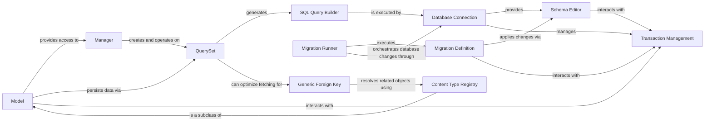

## Component Details

This subsystem provides Django's Object-Relational Mapper (ORM) for interacting with databases. It encompasses the definition of database models, the execution of queries through QuerySets and Managers, the generation and execution of SQL queries, and the management of database schema changes via migrations. Additionally, it includes functionalities for handling generic relationships through content types and ensures data integrity through transaction management. The core flow involves defining models, querying data, and applying schema changes, all abstracted from the underlying database specifics.

### Model
The fundamental building block of Django's ORM, representing a database table. Instances of this class correspond to rows in the database, providing an object-oriented interface for data manipulation and schema definition.

**Related Classes/Methods**:

- <a href="https://github.com/django/django/blob/master/django/db/models/base.py#L480-L2406" target="_blank" rel="noopener noreferrer">`django.db.models.base.Model` (480:2406)</a>
- <a href="https://github.com/django/django/blob/master/django/db/models/base.py#L809-L877" target="_blank" rel="noopener noreferrer">`django.db.models.base.Model.save` (809:877)</a>
- <a href="https://github.com/django/django/blob/master/django/db/models/base.py#L1230-L1239" target="_blank" rel="noopener noreferrer">`django.db.models.base.Model.delete` (1230:1239)</a>
- <a href="https://github.com/django/django/blob/master/django/db/models/base.py#L1592-L1637" target="_blank" rel="noopener noreferrer">`django.db.models.base.Model.full_clean` (1592:1637)</a>
- <a href="https://github.com/django/django/blob/master/django/db/models/base.py#L1668-L1703" target="_blank" rel="noopener noreferrer">`django.db.models.base.Model.check` (1668:1703)</a>

### QuerySet
A lazy database lookup for a collection of objects. It allows for filtering, ordering, slicing, and performing bulk operations on database records without immediately hitting the database until evaluated.

**Related Classes/Methods**:

- <a href="https://github.com/django/django/blob/master/django/db/models/query.py#L100-L200" target="_blank" rel="noopener noreferrer">`django.db.models.query.QuerySet` (100:200)</a>
- <a href="https://github.com/django/django/blob/master/django/db/models/query.py#L1518-L1524" target="_blank" rel="noopener noreferrer">`django.db.models.query.QuerySet.filter` (1518:1524)</a>
- <a href="https://github.com/django/django/blob/master/django/db/models/query.py#L649-L666" target="_blank" rel="noopener noreferrer">`django.db.models.query.QuerySet.create` (649:666)</a>
- <a href="https://github.com/django/django/blob/master/django/db/models/query.py#L1256-L1294" target="_blank" rel="noopener noreferrer">`django.db.models.query.QuerySet.update` (1256:1294)</a>
- <a href="https://github.com/django/django/blob/master/django/db/models/query.py#L1206-L1234" target="_blank" rel="noopener noreferrer">`django.db.models.query.QuerySet.delete` (1206:1234)</a>
- <a href="https://github.com/django/django/blob/master/django/db/models/query.py#L567-L637" target="_blank" rel="noopener noreferrer">`django.db.models.query.QuerySet.aggregate` (567:637)</a>
- <a href="https://github.com/django/django/blob/master/django/db/models/query.py#L1647-L1670" target="_blank" rel="noopener noreferrer">`django.db.models.query.QuerySet.prefetch_related` (1647:1670)</a>

### Manager
The interface through which database query operations are provided to Django models. Typically accessed as `Model.objects`, it acts as the primary entry point for interacting with the database for a given model.

**Related Classes/Methods**:

- <a href="https://github.com/django/django/blob/master/django/db/models/manager.py#L175-L176" target="_blank" rel="noopener noreferrer">`django.db.models.manager.Manager` (175:176)</a>

### SQL Query Builder
An internal component responsible for constructing the underlying SQL query from the QuerySet's operations. It manages table aliases, WHERE clauses, joins, and other SQL components before passing them to the database backend.

**Related Classes/Methods**:

- <a href="https://github.com/django/django/blob/master/django/db/models/sql/query.py#L220-L2677" target="_blank" rel="noopener noreferrer">`django.db.models.sql.query.Query` (220:2677)</a>
- <a href="https://github.com/django/django/blob/master/django/db/models/sql/query.py#L358-L365" target="_blank" rel="noopener noreferrer">`django.db.models.sql.query.Query.get_compiler` (358:365)</a>
- <a href="https://github.com/django/django/blob/master/django/db/models/sql/query.py#L1628-L1650" target="_blank" rel="noopener noreferrer">`django.db.models.sql.query.Query.add_q` (1628:1650)</a>
- <a href="https://github.com/django/django/blob/master/django/db/models/sql/query.py#L1850-L1965" target="_blank" rel="noopener noreferrer">`django.db.models.sql.query.Query.setup_joins` (1850:1965)</a>
- <a href="https://github.com/django/django/blob/master/django/db/models/sql/compiler.py#L39-L1674" target="_blank" rel="noopener noreferrer">`django.db.models.sql.compiler.SQLCompiler` (39:1674)</a>

### Database Connection
An abstraction layer that handles the actual communication with a specific database backend (e.g., PostgreSQL, MySQL, SQLite). It manages connections, cursors, transactions, and provides backend-specific functionalities.

**Related Classes/Methods**:

- <a href="https://github.com/django/django/blob/master/django/db/backends/base/base.py#L29-L791" target="_blank" rel="noopener noreferrer">`django.db.backends.base.base.BaseDatabaseWrapper` (29:791)</a>
- <a href="https://github.com/django/django/blob/master/django/db/backends/base/base.py#L236-L260" target="_blank" rel="noopener noreferrer">`django.db.backends.base.base.BaseDatabaseWrapper.connect` (236:260)</a>
- <a href="https://github.com/django/django/blob/master/django/db/backends/base/base.py#L317-L319" target="_blank" rel="noopener noreferrer">`django.db.backends.base.base.BaseDatabaseWrapper.cursor` (317:319)</a>
- <a href="https://github.com/django/django/blob/master/django/db/backends/base/base.py#L322-L329" target="_blank" rel="noopener noreferrer">`django.db.backends.base.base.BaseDatabaseWrapper.commit` (322:329)</a>

### Migration Definition
A Python class that defines a set of atomic operations (e.g., CreateModel, AddField) to modify the database schema or data. These files are generated by Django's migration system and represent changes over time.

**Related Classes/Methods**:

- <a href="https://github.com/django/django/blob/master/django/db/migrations/migration.py#L8-L221" target="_blank" rel="noopener noreferrer">`django.db.migrations.migration.Migration` (8:221)</a>
- <a href="https://github.com/django/django/blob/master/django/db/migrations/migration.py#L93-L136" target="_blank" rel="noopener noreferrer">`django.db.migrations.migration.Migration.apply` (93:136)</a>
- <a href="https://github.com/django/django/blob/master/django/db/migrations/migration.py#L138-L197" target="_blank" rel="noopener noreferrer">`django.db.migrations.migration.Migration.unapply` (138:197)</a>
- <a href="https://github.com/django/django/blob/master/django/db/migrations/migration.py#L79-L91" target="_blank" rel="noopener noreferrer">`django.db.migrations.migration.Migration.mutate_state` (79:91)</a>
- <a href="https://github.com/django/django/blob/master/django/db/migrations/operations/base.py#L15-L176" target="_blank" rel="noopener noreferrer">`django.db.migrations.operations.base.Operation` (15:176)</a>

### Migration Runner
Responsible for orchestrating the application and unapplication of migrations. It loads migration files, builds a dependency graph, and executes the defined schema changes on the database.

**Related Classes/Methods**:

- <a href="https://github.com/django/django/blob/master/django/db/migrations/executor.py#L9-L411" target="_blank" rel="noopener noreferrer">`django.db.migrations.executor.MigrationExecutor` (9:411)</a>
- <a href="https://github.com/django/django/blob/master/django/db/migrations/executor.py#L93-L144" target="_blank" rel="noopener noreferrer">`django.db.migrations.executor.MigrationExecutor.migrate` (93:144)</a>
- <a href="https://github.com/django/django/blob/master/django/db/migrations/executor.py#L238-L263" target="_blank" rel="noopener noreferrer">`django.db.migrations.executor.MigrationExecutor.apply_migration` (238:263)</a>
- <a href="https://github.com/django/django/blob/master/django/db/migrations/executor.py#L276-L289" target="_blank" rel="noopener noreferrer">`django.db.migrations.executor.MigrationExecutor.unapply_migration` (276:289)</a>
- <a href="https://github.com/django/django/blob/master/django/db/migrations/loader.py#L20-L417" target="_blank" rel="noopener noreferrer">`django.db.migrations.loader.MigrationLoader` (20:417)</a>

### Content Type Registry
A built-in Django model that provides a generic interface for working with installed models. It stores a record for each model in your Django project, allowing dynamic referencing of models.

**Related Classes/Methods**:

- <a href="https://github.com/django/django/blob/master/django/contrib/contenttypes/models.py#L133-L187" target="_blank" rel="noopener noreferrer">`django.contrib.contenttypes.models.ContentType` (133:187)</a>
- <a href="https://github.com/django/django/blob/master/django/contrib/contenttypes/models.py#L164-L169" target="_blank" rel="noopener noreferrer">`django.contrib.contenttypes.models.ContentType.model_class` (164:169)</a>
- <a href="https://github.com/django/django/blob/master/django/contrib/contenttypes/models.py#L171-L178" target="_blank" rel="noopener noreferrer">`django.contrib.contenttypes.models.ContentType.get_object_for_this_type` (171:178)</a>

### Generic Foreign Key
A flexible foreign key field that can refer to any model, enabling generic relationships. It achieves this by storing both the content type ID and the object's primary key.

**Related Classes/Methods**:

- <a href="https://github.com/django/django/blob/master/django/contrib/contenttypes/fields.py#L25-L266" target="_blank" rel="noopener noreferrer">`django.contrib.contenttypes.fields.GenericForeignKey` (25:266)</a>
- <a href="https://github.com/django/django/blob/master/django/contrib/contenttypes/fields.py#L148-L161" target="_blank" rel="noopener noreferrer">`django.contrib.contenttypes.fields.GenericForeignKey.get_content_type` (148:161)</a>
- <a href="https://github.com/django/django/blob/master/django/contrib/contenttypes/fields.py#L163-L220" target="_blank" rel="noopener noreferrer">`django.contrib.contenttypes.fields.GenericForeignKey.get_prefetch_querysets` (163:220)</a>

### Schema Editor
A database-agnostic interface for performing schema modifications (DDL operations) on the database. It translates Django's schema operations into the appropriate SQL for the connected database backend.

**Related Classes/Methods**:

- <a href="https://github.com/django/django/blob/master/django/db/backends/base/schema.py#L76-L2045" target="_blank" rel="noopener noreferrer">`django.db.backends.base.schema.BaseDatabaseSchemaEditor` (76:2045)</a>
- <a href="https://github.com/django/django/blob/master/django/db/backends/base/schema.py#L503-L536" target="_blank" rel="noopener noreferrer">`django.db.backends.base.schema.BaseDatabaseSchemaEditor.create_model` (503:536)</a>
- <a href="https://github.com/django/django/blob/master/django/db/backends/base/schema.py#L719-L805" target="_blank" rel="noopener noreferrer">`django.db.backends.base.schema.BaseDatabaseSchemaEditor.add_field` (719:805)</a>

### Transaction Management
Handles database transactions, ensuring data integrity by grouping multiple database operations into a single, atomic unit of work.

**Related Classes/Methods**:

- <a href="https://github.com/django/django/blob/master/django/db/transaction.py#L315-L322" target="_blank" rel="noopener noreferrer">`django.db.transaction.atomic` (315:322)</a>
- <a href="https://github.com/django/django/blob/master/django/db/transaction.py#L128-L133" target="_blank" rel="noopener noreferrer">`django.db.transaction.on_commit` (128:133)</a>
- <a href="https://github.com/django/django/blob/master/django/db/transaction.py#L32-L34" target="_blank" rel="noopener noreferrer">`django.db.transaction.set_autocommit` (32:34)</a>

### [FAQ](https://github.com/CodeBoarding/GeneratedOnBoardings/tree/main?tab=readme-ov-file#faq)