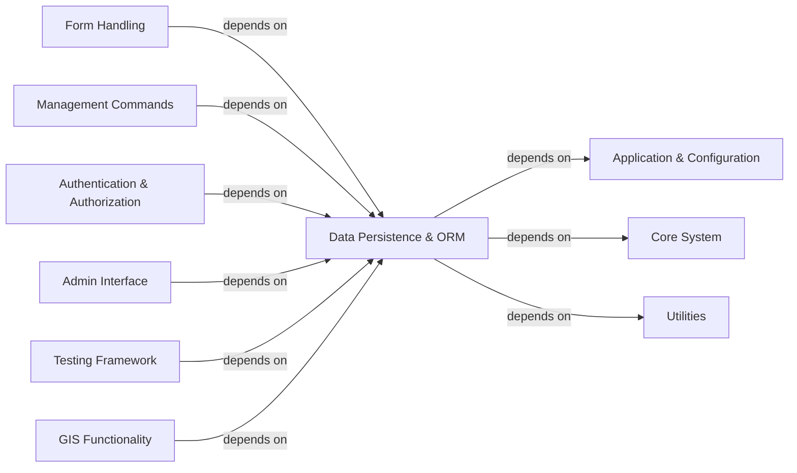

## Component Details

This graph provides an overview of the Data Persistence & ORM component in Django, detailing its structure, purpose, and interactions with other core Django components. It encompasses functionalities for object-relational mapping, model definition, query building, and database schema management through migrations, serving as the primary abstraction layer for database interactions within a Django application.

### Data Persistence & ORM
Handles all database interactions, including object-relational mapping (ORM) for defining and querying models, managing database schema changes through migrations, and providing an abstraction layer for various database backends.

**Related Classes/Methods**:

- `django.db.models.base.Model` (full file reference)
- <a href="https://github.com/django/django/blob/master/django/db/models/query.py#L279-L1000" target="_blank" rel="noopener noreferrer">`django.db.models.query.QuerySet` (279:1000)</a>
- <a href="https://github.com/django/django/blob/master/django/db/backends/base/base.py#L30-L792" target="_blank" rel="noopener noreferrer">`django.db.backends.base.base.BaseDatabaseWrapper` (30:792)</a>
- `django.db.migrations.autodetector.MigrationAutodetector` (full file reference)
- <a href="https://github.com/django/django/blob/master/django/db/migrations/executor.py#L10-L412" target="_blank" rel="noopener noreferrer">`django.db.migrations.executor.MigrationExecutor` (10:412)</a>
- `django.db` (full file reference)
- `django.db.utils` (full file reference)
- `django.db.backends` (full file reference)
- `django.db.models` (full file reference)
- `django.db.models.aggregates` (full file reference)
- `django.db.models.constraints` (full file reference)
- `django.db.models.deletion` (full file reference)
- `django.db.models.enums` (full file reference)
- `django.db.models.expressions` (full file reference)
- `django.db.models.fields` (full file reference)
- `django.db.models.functions` (full file reference)
- `django.db.models.indexes` (full file reference)
- `django.db.models.lookups` (full file reference)
- `django.db.models.manager` (full file reference)
- `django.db.models.options` (full file reference)
- `django.db.models.query_utils` (full file reference)
- `django.db.models.signals` (full file reference)
- `django.db.models.sql` (full file reference)
- `django.db.transaction` (full file reference)
- `django.db.migrations` (full file reference)
- `django.db.migrations.exceptions` (full file reference)
- `django.db.migrations.graph` (full file reference)
- `django.db.migrations.loader` (full file reference)
- `django.db.migrations.migration` (full file reference)
- `django.db.migrations.operations` (full file reference)
- `django.db.migrations.questioner` (full file reference)
- `django.db.migrations.recorder` (full file reference)
- `django.db.migrations.serializer` (full file reference)
- `django.db.migrations.state` (full file reference)
- `django.db.migrations.utils` (full file reference)
- `django.db.migrations.writer` (full file reference)

### Application & Configuration
Manages the registration and lifecycle of Django applications and handles the project's settings and configurations, including global settings and application-specific configurations.

**Related Classes/Methods**:

- `django.apps` (full file reference)
- `django.apps.config` (full file reference)
- `django.apps.registry` (full file reference)
- `django.conf` (full file reference)
- `django.conf.global_settings` (full file reference)

### Core System
The foundational layer of Django, handling application startup, core exceptions, signals, and basic WSGI/ASGI interfaces. It provides the fundamental building blocks for any Django application.

**Related Classes/Methods**:

- `django` (full file reference)
- `django.__main__` (full file reference)
- `django.core.exceptions` (full file reference)
- `django.core.signals` (full file reference)
- `django.core.wsgi` (full file reference)
- `django.core.asgi` (full file reference)

### Utilities
A comprehensive collection of various helper functions and classes used across different parts of Django. This includes functionalities for caching, cryptography, encoding, functional programming, HTTP utilities, logging, module loading, text manipulation, timezone handling, and internationalization.

**Related Classes/Methods**:

- `django.utils` (full file reference)
- `django.utils._os` (full file reference)
- `django.utils.archive` (full file reference)
- `django.utils.asyncio` (full file reference)
- `django.utils.autoreload` (full file reference)
- `django.utils.cache` (full file reference)
- `django.utils.choices` (full file reference)
- `django.utils.connection` (full file reference)
- `django.utils.copy` (full file reference)
- `django.utils.crypto` (full file reference)
- `django.utils.datastructures` (full file reference)
- `django.utils.dateformat` (full file reference)
- `django.utils.dateparse` (full file reference)
- `django.utils.dates` (full file reference)
- `django.utils.deconstruct` (full file reference)
- `django.utils.deprecation` (full file reference)
- `django.utils.encoding` (full file reference)
- `django.utils.feedgenerator` (full file reference)
- `django.utils.formats` (full file reference)
- `django.utils.functional` (full file reference)
- `django.utils.html` (full file reference)
- `django.utils.http` (full file reference)
- `django.utils.ipv6` (full file reference)
- `django.utils.log` (full file reference)
- `django.utils.module_loading` (full file reference)
- `django.utils.numberformat` (full file reference)
- `django.utils.regex_helper` (full file reference)
- `django.utils.safestring` (full file reference)
- `django.utils.text` (full file reference)
- <a href="https://github.com/django/django/blob/master/django/utils/timesince.py#L28-L135" target="_blank" rel="noopener noreferrer">`django.utils.timesince` (28:135)</a>
- `django.utils.timezone` (full file reference)
- `django.utils.translation` (full file reference)
- `django.utils.tree` (full file reference)
- `django.utils.version` (full file reference)

### Form Handling
Provides a robust framework for creating, validating, and rendering HTML forms. It simplifies the process of handling user input and ensures data integrity.

**Related Classes/Methods**:

- `django.forms` (full file reference)
- `django.forms.boundfield` (full file reference)
- `django.forms.fields` (full file reference)
- `django.forms.forms` (full file reference)
- `django.forms.formsets` (full file reference)
- `django.forms.models` (full file reference)
- `django.forms.renderers` (full file reference)
- `django.forms.utils` (full file reference)
- `django.forms.widgets` (full file reference)

### Management Commands
Provides the command-line interface for various administrative tasks, such as running the development server, managing migrations, creating superusers, and checking project health.

**Related Classes/Methods**:

- `django.core.management` (full file reference)
- `django.core.management.base` (full file reference)
- `django.core.management.color` (full file reference)
- `django.core.management.commands` (full file reference)
- `django.core.management.sql` (full file reference)
- `django.core.management.templates` (full file reference)
- `django.core.management.utils` (full file reference)

### Authentication & Authorization
Handles user authentication, permissions, and group management. It provides a flexible system for controlling access to different parts of the application.

**Related Classes/Methods**:

- `django.contrib.auth` (full file reference)
- `django.contrib.auth.admin` (full file reference)
- `django.contrib.auth.apps` (full file reference)
- `django.contrib.auth.backends` (full file reference)
- `django.contrib.auth.base_user` (full file reference)
- `django.contrib.auth.checks` (full file reference)
- `django.contrib.auth.context_processors` (full file reference)
- `django.contrib.auth.decorators` (full file reference)
- `django.contrib.auth.forms` (full file reference)
- `django.contrib.auth.handlers.modwsgi` (full file reference)
- `django.contrib.auth.hashers` (full file reference)
- `django.contrib.auth.management` (full file reference)
- `django.contrib.auth.middleware` (full file reference)
- `django.contrib.auth.migrations` (full file reference)
- `django.contrib.auth.mixins` (full file reference)
- `django.contrib.auth.models` (full file reference)
- `django.contrib.auth.password_validation` (full file reference)
- `django.contrib.auth.signals` (full file reference)
- `django.contrib.auth.templatetags.auth` (full file reference)
- `django.contrib.auth.tokens` (full file reference)
- `django.contrib.auth.urls` (full file reference)
- `django.contrib.auth.validators` (full file reference)
- `django.contrib.auth.views` (full file reference)

### Admin Interface
Provides an automatically generated administrative interface for managing application data. It allows site administrators to easily create, read, update, and delete records.

**Related Classes/Methods**:

- `django.contrib.admin` (full file reference)
- `django.contrib.admin.actions` (full file reference)
- `django.contrib.admin.apps` (full file reference)
- `django.contrib.admin.checks` (full file reference)
- `django.contrib.admin.decorators` (full file reference)
- `django.contrib.admin.exceptions` (full file reference)
- `django.contrib.admin.filters` (full file reference)
- `django.contrib.admin.forms` (full file reference)
- `django.contrib.admin.helpers` (full file reference)
- `django.contrib.admin.migrations` (full file reference)
- `django.contrib.admin.models` (full file reference)
- `django.contrib.admin.options` (full file reference)
- `django.contrib.admin.sites` (full file reference)
- `django.contrib.admin.templatetags` (full file reference)
- `django.contrib.admin.tests` (full file reference)
- `django.contrib.admin.utils` (full file reference)
- `django.contrib.admin.views` (full file reference)

### Testing Framework
Provides a comprehensive set of tools and utilities for writing and running tests for Django applications, including test clients, test cases, and test runners.

**Related Classes/Methods**:

- `django.test` (full file reference)
- `django.test.client` (full file reference)
- `django.test.html` (full file reference)
- `django.test.runner` (full file reference)
- `django.test.selenium` (full file reference)
- `django.test.signals` (full file reference)
- `django.test.testcases` (full file reference)
- `django.test.utils` (full file reference)

### GIS Functionality
Extends Django's ORM and forms to support Geographic Information System (GIS) data types and operations, enabling the development of location-aware applications.

**Related Classes/Methods**:

- `django.contrib.gis` (full file reference)
- `django.contrib.gis.admin` (full file reference)
- `django.contrib.gis.apps` (full file reference)
- `django.contrib.gis.db` (full file reference)
- `django.contrib.gis.forms` (full file reference)
- `django.contrib.gis.gdal` (full file reference)
- `django.contrib.gis.geoip2` (full file reference)
- `django.contrib.gis.geometry` (full file reference)
- `django.contrib.gis.geos` (full file reference)
- `django.contrib.gis.management` (full file reference)
- `django.contrib.gis.serializers.geojson` (full file reference)
- `django.contrib.gis.shortcuts` (full file reference)
- `django.contrib.gis.sitemaps` (full file reference)
- `django.contrib.gis.utils` (full file reference)
- `django.contrib.gis.views` (full file reference)

### [FAQ](https://github.com/CodeBoarding/GeneratedOnBoardings/tree/main?tab=readme-ov-file#faq)