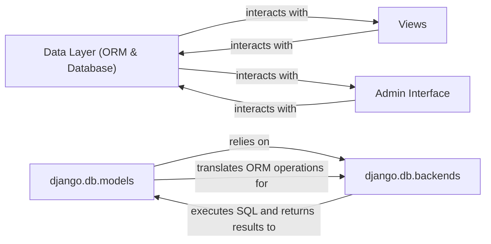

## Details

The Django framework's core data interaction revolves around its robust Object-Relational Mapper (ORM) and the underlying database backend. The `Data Layer (ORM & Database)` serves as the central hub, abstracting complex SQL operations and managing data persistence. This layer is primarily composed of `django.db.models`, which defines the application's data structure and provides a high-level QuerySet API, and `django.db.backends`, which handles the low-level communication with specific database systems. User-facing components like `Views` and the `Admin Interface` interact directly with this data layer to perform CRUD operations, ensuring a clear separation of concerns and efficient data management within the application.

### Data Layer (ORM & Database) [[Expand]](./Data_Layer_ORM_Database_.md)
The overarching component providing Django's Object-Relational Mapping (ORM) and database interaction capabilities. It abstracts SQL operations, manages data persistence, and serves as the 'Model' in Django's MVT pattern.

**Related Classes/Methods**:

- <a href="https://github.com/django/django/blob/main/django/db/models" target="_blank" rel="noopener noreferrer">`django.db.models`</a>
- <a href="https://github.com/django/django/blob/main/django/db/backends" target="_blank" rel="noopener noreferrer">`django.db.backends`</a>

### django.db.models
The core of Django's ORM, responsible for defining database models (Python classes mapped to tables), fields, relationships, and the QuerySet API for CRUD operations. It also manages database migrations.

**Related Classes/Methods**:

- <a href="https://github.com/django/django/blob/main/django/db/models" target="_blank" rel="noopener noreferrer">`django.db.models`</a>

### django.db.backends
Contains specific implementations for connecting to and interacting with various database systems (e.g., PostgreSQL, MySQL, SQLite). It handles low-level database communication, connection pooling, transaction management, and raw SQL execution.

**Related Classes/Methods**:

- <a href="https://github.com/django/django/blob/main/django/db/backends" target="_blank" rel="noopener noreferrer">`django.db.backends`</a>

### Views
Handles incoming user requests, processes application logic, and interacts with the `Data Layer (ORM & Database)` to retrieve, create, update, or delete data.

**Related Classes/Methods**:

- <a href="https://github.com/django/django/blob/main/" target="_blank" rel="noopener noreferrer">`django.views.View`</a>

### Admin Interface
Django's built-in automated interface for data management, which heavily relies on and interacts with the `Data Layer (ORM & Database)` to provide CRUD operations for registered models.

**Related Classes/Methods**:

- <a href="https://github.com/django/django/blob/main/django/contrib/admin/sites.py#L30-L606" target="_blank" rel="noopener noreferrer">`django.contrib.admin.sites.AdminSite`:30-606</a>

### [FAQ](https://github.com/CodeBoarding/GeneratedOnBoardings/tree/main?tab=readme-ov-file#faq)