## Details

The `Data Management` component in Django is a sophisticated system that provides a robust and flexible way to interact with databases. It is composed of three fundamental sub-components: the ORM, Database Backends, and Database Migrations. These components are crucial for abstracting database interactions, supporting various database systems, and managing schema evolution.

### ORM
The ORM is the heart of Django's data interaction. It allows developers to define database tables as Python classes (models) and interact with database records as Python objects. This abstraction eliminates the need to write raw SQL for most operations, making database interactions more intuitive and Pythonic. It handles the translation of Python object operations into SQL queries, execution of these queries, and mapping the results back to Python objects.

**Related Classes/Methods**:

- <a href="https://github.com/django/django/blob/master/django/db/models/base.py#L480-L2407" target="_blank" rel="noopener noreferrer">`django.db.models.base.Model` (480:2407)</a>
- <a href="https://github.com/django/django/blob/master/django/db/models/query.py#L0-L0" target="_blank" rel="noopener noreferrer">`django.db.models.query.QuerySet` (0:0)</a>
- <a href="https://github.com/django/django/blob/master/django/db/models/manager.py#L175-L176" target="_blank" rel="noopener noreferrer">`django.db.models.manager.Manager` (175:176)</a>
- `django.db.models.fields` (0:0)
- <a href="https://github.com/django/django/blob/master/django/db/models/expressions.py#L0-L0" target="_blank" rel="noopener noreferrer">`django.db.models.expressions` (0:0)</a>
- <a href="https://github.com/django/django/blob/master/django/db/models/sql/query.py#L0-L0" target="_blank" rel="noopener noreferrer">`django.db.models.sql.query.Query` (0:0)</a>

### Database Backends
This component provides the necessary drivers and functionalities to interact with specific database systems (e.g., PostgreSQL, MySQL, SQLite, Oracle). It acts as an abstraction layer, hiding the differences in SQL dialects, connection protocols, and database-specific features. This allows the ORM to operate uniformly across various databases without requiring changes to the application's model definitions.

**Related Classes/Methods**:

- <a href="https://github.com/django/django/blob/master/django/db/backends/base/base.py#L29-L791" target="_blank" rel="noopener noreferrer">`django.db.backends.base.base.BaseDatabaseWrapper` (29:791)</a>
- <a href="https://github.com/django/django/blob/master/django/db/backends/base/operations.py#L14-L822" target="_blank" rel="noopener noreferrer">`django.db.backends.base.operations.BaseDatabaseOperations` (14:822)</a>
- <a href="https://github.com/django/django/blob/master/django/db/backends/base/schema.py#L76-L2045" target="_blank" rel="noopener noreferrer">`django.db.backends.base.schema.BaseDatabaseSchemaEditor` (76:2045)</a>
- <a href="https://github.com/django/django/blob/master/django/db/backends/utils.py#L16-L113" target="_blank" rel="noopener noreferrer">`django.db.backends.utils.CursorWrapper` (16:113)</a>
- <a href="https://github.com/django/django/blob/master/django/db/utils.py#L140-L196" target="_blank" rel="noopener noreferrer">`django.db.utils.ConnectionHandler` (140:196)</a>
- <a href="https://github.com/django/django/blob/master/django/db/backends/postgresql/base.py#L0-L0" target="_blank" rel="noopener noreferrer">`django.db.backends.postgresql.base.DatabaseWrapper` (0:0)</a>

### Database Migrations
This component provides a robust and version-controlled system for managing changes to the database schema. It allows developers to define schema modifications (e.g., adding a new field, creating a new table) in Python code, which can then be automatically applied, rolled back, or squashed. This ensures that the database structure remains synchronized with the application's models throughout the development lifecycle.

**Related Classes/Methods**:

- <a href="https://github.com/django/django/blob/master/django/db/migrations/migration.py#L8-L221" target="_blank" rel="noopener noreferrer">`django.db.migrations.migration.Migration` (8:221)</a>
- <a href="https://github.com/django/django/blob/master/django/db/migrations/executor.py#L9-L411" target="_blank" rel="noopener noreferrer">`django.db.migrations.executor.MigrationExecutor` (9:411)</a>
- <a href="https://github.com/django/django/blob/master/django/db/migrations/operations/base.py#L15-L176" target="_blank" rel="noopener noreferrer">`django.db.migrations.operations.base.Operation` (15:176)</a>
- <a href="https://github.com/django/django/blob/master/django/db/migrations/autodetector.py#L41-L1962" target="_blank" rel="noopener noreferrer">`django.db.migrations.autodetector.MigrationAutodetector` (41:1962)</a>
- <a href="https://github.com/django/django/blob/master/django/db/migrations/loader.py#L20-L417" target="_blank" rel="noopener noreferrer">`django.db.migrations.loader.MigrationLoader` (20:417)</a>
- <a href="https://github.com/django/django/blob/master/django/db/migrations/recorder.py#L8-L110" target="_blank" rel="noopener noreferrer">`django.db.migrations.recorder.MigrationRecorder` (8:110)</a>
- <a href="https://github.com/django/django/blob/master/django/db/migrations/state.py#L93-L601" target="_blank" rel="noopener noreferrer">`django.db.migrations.state.ProjectState` (93:601)</a>

### [FAQ](https://github.com/CodeBoarding/GeneratedOnBoardings/tree/main?tab=readme-ov-file#faq)