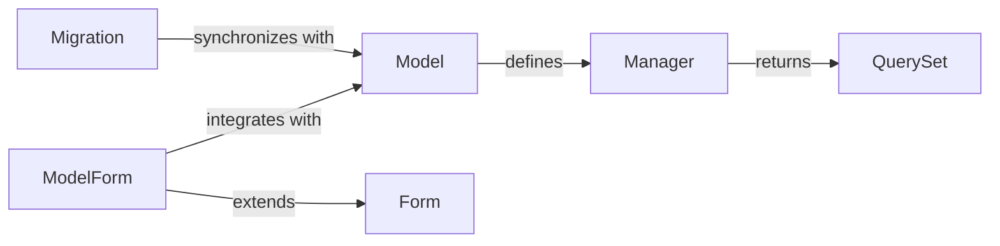

## Details

The `Data Management (ORM & Forms)` subsystem in Django provides a robust Pythonic interface for database interaction through its Object-Relational Mapper (ORM) and facilitates the creation, validation, and processing of HTML forms, often tightly integrated with database models.

### Model
The foundational class for defining database tables and their fields. Each `Model` subclass represents a table in the database and provides an object-oriented interface to interact with its records.

**Related Classes/Methods**:

- <a href="https://github.com/django/django//blob/django/db/models/base.py" target="_blank" rel="noopener noreferrer">`django.db.models.base.Model`</a>

### Manager
Provides the interface for database query operations. Every `Model` has at least one `Manager` (the default `objects` manager) which is used to perform operations like `all()`, `filter()`, `get()`, etc.

**Related Classes/Methods**:

- <a href="https://github.com/django/django//blob/django/db/models/manager.py" target="_blank" rel="noopener noreferrer">`django.db.models.manager.Manager`</a>

### QuerySet
Represents a collection of database objects. `QuerySet` objects are "lazy" – they don't hit the database until they are evaluated. They allow for chaining multiple query methods (e.g., `filter().order_by()`) to build complex queries.

**Related Classes/Methods**:

- <a href="https://github.com/django/django//blob/django/db/models/query.py#L279-L2071" target="_blank" rel="noopener noreferrer">`django.db.models.query.QuerySet`:279-2071</a>

### Form
The base class for handling HTML forms. It manages form fields, validates submitted data, cleans data, and handles error reporting. It provides methods for rendering the form as HTML.

**Related Classes/Methods**:

- <a href="https://github.com/django/django//blob/django/forms/forms.py#L432-L433" target="_blank" rel="noopener noreferrer">`django.forms.forms.Form`:432-433</a>

### ModelForm
A specialized `Form` class that automatically generates form fields from a `Model` definition. It simplifies the process of creating forms for database models, including saving data back to the model instance.

**Related Classes/Methods**:

- <a href="https://github.com/django/django//blob/django/forms/models.py#L585-L586" target="_blank" rel="noopener noreferrer">`django.forms.models.ModelForm`:585-586</a>

### Migration
Defines a set of operations to change the database schema. These are typically auto-generated by Django when `Model` definitions are altered and are applied to the database using the `migrate` command.

**Related Classes/Methods**:

- <a href="https://github.com/django/django//blob/django/db/migrations/migration.py#L9-L222" target="_blank" rel="noopener noreferrer">`django.db.migrations.migration.Migration`:9-222</a>

### [FAQ](https://github.com/CodeBoarding/GeneratedOnBoardings/tree/main?tab=readme-ov-file#faq)