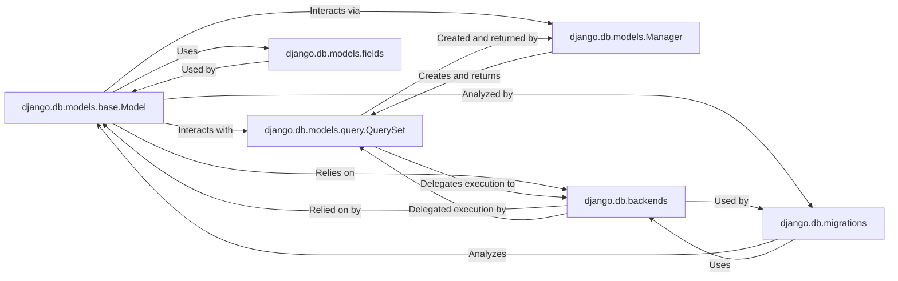

## Details

The Django ORM subsystem is centered around the `Model` component, which serves as the blueprint for database tables. `Model` instances are managed and queried through `Manager` objects, which in turn construct and execute `QuerySet` objects. `QuerySet`s, representing database queries, delegate their execution to the `backends` component, which handles the low-level, database-specific interactions. The structure of `Model`s is defined by `fields`, which specify column types and constraints. Finally, the `migrations` component ensures that changes to `Model` definitions are systematically applied to the database schema, maintaining consistency and enabling version control of the database structure.

### django.db.models.base.Model
This is the foundational component of the Django ORM. It serves as the base class for all application-specific models, providing the core object-relational mapping capabilities. It maps Python classes to database tables and instances of these classes to table rows, abstracting away direct SQL interactions.

**Related Classes/Methods**:

- <a href="https://github.com/django/django//blob/django/db/models/base.py" target="_blank" rel="noopener noreferrer">`django.db.models.base.Model`</a>

### django.db.models.query.QuerySet
Represents a collection of database queries. It offers a rich, chainable API for filtering, ordering, slicing, and retrieving data from the database in a lazy and efficient manner. It is the primary interface for constructing and executing queries against model data.

**Related Classes/Methods**:

- <a href="https://github.com/django/django//blob/django/db/models/query.py#L279-L2071" target="_blank" rel="noopener noreferrer">`django.db.models.query.QuerySet`:279-2071</a>

### django.db.models.Manager
Provides the primary interface for database query operations for a given model. Typically accessed via `Model.objects`, it acts as the entry point for performing `QuerySet` operations and custom data access methods.

**Related Classes/Methods**:

- <a href="https://github.com/django/django//blob/django/db/models/manager.py" target="_blank" rel="noopener noreferrer">`django.db.models.manager.Manager`</a>

### django.db.models.fields
A collection of classes (e.g., `CharField`, `IntegerField`, `ForeignKey`) that define the types, constraints, and behaviors of columns within a database table. These field types are used to define the attributes of `Model` classes, dictating how data is stored and validated.

**Related Classes/Methods**:

- <a href="https://github.com/django/django//blob/django/db/models/fields/__init__.py" target="_blank" rel="noopener noreferrer">`django.db.models.fields.Field`</a>

### django.db.backends
This package contains the database-specific implementations (e.g., for PostgreSQL, MySQL, SQLite). It handles the low-level details of connecting to the database, generating dialect-specific SQL queries, and executing them, abstracting database vendor differences from the ORM.

**Related Classes/Methods**:

- <a href="https://github.com/django/django//blob/django/db/backends/base/base.py#L30-L792" target="_blank" rel="noopener noreferrer">`django.db.backends.base.base.BaseDatabaseWrapper`:30-792</a>

### django.db.migrations
Manages the evolution of the database schema over time. It provides tools to detect changes in `Model` definitions, generate migration files (Python code representing schema changes), and apply these changes to the database in a controlled and versioned manner.

**Related Classes/Methods**:

- <a href="https://github.com/django/django//blob/django/db/migrations/migration.py" target="_blank" rel="noopener noreferrer">`django.db.migrations.Migration`</a>

### [FAQ](https://github.com/CodeBoarding/GeneratedOnBoardings/tree/main?tab=readme-ov-file#faq)