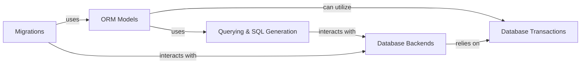

## Details

This crucial component provides Django's Object-Relational Mapper (ORM), enabling Python objects to interact with the database. It includes specific database backend implementations, manages schema changes through migrations, handles data serialization/deserialization, and extends support for geospatial data types and queries.

### Database Backends
This component provides the necessary interfaces and implementations for Django to communicate with various relational databases (e.g., PostgreSQL, MySQL, SQLite). It abstracts away database-specific SQL dialects and operations, offering a unified API for data interaction.

**Related Classes/Methods**:

- <a href="https://github.com/django/django/django/template/backends/django.py#L1-L1" target="_blank" rel="noopener noreferrer">`django.db.backends` (1:1)</a>
- <a href="https://github.com/django/django/django/template/backends/django.py#L1-L1" target="_blank" rel="noopener noreferrer">`django.db.backends` (1:1)</a>
- <a href="https://github.com/django/django/django/template/backends/django.py#L1-L1" target="_blank" rel="noopener noreferrer">`django.db.backends` (1:1)</a>
- <a href="https://github.com/django/django/django/template/backends/django.py#L1-L1" target="_blank" rel="noopener noreferrer">`django.db.backends` (1:1)</a>
- <a href="https://github.com/django/django/django/template/backends/django.py#L1-L1" target="_blank" rel="noopener noreferrer">`django.db.backends` (1:1)</a>

### ORM Models
This is the core of Django's Object-Relational Mapper. It defines how Python classes and objects map to database tables and rows, respectively. It includes functionalities for defining fields, relationships, and custom managers.

**Related Classes/Methods**:

- <a href="https://github.com/django/django/django/template/backends/django.py#L1-L1" target="_blank" rel="noopener noreferrer">`django.db.models` (1:1)</a>
- <a href="https://github.com/django/django/django/template/backends/django.py#L1-L1" target="_blank" rel="noopener noreferrer">`django.db.models` (1:1)</a>
- <a href="https://github.com/django/django/django/template/backends/django.py#L1-L1" target="_blank" rel="noopener noreferrer">`django.db.models` (1:1)</a>
- <a href="https://github.com/django/django/django/template/backends/django.py#L1-L1" target="_blank" rel="noopener noreferrer">`django.db.models` (1:1)</a>
- <a href="https://github.com/django/django/django/template/backends/django.py#L1-L1" target="_blank" rel="noopener noreferrer">`django.db.models` (1:1)</a>

### Migrations
This component manages changes to the database schema. It allows developers to define schema modifications (e.g., adding tables, columns, or altering existing ones) in a version-controlled manner, ensuring that the database schema evolves consistently across different environments.

**Related Classes/Methods**:

- <a href="https://github.com/django/django/django/template/backends/django.py#L1-L1" target="_blank" rel="noopener noreferrer">`django.db.migrations` (1:1)</a>
- <a href="https://github.com/django/django/django/template/backends/django.py#L1-L1" target="_blank" rel="noopener noreferrer">`django.db.migrations` (1:1)</a>
- <a href="https://github.com/django/django/django/template/backends/django.py#L1-L1" target="_blank" rel="noopener noreferrer">`django.db.migrations` (1:1)</a>
- <a href="https://github.com/django/django/django/template/backends/django.py#L1-L1" target="_blank" rel="noopener noreferrer">`django.db.migrations` (1:1)</a>
- <a href="https://github.com/django/django/django/template/backends/django.py#L1-L1" target="_blank" rel="noopener noreferrer">`django.db.migrations` (1:1)</a>
- <a href="https://github.com/django/django/django/template/backends/django.py#L1-L1" target="_blank" rel="noopener noreferrer">`django.db.migrations` (1:1)</a>

### Querying & SQL Generation
This component is responsible for translating ORM queries (e.g., MyModel.objects.filter(...)) into raw SQL statements that the database can understand and execute. It handles query optimization, filtering, ordering, and aggregation.

**Related Classes/Methods**:

- `django.db.models.sql` (1:1)
- <a href="https://github.com/django/django/django/db/models/query.py#L1-L1" target="_blank" rel="noopener noreferrer">`django.db.models.query` (1:1)</a>

### Database Transactions
This component provides mechanisms for managing database transactions. It ensures that a series of database operations are treated as a single, atomic unit, either all succeeding or all failing, thereby maintaining data integrity.

**Related Classes/Methods**:

- <a href="https://github.com/django/django/django/db/transaction.py#L1-L1" target="_blank" rel="noopener noreferrer">`django.db.transaction` (1:1)</a>

### [FAQ](https://github.com/CodeBoarding/GeneratedOnBoardings/tree/main?tab=readme-ov-file#faq)