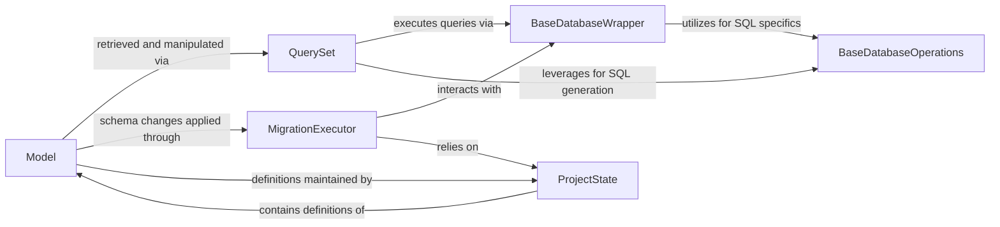

## Component Details

These components collectively cover the entire lifecycle of data within a Django application: defining its structure (`Model`, `ProjectState`), interacting with it (`QuerySet`), and managing its persistence and evolution in the database (`BaseDatabaseWrapper`, `BaseDatabaseOperations`, `MigrationExecutor`).

### Model
The `Model` class is the cornerstone of Django's ORM. It provides a Pythonic definition for database tables, allowing developers to declare fields, relationships, and metadata. Each instance of a `Model` subclass corresponds to a row in the database, serving as the primary interface for data structure definition.

**Related Classes/Methods**:

- <a href="https://github.com/django/django/blob/master/django/db/models/base.py#L0-L0" target="_blank" rel="noopener noreferrer">`django/db/models/base.py` (0:0)</a>

### QuerySet
`QuerySet` objects represent a collection of database queries. They offer a rich, lazy API for filtering, ordering, and retrieving data from the database. This component is the main mechanism through which applications interact with `Model` instances for data retrieval and manipulation.

**Related Classes/Methods**:

- <a href="https://github.com/django/django/blob/master/django/db/models/query.py#L0-L0" target="_blank" rel="noopener noreferrer">`django/db/models/query.py` (0:0)</a>

### BaseDatabaseWrapper
This abstract class serves as the foundational interface for all database connections in Django. It manages the establishment and lifecycle of database connections, handles transaction management, and provides methods for executing raw SQL queries, abstracting away database-specific connection details.

**Related Classes/Methods**:

- <a href="https://github.com/django/django/blob/master/django/db/backends/base/base.py#L0-L0" target="_blank" rel="noopener noreferrer">`django/db/backends/base/base.py` (0:0)</a>

### BaseDatabaseOperations
Working in conjunction with `BaseDatabaseWrapper`, this abstract component defines a set of database-agnostic operations and utilities. It's responsible for generating database-specific SQL snippets for common tasks like quoting names, handling date/time functions, and implementing `LIMIT`/`OFFSET` clauses, ensuring compatibility across different database backends.

**Related Classes/Methods**:

- <a href="https://github.com/django/django/blob/master/django/db/backends/base/operations.py#L0-L0" target="_blank" rel="noopener noreferrer">`django/db/backends/base/operations.py` (0:0)</a>

### MigrationExecutor
The `MigrationExecutor` is the core component responsible for applying and unapplying database schema changes (migrations). It orchestrates the process of transforming the database to match the current or a historical state of the project's models, interacting with the schema editor and migration recorder.

**Related Classes/Methods**:

- <a href="https://github.com/django/django/blob/master/django/db/migrations/executor.py#L0-L0" target="_blank" rel="noopener noreferrer">`django/db/migrations/executor.py` (0:0)</a>

### ProjectState
`ProjectState` provides an in-memory representation of the entire Django project's model definitions at a specific point in time. It's a critical component for the migration system, enabling the detection of schema changes and the accurate application or reversal of migration operations by holding the "state" of the models.

**Related Classes/Methods**:

- <a href="https://github.com/django/django/blob/master/django/db/migrations/state.py#L0-L0" target="_blank" rel="noopener noreferrer">`django/db/migrations/state.py` (0:0)</a>

### [FAQ](https://github.com/CodeBoarding/GeneratedOnBoardings/tree/main?tab=readme-ov-file#faq)